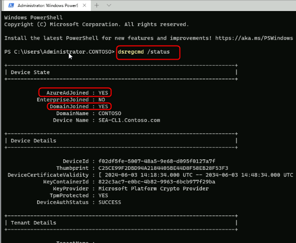
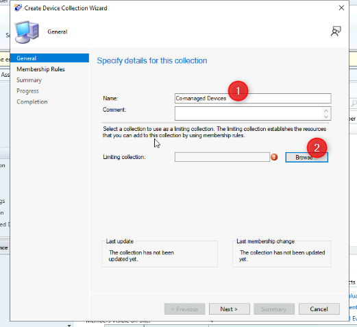
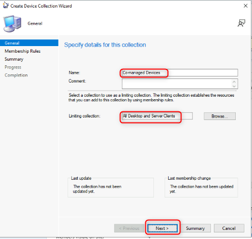
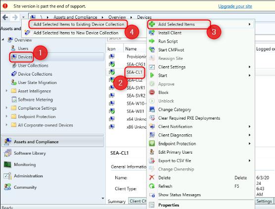
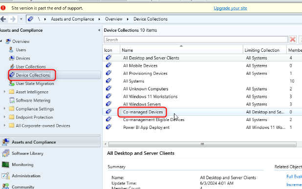
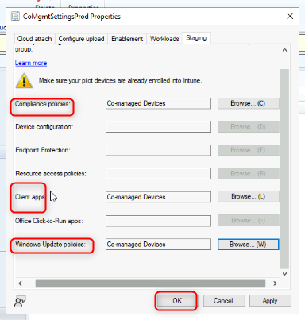
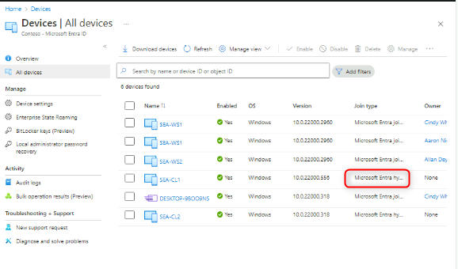

实验 22：使用 Configuration Manager 配置 Cloud Attach 和共同管理

**总结**

在本实验中，您将启用 Cloud Attach 并使用 Microsoft Endpoint
Configuration Manager 和 Microsoft Intune 配置共同管理。

**先决条件**

在此实验之前，必须完成以下实验：

- 实验 01 - 在 Microsoft Entra ID 中管理身份

- 实验 02 - 使用 Azure AD Connect 同步身份

- 实验 03 - 配置和管理 Microsoft Entra ID 加入

- 实验 05 - 管理设备注册到 Intune

**场景**

Contoso 同时具有 Microsoft Endpoint Configuration Manager 实现和
Microsoft Intune。您需要配置这两项服务之间的集成，并为托管的 Windows
设备启用共同管理。您将启用 Cloud Attach，配置共同管理，然后使用 SEA-CL1
验证设置。

任务 1：准备环境

1.  切换到[***SEA-SVR1***](urn:gd:lg:a:select-vm) 并以 [**Contoso\Administrator**](urn:gd:lg:a:send-vm-keys) 身份登录，密码为 !\!!。

2.  从服务器管理器中，选择 “**Tools**” ，然后选择 “**Active Directory
    Users and Computers**” 。

> 

3.  在导航窗格中，选择 **Seattle Clients**。

> 

4.  右键单击 **SEA-CL1**，然后选择 **Move**。

> 

5.  在 “**Move**” 对话框中，选择 “**Entra clients**”，然后选择 “**OK**”
    。

> 

6.  关闭 **Active Directory Users and Computers**。

7.  在任务栏上，右键单击 **Start** 并开始并选择 **Windows Powershell
    （Admin）。**

> 

8.  在 **Windows PowerShell** 窗口中，键入以下命令，然后按 **Enter**：

> !!**Start**-ADSyncSyncCycle -PolicyType **Initial**!!
>
> 

9.  关闭 PowerShell 窗口。

10. 切换到 [***SEA-CL1***](urn:gd:lg:a:select-vm)。

11. 在任务栏上，右键单击 “**Start**” ，选择 “**Shut down or sign
    out**”，然后选择 “**Restart**” 。

> 
>
> **注意：**重新启动将在 SEA-CL1 上触发混合 Azure AD 联接。

12. [***SEA-CL1***](urn:gd:lg:a:select-vm) 重启后，使用密码
    [**Pa55w.rd**](urn:gd:lg:a:send-vm-keys) 以
    [**Contoso\Administrator**](urn:gd:lg:a:send-vm-keys) 身份登录。

13. 在任务栏上，右键单击 **Start** 并开始并选择 **Windows Terminal
    (Admin)**。

> 

14. 在 **Windows PowerShell** 窗口中，键入以下命令，然后按 **Enter**：

> !!dsregcmd /**status**!!

15. 在 **Device State**（设备状态）下的输出中，验证是否显示
    **AzureAdJoined ： YES** 和 **DomainJoined ： YES**。

> 
>
> **注意：**如果设备尚未加入 Azure AD，请等待 Azure AD Connect
> 同步完成并再次重新启动 SEA-CL1。

16. 关闭 [***SEA-CL1***](urn:gd:lg:a:select-vm) 上的所有窗口。

任务 2：创建设备集合

1.  切换到 [***SEA-CFG1***](urn:gd:lg:a:select-vm)，使用密码
    [**Pa55w.rd**](urn:gd:lg:a:send-vm-keys) 以
    [**Contoso\Administrator**](urn:gd:lg:a:send-vm-keys) 身份登录。

2.  在任务栏上，选择 **Configuration Manager Console**。此时将打开
    Microsoft Endpoint Configuration Manager 控制台。

> 

3.  在 **Assets and Compliance** 工作区中，选择 **Device Collections**。

4.  右键单击 **Device Collections** （设备集合），然后选择 **Create
    Device Collection** （创建设备集合）。此时将打开 Create Device
    Collection Wizard。

> 

5.  在 **General** （常规） 页面上，配置以下内容，然后选择 **Next**
    （下一步）：

    - 名字： !\!!

    - 限制收集： **All Desktop and Server Clients**

> 
>
> 
>
> 

6.  在 “**Membership Rules**” 页上，选择 “**Next**” 。

> 

7.  在 Configuration Manager 警告处，选择 “**OK**”
    。您将在后续步骤中添加直接成员。

> 

8.  在 **Summary** （摘要） 页面上，选择 **Next** （下一步），然后在
    **Completion** （完成） 页面上，选择 **Close** （关闭）。

> 
>
> 

任务 3：将设备分配给现有集合

1.  在 **Assets and Compliance** （资产和合规性） 工作区中，选择
    **Devices** （设备）。

> 记下列出的设备。任何带有绿色圆圈和白色对勾标记的设备当前都处于活动状态。

2.  在详细信息窗格中，选择 **SEA-CL1**。

3.  右键单击 **SEA-CL1**，指向 “**Add Selected Items**” ，然后选择
    “**Add Selected Items to Existing Device Collection**” 。

> 

4.  在 **Select Collection** 对话框中，选择 **Co-managed
    Devices**，然后选择 **OK**。

> 

5.  若要验证，请在 “**Assets and Compliance**” 工作区中，选择 “**Device
    Collections**” ，然后双击 “**Co-managed Devices**” 。

> 
>
> 
>
> **SEA-CL1** 应列为此集合的成员。

任务 4：云附加 Endpoint Configuration Manager

1.  在 Microsoft Endpoint Configuration Manager 控制台中，选择
    “**Administration**” 工作区。

> 

2.  在 **Administration** 工作区中，展开 **Cloud Services**，然后选择
    **Cloud Attach**。

> 

3.  在功能区中，选择 **Configure Cloud Attach**。此时将打开 **Cloud
    Attach Configuration Wizard** 。

> 
>
> 

4.  在 **Cloud Attach Configuration Wizard** 的 **Cloud attach**
    页面上，选择 **Sign In** （登录）。

5.  登录身份 [**admin@M365x19242953.onmicrosoft.com**](urn:gd:lg:a:send-vm-keys) 密码为 [**9whL~;H8ke=D1^95%D**](urn:gd:lg:a:send-vm-keys).

6.  在 **Cloud attach** （云附加） 页面上，选择 **Customize settings**
    （自定义设置），然后选择 **Next** （下一步）。

> 

7.  在 **Create AAD Application** （创建 AAD 应用程序） 警告中，选择
    **Yes** （是）。

> 

8.  在 **Configure upload** （配置上传） 页面上，接受默认值并选择
    **Next** （下一步）。

> 

9.  在 “**Enablement**” 页上的 “**Automatic enrollment in Intune**”
    旁边，选择 “**Pilot**” 。

10. 在 “**Enablement**” 页上的 “**Intune Auto Enrollment**” 旁边，选择
    “**Browse**” 。

> 

11. 在 **Select Collection** （选择集合） 对话框中，选择 **Co-managed
    Devices** （共同管理的设备），然后选择 **OK** （确定）。 选择
    **Next** （下一步）。

> 

12. 在 **Summary** （摘要） 页面上，选择 **Next** （下一步），然后在
    **Completion** （完成） 页面上，选择 **Close** （关闭）。

> 

任务 5：配置工作负载

1.  在 Microsoft Endpoint Configuration Manager 控制台中，选择
    “**Administration**” 工作区。

2.  在 **Administration** 工作区中，展开 **Cloud Services** ，然后选择
    **Cloud Attach**。

3.  在详细信息窗格中，选择 **CoMgmtSettingsProd**，然后从功能区中选择
    **Properties**。

> 
>
>  **CoMgmtSettingsProd Properties** （属性） 框打开。

4.  选择 **Workloads** （工作负载）。在 “**Workloads**”
    页上，将滑块拖动到 “为以下工作负载 **Pilot Intune**” ：

    - **Compliance policies**

    - **Client apps**

    - **Windows Update policies**

> 

5.  选择 **Staging page**。在 “**Staging**” 页面上，选择 “**Compliance
    policies**” 、 “**Client Apps**” 和 “**Windows Update Policies**”
    旁边的 “**Browse**” ，然后为每个工作负载选择 “**Co-managed
    Devices**” 集合。

6.  选择 **OK** 关闭 **CoMgmtSettingsProd Properties** 框。

> 

任务 6：验证 SEA-CL1 是否为共同管理

1.  切换到 [***SEA-SVR1***](urn:gd:lg:a:select-vm)。

2.  在任务栏上，选择 **Microsoft Edge**，在地址栏中键入
    [**https://entra.microsoft.com**](https://entra.microsoft.com)，然后按
    **Enter**。

3.  以用户
     [**admin@M365x19242953.onmicrosoft.com**](urn:gd:lg:a:send-vm-keys)身份登录，然后使用密码。

4.  如果 **Stay signed in?** 提示符，请选择 **No**。

> 此时将打开 Microsoft Entra 管理中心。

5.  在 Microsoft Entra 管理中心的导航窗格中，选择 “**Identity**” 。

> 

6.  在 **Devices|All devices** 页面，验证是否列出了 **SEA-CL1** 以及
    “**联接类型**” 是否为 “**Microsoft Entr hybrid Join**” 。

> 

7.  在 Microsoft Edge 中打开另一个选项卡并在地址栏中键入
     [**https://intune.microsoft.com**](https://intune.microsoft.com) ，然后按
    **Enter**。

8.  在导航窗格中，选择 **Devices** （设备），然后选择 **All devices**
    （所有设备）。

9.  验证 SEA-CL1 是否列出，并将 “**Managed by**” 设置设置为
    “**Co-managed**” 。

> 
>
> 可能需要一些时间才能显示。根据需要刷新详细信息窗格。机器可能会出现在不同的名称下，单击设备以确认它显示
> **SEA-CL1**。

10. 选择 **SEA-CL1**
    ，然后在详细信息窗格中向下滚动以显示与共同管理状态相关的信息。

11. 关闭Microsoft Edge。

**结果：**完成本练习后，您将成功启用云附加并使用 Microsoft Endpoint
Configuration Manager 和 Microsoft Intune 配置共同管理。
