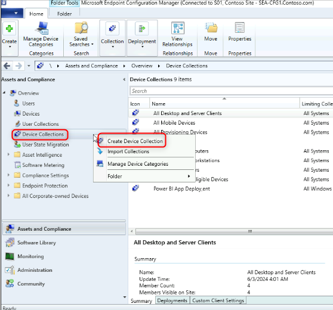
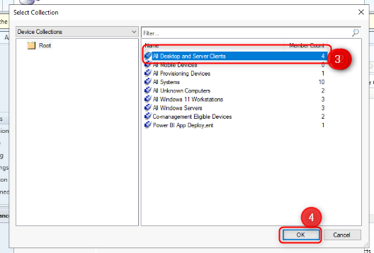
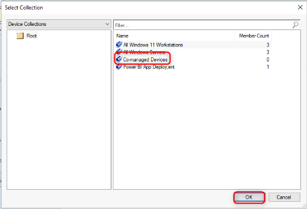
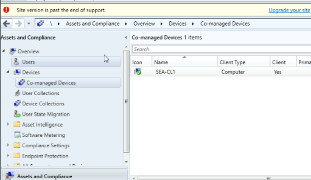
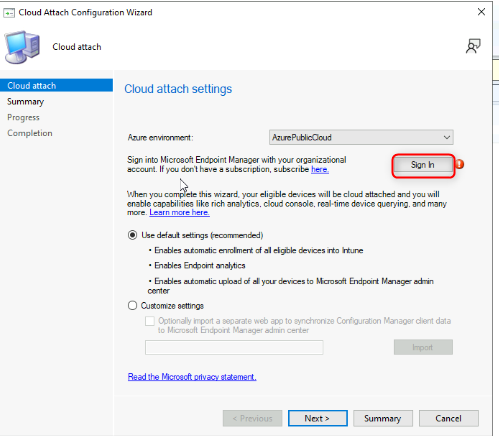
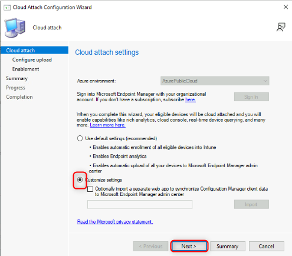
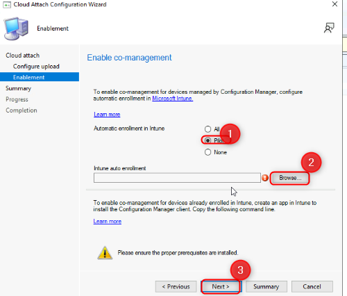
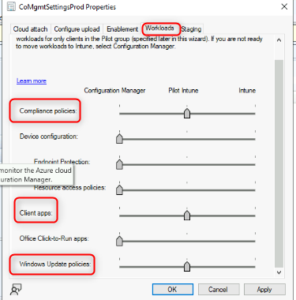
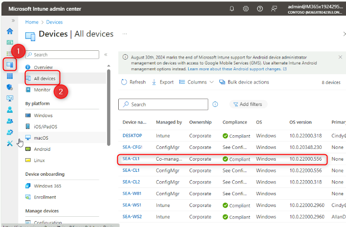

Atelier 22 : Configuration de Cloud Attach et de la cogestion à l'aide
de Configuration Manager

**Résumé**

Dans cet atelier, vous allez activer Cloud Attach et configurer la
cogestion à l'aide de Microsoft Endpoint Configuration Manager et de
Microsoft Intune.

**Conditions préalables**

Le(s) Ateliers suivant(s) doit(vent) être complété(s) avant cet atelier:

- Atelier 01-Gestion des identités dans Microsoft Entra ID

- Atelier 02 : synchronisation des identités à l'aide d'Azure AD Connect

- Atelier 03 : Configuration et gestion de la jonction Microsoft Entra
  ID

- Atelier 05 : Gérer l'inscription de l'appareil dans Intune

**Scénario**

Contoso dispose à la fois d'une implémentation de Microsoft Endpoint
Configuration Manager et de Microsoft Intune. Vous devez configurer
l'intégration entre les deux services et activer la cogestion pour vos
appareils Windows gérés. Vous allez activer Cloud Attach, configurer la
cogestion, puis valider les paramètres à l'aide de SEA-CL1.

Tâche 1 : Préparer l'environnement

1.  Basculez vers [***SEA-SVR1***](urn:gd:lg:a:select-vm) et
    connectez-vous en tant que
    [**Contoso\Administrator**](urn:gd:lg:a:send-vm-keys) avec le mot de
    passe de !\ !! .

2.  Dans le Gestionnaire de serveur, sélectionnez **Tools**, puis
    sélectionnez **Active Directory Users and Computers**.

> 

3.  Dans le volet de navigation, sélectionnez **Clients Seattle**.

> 

4.  Cliquez avec le bouton droit de la souris sur **SEA-CL1,** puis
    sélectionnez **Move**.

> 

5.  Dans la boîte de dialogue **Move**, sélectionnez **Entra client**,
    puis **OK.**

> 

6.  Fermez **Active Directory Users and Computers**.

7.  Dans la barre des tâches, cliquez avec le bouton droit sur **Strat**
    et sélectionnez **Windows Powershell (Admin).**

> 

8.  Dans la fenêtre **Windows PowerShell**, tapez la commande suivante,
    puis appuyez sur **Enter**:

> !! Start-ADSyncSyncCycle -PolicyType **Initial** !!
>
> 

9.  Fermez la fenêtre PowerShell.

10. Passez à [***SEA-CL1***](urn:gd:lg:a:select-vm).

11. Dans la barre des tâches, cliquez avec le bouton droit sur
    **Start**, sélectionnez **Shut down or sign out** , puis
    sélectionnez **Restart**.

> 
>
> **Remarque** : Le redémarrage déclenche la jonction Azure AD hybride
> sur SEA-CL1.

12. Une fois [***SEA-CL1***](urn:gd:lg:a:select-vm) redémarré,
    connectez-vous en tant que
    [**Contoso\Administrator**](urn:gd:lg:a:send-vm-keys) avec le mot de
    passe [**Pa55w.rd**](urn:gd:lg:a:send-vm-keys).

13. Dans la barre des tâches, cliquez avec le bouton droit sur **Start**
    et sélectionnez **Windows Terminal (Admin).**

> 

14. Dans la fenêtre **Windows PowerShell**, tapez la commande suivante,
    puis appuyez sur **Enter**:

> !!dsregcmd /**status** !!

15. Dans la sortie sous **Device State**, vérifiez que **AzureAdJoined :
    YES** et **DomainJoined : YES** sont affichés.

> 
>
> **Remarque** : Si l'appareil n'est pas encore joint à Azure AD,
> attendez la fin de la synchronisation Azure AD Connect et redémarrez à
> nouveau SEA-CL1.

16. Fermez toutes les fenêtres sur
    [***SEA-CL1***](urn:gd:lg:a:select-vm).

Tâche 2 : Créer une collection d'appareils

1.  Basculez vers [***SEA-CFG1***](urn:gd:lg:a:select-vm),
    connectez-vous en tant que
    [**Contoso\Administrator**](urn:gd:lg:a:send-vm-keys) avec le mot de
    passe [**Pa55w.rd**](urn:gd:lg:a:send-vm-keys).

2.  Dans la barre des tâches, sélectionnez **Configuration Manager
    Console**. La console Microsoft Endpoint Configuration Manager
    s'ouvre.

> 

3.  Dans l'espace de travail **Assets and Compliance** , sélectionnez
    **Device Collections**

4.  Cliquez avec le bouton droit sur **Device Collections**, puis
    sélectionnez **Create Device Collection**. L'Assistant Création
    d'une collection de périphériques s'ouvre.

> 

5.  Sur la page **Gneral**, configurez les éléments suivants, puis
    sélectionnez **Next** :

    - Nom:!\!!

    - Limitation de la collecte : **All Desktop and Server Clients**

> 
>
> 
>
> 

6.  Sur la page **Membership Rules** , sélectionnez **Next**.

> 

7.  Dans l'avertissement du Gestionnaire de configuration, sélectionnez
    **OK.** Vous ajouterez un membre direct à une étape ultérieure.

> 

8.  Sur la page **Résumé**, sélectionnez **Next**, puis sur la page
    **Completion**, sélectionnez **Close**.

> 
>
> 

Tâche 3 : Attribuer un appareil à une collection existante

1.  Dans l'espace de **Assets and Compliance** ,sélectionnez
    **Devices**.

> Prenez note des appareils répertoriés. Tous les appareils qui ont un
> cercle vert avec une coche blanche sont actuellement actifs.

2.  Dans le volet d'informations, sélectionnez **SEA-CL1**.

3.  Cliquez avec le bouton droit sur **SEA-CL1**, pointez sur **Add
    Selected Items**, puis sélectionnez **Add Selected Items to Existing
    Device Collection**..

> 

4.  Dans la boîte de **Select Collection**  une collection**, Co-managed
    Devices**, puis **OK.**

> 

5.  Pour vérifier, dans l'espace de travail **Assets and Compliance** 
    sélectionnez **devices collection**, puis double-cliquez sur
    **Co-managed Devices**.

> 
>
> 
>
> **SEA-CL1** devrait être répertorié comme membre de cette collection.

Tâche 4 : Cloud attach Endpoint Configuration Manage

1.  Dans la console Microsoft Endpoint Configuration Manager,
    sélectionnez l'espace de travail **Administration**.

> 

2.  Dans l'espace de travail **Administration**, développez **Cloud
    Services**, puis sélectionnez **Cloud Attach**.

> 

3.  Dans le ruban, sélectionnez **Configure Cloud Attach**. L**e Cloud
    Attach Configuration Wizard**.

> 
>
> 

4.  Dans le **Cloud Attach Configuration Wizard**, sur la page **cloud
    attach**, sélectionnez **Sign in** .

5.  Connectez-vous en tant que
    [**admin@M365x19242953.onmicrosoft.com**](urn:gd:lg:a:send-vm-keys)
    avec le mot de passe [**9whL~ ;
    H8ke=D1^95 %D**](urn:gd:lg:a:send-vm-keys).

6.  Sur la page **cloud attach**, sélectionnez **Personnaliser les
    paramètres**, puis Suivant.

> 

7.  Dans l' avertissement **Create AAD Application** , sélectionnez
    **Yes**.

> 

8.  Sur la page **configure upload**  acceptez la valeur par défaut et
    sélectionnez **Next**.

> 

9.  Sur la page **Activation**, à côté de **Inscription automatique dans
    Intune**, sélectionnez **Pilot**.

10. Dans la **Enablement**, en regard de **Intune Auto Enrollment**,
    sélectionnez **Browse**.

> 

11. Dans la boîte de dialogue **Select collection, Co-managed
    Devices** , puis **OK.** Sélectionnez **Next**.

> 

12. Sur la page **Résumé**, sélectionnez **Next**, puis sur la page
    **completion**, sélectionnez **close**.

> 

Tâche 5 : Configurer les charges de travail

1.  Dans la console Microsoft Endpoint Configuration Manager,
    sélectionnez l'espace de travail **Administration**.

2.  Dans l'espace de travail **Administration**, développez **Cloud
    services**, puis sélectionnez **Cloud attach**.

3.  Dans le volet d'informations, sélectionnez **CoMgmtSettingsProd,**
    puis dans le ruban, sélectionnez **Properties**.

> 
>
> La boîte de dialogue **CoMgmtSettingsProd Properties**  s'ouvre.

4.  Sélectionnez **Workloads**. Dans la page **workloads** faites
    glisser le curseur vers **Pilot Intune** pour les charges de travail
    suivantes :

    - **Compliance policies**

    - **Client apps**

    - **Windows Update policies**

> 

5.  Sélectionnez la **Staging page**. Dans la page **Staging**,
    sélectionnez **Browse** en regard de **Compliance
    policies**, **Client Apps**, et **Windows Update Policies,** puis
    sélectionnez le **Co-managed Devices** pour chaque charge de
    travail.

6.  Sélectionnez **OK** pour fermer la boîte de dialogue
    **CoMgmtSettingsProd Properties**.

> 

Tâche 6 : Valider que SEA-CL1 est cogéré

1.  Passez à [***SEA-SVR1***](urn:gd:lg:a:select-vm).

2.  Dans la barre des tâches, sélectionnez **Microsoft Edge**, dans la
    barre d'adresse, tapez
    [**https://entra.microsoft.com**](https://entra.microsoft.com), puis
    appuyez sur **Enter**.

3.  Connectez-vous en tant qu'utilisateur
    [**admin@M365x19242953.onmicrosoft.com**](urn:gd:lg:a:send-vm-keys)
    et utilisez le mot de passe.

4.  Si le **Stay signed in?** **?** s'affiche, sélectionnez **No**.

> Le centre d'administration Microsoft Entra s'ouvre.

5.  Dans le Microsoft Entra admin center, dans le volet de navigation,
    sélectionnez **Identity.**

> 

6.  Dans la section **Devices|All devices** ,vérifiez que **SEA-CL1**
    est répertorié et que **le type de jonction** est **Microsoft Entr
    hybrid Join**.

> 

7.  Dans Microsoft Edge, ouvrez un autre onglet et tapez
    [**https://intune.microsoft.com**](https://intune.microsoft.com)
    dans la barre d'adresse, puis appuyez sur **Enter**.

8.  Dans le volet de navigation, sélectionnez **Devices**, puis Tous
    **All devices**.

9.  Vérifiez que **SEA-CL1** est répertorié avec le paramètre **Managed
    by** défini sur **Managed**.

> 
>
> Il peut s'écouler un certain temps avant qu'il ne se manifeste.
> Actualisez le volet de détails si nécessaire. La machine peut
> apparaître sous un nom différent, cliquez sur l'appareil pour
> confirmer qu'il indique **SEA-CL1**.

10. Sélectionnez **SEA-CL1** et, dans le volet d'informations, faites
    défiler l'écran vers le bas pour afficher les informations relatives
    à l'état de cogestion.

11. Fermez Microsoft Edge.

**Résultats** : Une fois cet exercice terminé, vous aurez activé Cloud
Attach et configuré la cogestion à l'aide de Microsoft Endpoint
Configuration Manager et de Microsoft Intune.
