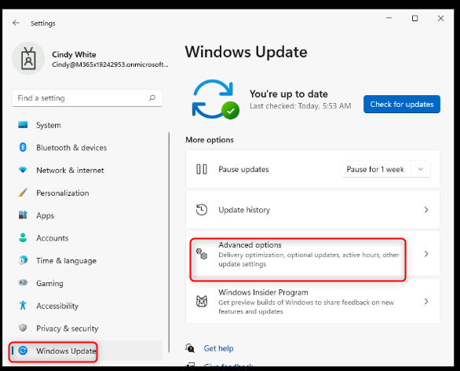
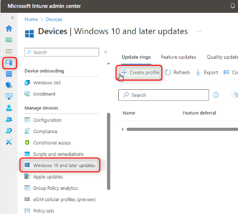
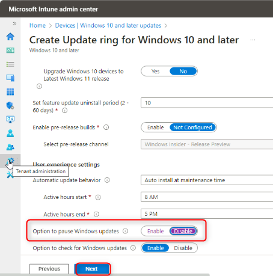
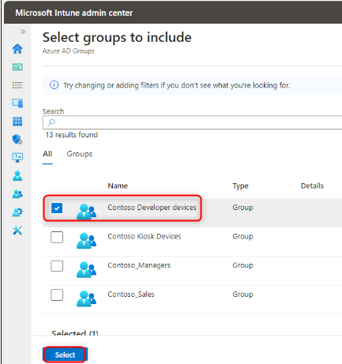
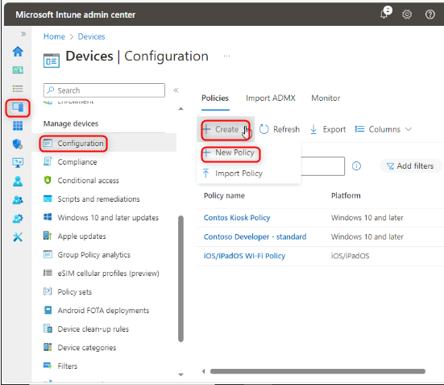
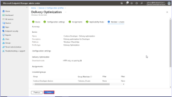

ラボ 23: Windows の品質と機能の更新の管理

**要約**

このラボでは、Intune を使用して Windows
の品質と機能の更新の設定を構成します。

**前提条件**

このラボの前に、次のラボを完了する必要があります:

- ラボ 01 - Intune へのデバイス登録の管理

- ラボ 06 - Intune へのデバイスの登録

- ラボ 07-構成プロファイルの作成とデプロイ

**シナリオ**

Contoso Developer Devices
グループのメンバーであるデバイスのみに更新リングを適用するように構成するよう求められています。このグループは、以下の要件を満たしている必要があります：

- 品質更新プログラムの延期期間 (日数): **15**

- 機能更新プログラムの延期期間 (日数): **45**

- Windowsの更新プログラムを一時停止するオプション:**無効**

- Windows の更新プログラムを確認するオプション: **有効**

- 配信の最適化: ダウンロード モード: **HTTP のみ、ピアリングなし (0)**

タスク 1: 1 つのデバイスの現在の更新設定を確認する

1.  [***SEA-WS1***](urn:gd:lg:a:select-vm),に切り替えて、PIN [**102938**](urn:gd:lg:a:select-vm)を使用し、**Cindy
    White**としてサインインする。

2.  **Start**を選択してから**Settings**アイコンを選択する。

> 

3.  **Settings**に**Windows Update**を選択する。

> 特定の時間だけ更新を一時停止するオプションがあることに注意する。

4.  **Windows UpdateページでAdvanced options**を選択する。

> 

5.  **Advanced optionsページでDelivery Optimization**を選択する。

> 

6.  **Delivery Optimizationページで** **Allow downloads from other
    PCs**オプションが有効であることを確認する。

7.  **Devices on the internet and my local network**を選択する。

> 

8.  **SettingsにWindows Update**を選択する。

> 

9.  **Advanced options**を選択してから**Configured update
    policies**を選択する。

> 
>
> デバイスに更新ポリシーが設定されていないことに注意する
>
> 

10. ナビゲーションウィンドウで**Windows Update**を選択する。

タスク 2: 適用された設定を確認する

1.  **Windows UpdateページでUpdate history**を選択する。

> 

2.  リストされたアップデートをレビューしてから**Uninstall
    updates**を選択する。

> 

3.  **Installed
    Updatesにリストされたアップデートをレビューする。**Installed
    Updatesを閉じる。

> 

4.  **Settings**を閉じる

タスク 3: Intuneを使用してアップデートの設定を構成する。

1.  [***SEA-SVR1***](urn:gd:lg:a:send-vm-keys) に切り替えて、 [**Contoso\Administrator**](urn:gd:lg:a:send-vm-keys) としてサインインし、[**Pa55w.rd**](urn:gd:lg:a:send-vm-keys)パスワードを使用する。

2.  タスクバーで**Microsoft Edge**を選択する。

3.  Microsoft
    Edgeにアドレスバーに[**https://intune.microsoft.com**](urn:gd:lg:a:send-vm-keys) を入力してから**Enter**ボタンを押す。

4.   [**admin@M365x19242953.onmicrosoft.com**](urn:gd:lg:a:send-vm-keys) として、パスワードを使用し、サインインする。

5.  ナビゲーションウィンドウで**Devicesを選択してからWindows 10 and
    later Updates**を選択する。

> 

6.  **Devices | Update rings for Windows 10 and
    later**ブレードで**Create profile**を選択する。

> 

7.  **Basicsブレードで次の情報を入力してからNext**を選択する：

    - Name: !\!!

    - Description: !\!!

> 

8.  **Update ring
    settingsブレードで次の情報を入力してから** **Next**を選択する：

    - Quality update deferral period
      (days): [**15**](urn:gd:lg:a:send-vm-keys)

    - Feature update deferral period
      (days): [**45**](urn:gd:lg:a:send-vm-keys)

    - Option to pause Windows updates: **Disable**

    - Option to check for Windows updates: **Enable**

> 

9.  **Assignments**ブレードで**Included groups**の下に**Add
    groups**を選択する。

10. **Select groups to include**ブレードで **Search**ボックスに**Contoso
    Developer devices**を選択してから**Select**を選択する。

> 
>
> 

11. **Next**を選択してから**Review +
    create**ブレードで**Create**を選択する。

12. ナビゲーションバーから**Configuration profiles**を選択する。

13. **Devices | Configuration**ブレードで、詳細のペインに**Create
    policy**を選択する。

> 

14. **Create a
    profile**ブレードで次のオプションを選択してから**Create**を選択する：

    - Platform: **Windows 10 and later**

    - Profile type: **Templates**

    - Template name: **Delivery Optimization**

> 

15. **Basics**ブレードで次の情報を入力してから**Next**を選択する：

    - Name: !\!!

    - Description: !\!!

> 

16. **Configuration
    settings**ブレードに次の情報を入力してから**Next**を選択する。

    - Download Mode: **HTTP only, no peering (0)**

> 

17. **Assignments**ブレードに**Included groups**の下に**Add
    groups**を選択する。

18. **Select groups to include**ブレードに**Contoso Developer
    devices**を選択してから**Select**を選択する。

> 
>
> 

19. **Next**を2回せんたくし**、Review +
    create**ブレードで**Create**を選択する。

> 

タスク 4: デバイスの更新設定が一元的に管理されていることを確認する

1.  [***SEA-WS1***](https://intune.microsoft.com)に切り替える。

2.  **Start**を選択してから**Settings**アイコンを選択する**。**

> 

3.  **Settings**アプリに**Accounts**を選択してから **Access work or
    school**を選択する。

> 

4.  **Access work or school**セクションに**Connected to Contoso's Azure
    AD**リンクを選択してから**Info**を選択する。

> 

1.  **Areas Managed by
    Contoso**ダイアログボックスに**Sync**を選択する**。**
    同期が完了するまで待つ。

> 

5.  **SettingsアプリにWindows Update**を選択する。

> 更新を一時停止できないことに注意する。

6.  **Advanced options**を選択する。

> 

7.  **Delivery Optimization**を選択する。

> 
>
> **Allow downloads from other PCs** は利用可能ではないことに注意する。

8.  **Settings**アプリに**Windows Update**を選択して、**Advanced
    options**を選択してから、**Configured update
    policies**を選択する**。**

> 
>
> デバイスに設定されているすべてのポリシーを注意する。

9.  開いているすべてのアプリとウィンドウを閉じます。

> **注**:
> ラボ環境は、ラボ中の遅延や意図しない影響を避けるために、Windows
> 更新プログラムが適用されないように構成されています.
