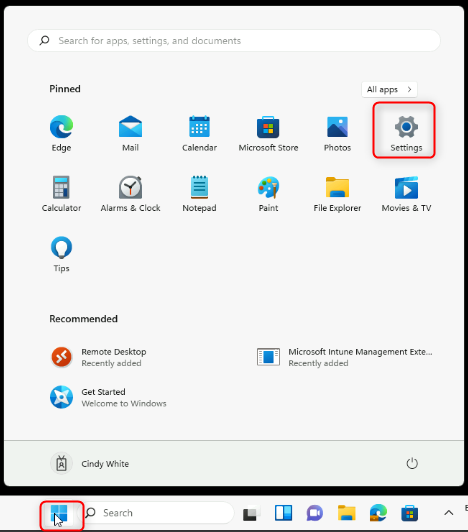
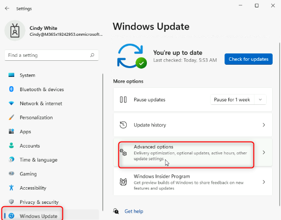

Atelier 23 : Gestion de la qualité de Windows et des mises à jour des
fonctionnalités

**Résumé**

Dans cet atelier, vous allez configurer les paramètres de qualité et de
mise à jour des fonctionnalités Windows à l'aide d'Intune.

**Conditions préalables**

Ateliers suivant(s) doit(vent) être complété(s) avant cet atelier:

- Atelier 01 : Gérer l'inscription d'un appareil dans Intune

- Atelier 06 : Inscription d'appareils dans Intune

- Atelier 07 : création et déploiement de profils de configuration

**Remarque** : Vous aurez également besoin d'un téléphone mobile capable
de recevoir des SMS utilisés pour sécuriser l'authentification de
connexion Windows Hello à Azure AD.

**Scénario**

Vous avez été invité à configurer un anneau de mise à jour pour
n'affecter que les appareils membres du groupe Appareils de
développement Contoso. Ce groupe doit répondre aux exigences suivantes :

- Période de report de la mise à jour de la qualité (jours) : **15**

- Période de report de la mise à jour des fonctionnalités (jours) :
  **45**

- Option pour suspendre les mises à jour Windows : **Disable**

- Option pour vérifier les mises à jour Windows : **Enable**

- Optimisation de la diffusion : Mode de téléchargement : **HTTP only,
  no peering (0)**

Tâche 1 : Vérifier les paramètres de mise à jour actuels d'un seul
appareil

1.  Passez à [***SEA-WS1***](urn:gd:lg:a:select-vm), connectez-vous en
    tant que **Cindy White** avec le code PIN
    [**102938**](urn:gd:lg:a:select-vm).

2.  Sélectionnez **Start**, puis sélectionnez l' icône **Setting**.

> 

3.  Dans **Devices**, sélectionnez **Windows Update**.

> Notez que vous avez la possibilité de suspendre les mises à jour
> pendant une durée spécifique.

4.  Sur la page **Windows Update**, sélectionnez **Advanced options**

> 

5.  Sur la page **Advanced options**, sélectionnez **Delivery
    Optimization**.

> 

6.  Sur la page **Delivery Optimization** , vérifiez que l' option
    **Allow downloads from other PCs** est activée.

7.  Sélectionnez **Devices on the internet and my local network**.

> 

8.  Dans **Devices**, sélectionnez **Windows Update**.

> 

9.  Sélectionnez **Advanced Options** , puis Sélectionnez **Configured
    update policies**

> 
>
> Notez qu'aucune politique de mise à jour n'est définie sur l'appareil.
>
> 

10. Dans le volet de navigation, sélectionnez **Windows Update**.

Tâche 2 : Examiner les paramètres appliqués

1.  Sur la page **Windows Update**, sélectionnez  **Update history**.

> 

2.  Passez en revue les mises à jour répertoriées, puis sélectionnez
    **Uninstall updates**.

> 

3.  Passez en revue les mises à jour répertoriées dans la section
    **Installed Updates**. Fermez les mises à jour installées.

> 

4.  Fermez l' app **Settings**.

Tâche 3 : Configurer les paramètres de mise à jour à l'aide d'Intune

1.  Basculez vers [***SEA-SVR1***](urn:gd:lg:a:send-vm-keys) et
    connectez-vous en tant que
    [**Contoso\Administrator**](urn:gd:lg:a:send-vm-keys) avec le mot de
    passe [**Pa55w.rd**](urn:gd:lg:a:send-vm-keys).

2.  Dans la barre des tâches, sélectionnez **Microsoft Edge**.

3.  Dans Microsoft Edge, tapez
    [**https://intune.microsoft.com**](urn:gd:lg:a:send-vm-keys) dans la
    barre d'adresse, puis appuyez sur **Enter**.

4.  Connectez-vous en tant que
    [**admin@M365x19242953.onmicrosoft.com**](urn:gd:lg:a:send-vm-keys)
    avec le mot de passe.

5.  Dans le volet de navigation, sélectionnez **Devices**, puis
    sélectionnez Mises **à Windows 10 and later Updates**

> 

6.  Sur les **Devices | Update rings for Windows 10 and later** 
    Sélectionnez **Create profile**.

> 

7.  Dans le panneau de **basics**, entrez les informations suivantes,
    puis sélectionnez **Next** :

    - Nom: !\!!

    - Description: !\!!

> 

8.  Dans le panneau **Update ring settings**, entrez les informations
    suivantes, puis sélectionnez **Next** :

    - Période de report de la mise à jour de la qualité (jours) :
      [**15**](urn:gd:lg:a:send-vm-keys)

    - Période de report de la mise à jour des fonctionnalités (jours) :
      [**45**](urn:gd:lg:a:send-vm-keys)

    - Option pour suspendre les mises à jour Windows : **Disable**

    - Option pour vérifier les mises à jour Windows : **Enable**

> 

9.  Dans le panneau  **Assignments** sous **Included groups** **,**
    sélectionnez **Add groups**.

10. Dans le panneau **Select groups to include**  dans la zone
    Rechercher, sélectionnez **Contoso Developer devices** **,** puis
    sélectionnez **Select.**

> 
>
> 

11. Sélectionnez **Next** et, dans le panneau **Review + create** 
    sélectionnez **Create**

12. Dans la barre de navigation, sélectionnez **Configuration
    profiles**..

13. Sur les **Devices | Configuration** , dans le volet de détails,
    sélectionnez **Create policy**..

> 

14. Dans le panneau **Create a profile** sélectionnez les options
    suivantes, puis sélectionnez **Create** :

    - Plate-forme : **Windows 10 et versions ultérieures**

    - Type de profil : **Modèles**

    - Nom du modèle : **Optimisation de la livraison**

> 

15. Dans le panneau **basics**, entrez les informations suivantes, puis
    sélectionnez **Next** :

    - Name: !\!!

    - Description: !\!!

> 

16. Dans le panneau **Configuration settings** , entrez les informations
    suivantes, puis sélectionnez **Next** :

    - Mode de téléchargement : **HTTP only, no peering (0)**

> 

17. Dans le panneau **Assignments** , sous **Included groups** **,**
    sélectionnez **Add groups**.

18. Dans le panneau **Select groups to include**, sélectionnez **Contoso
    Developer devices** , puis sélectionnez **Select**.

> 
>
> 

19. Sélectionnez **Next** deux fois, puis dans le panneau **Review +
    create** , sélectionnez **Create**.

> 

Tâche 4 : Vérifier que les paramètres de mise à jour de l'appareil sont
gérés de manière centralisée

1.  Passez à [***SEA-WS1***](https://intune.microsoft.com).

2.  Sélectionnez **Start**, puis sélectionnez l' icône **Settings**.

> 

3.  Dans l' app **Settings**, sélectionnez **Accounts**, puis
    sélectionnez **Access work or school**.

> 

4.  Dans la section **Access work or school** , sélectionnez le lien
    **Connected to Contoso's Azure AD** , puis sélectionnez **Infos**.

> 

5.  Dans la boîte de dialogue **Areas Managed by Contoso** ,
    sélectionnez **Sync**. Attendez la fin de la synchronisation.

> 

6.  Dans l' app **Setting**, sélectionnez **Windows Update**.

> Notez que vous ne pouvez pas suspendre les mises à jour.

7.  Sélectionnez **Advanced Options** .

> 

8.  Sélectionnez **Delivery Optimization.**

> 
>
> Notez que **l'option Autoriser les téléchargements à partir d'autres
> PC n'**est pas disponible.

9.  Dans l' app **Settings**, sélectionnez **Windows Update**, ,
    **Advanced options** puis sélectionnez **Configured update
    policies**..

> 
>
> Prenez note de toutes les règles définies sur l'appareil.

10. Fermez toutes les applications et fenêtres ouvertes.

> **Remarque** : L'environnement de labo est configuré pour empêcher
> l'application des mises à jour Windows afin d'éviter les retards et
> les impacts involontaires pendant les Ateliers.
