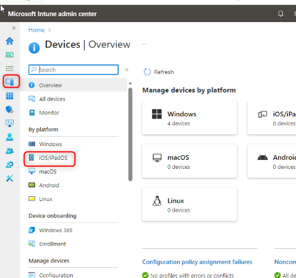

Laboratório Prático 24: Gerenciando Políticas de Atualização para iOS e
iPadOS

**Resumo**

Neste laboratório, você configurará uma política de atualização a ser
usada para gerenciar atualizações do sistema operacional para iOS e
iPadOS.

**Cenário**

Todos os desenvolvedores da Contoso possuem iPhones e iPads com as
versões mais recentes do iOS/iPadOS. Você registrou esses dispositivos
por meio do Registro Automatizado de Dispositivos da Apple e precisa
configurar uma política de atualização para o OS do dispositivo. Você
precisa garantir o seguinte:

- Versão para instalar: Última atualização.

- Permita que atualizações automáticas ocorram somente entre
  quarta-feira, às 00h, e quinta-feira, às 00h.

Tarefa 1: Criar uma política de atualização para dispositivos iOS/iPadOS

1.  Em [***SEA-SVR1***](urn:gd:lg:a:select-vm), se necessário, entre
    como
    [**[Contoso\Administrator](urn:gd:lg:a:send-vm-keys)**](urn:gd:lg:a:send-vm-keys)
    com a senha [**Pa55w.rd**](urn:gd:lg:a:send-vm-keys) e feche o
    **Server Manager**.

2.  Na barra de tarefas, selecione **Microsoft Edge.**

3.  No Microsoft Edge, digite
    [**https://intune.microsoft.com**](https://intune.microsoft.com) na
    barra de endereço e pressione **Enter.**

4.  Entre como
    [**admin@M365x19242953.onmicrosoft.com**](urn:gd:lg:a:send-vm-keys)
    com a senha.

5.  Na página do **Microsoft Intune admin center**, selecione
    **Devices**.

6.  No painel **Devices|By platform**, em **Policy**, selecione
    **iOS/iPadOS.**

> 

7.  Selecione **Update Policies for iOS/iPadOS**

> 

8.  No painel de detalhes, selecione **Create profile**.

9.  Na aba **Basics**, configure as seguintes opções e selecione
    **Next**:

    - Name: !\!!

    - Description: !\!!

> 

10. Na aba **Update policy settings**, configure as seguintes opções e
    selecione **Next**:

    - Select version to install: **Latest update**

    - Schedule type: **Update during scheduled time**

    - Time zone: **UTC:00**

    - Time window:

    - Start day: **Wednesday**

      - Start time: **12 AM**

      - End day: **Thursday**

      - End time: **12 AM**

> 

11. Na aba **Assignments**, selecione **Next**.

> 

12. Na aba **Review + create**, revise as configurações e selecione
    **Create**.

13. No painel **Devices | Update policies for iOS/iPadOS**, no painel de
    detalhes, verifique se a **iOS/iPadOS update policy** está listada.

> 

14. Feche o Microsoft Edge.

**Resultados:** Após concluir este exercício, você terá configurado com
sucesso uma política de atualização para iOS e iPadOS.
