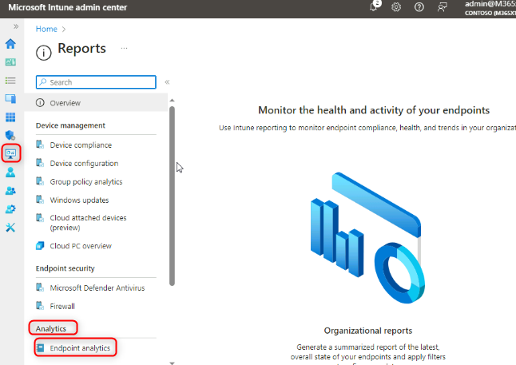

# Atelier 25 : Surveillance des performances des appareils et de l'expérience utilisateur avec Endpoint Analytics

**Résumé**

Dans cet atelier, vous allez activer Endpoint Analytics pour surveiller
les performances de l'appareil et les scores et informations sur
l'expérience utilisateur.

**Conditions préalables**

Le(s) Ateliers suivant(s) doit(vent) être complété(s) avant cet atelier:

- Atelier 05 : Gérer l'inscription de l'appareil dans Intune

- Atelier 06 : Inscription d'appareils dans Intune

- Atelier 07 : création et déploiement de profils de configuration

**Scénario**

Il vous a été demandé de surveiller les performances de démarrage, la
fiabilité des applications et l'expérience utilisateur à quelle
fréquence les utilisateurs redémarrent leurs appareils. Pour obtenir ces
informations, vous devez activer Endpoint Analytics.

### Tâche 1 : Activer Endpoint analytics

1.  Sur [**SEA-SVR1**](urn:gd:lg:a:select-vm), si nécessaire,
    connectez-vous en tant que
    [**Contoso\Administrator**](urn:gd:lg:a:send-vm-keys) avec le mot de
    passe !\ !! et fermez le
    **Server Manager**.

2.  Dans la barre des tâches, sélectionnez **Microsoft Edge**.

3.  Dans Microsoft Edge, tapez
    !\ !! dans
    la barre d'adresse, puis appuyez sur **Enter**.

4.  Connectez-vous en tant que
    [**admin@M365x19242953.onmicrosoft.com**](urn:gd:lg:a:send-vm-keys)
    avec le mot de passe.

5.  Dans la page **Microsoft Intune admin center** , sélectionnez
    **Reports**.

6.  Dans le panneau **Reports**, sous **Analytics**, sélectionnez
    **Endpoint analytics**.

> 

7.  Sur la page **Endpoint analytics** , assurez-vous que **l'**option
    **Collect device data from**  est définie sur **All cloud-managed
    devices**, puis sélectionnez **Start**.

> 
>
> Prenez note du message en haut de la page Vue d'ensemble. L'affichage
> des scores et des informations sur la page peut prendre jusqu'à 24
> heures.
>
> 

8.  Passez à [**SEA-WS1**](urn:gd:lg:a:select-vm) et redémarrez
    l'appareil.

9.  Connectez-vous en tant que **Cindy White** avec le mot de passe :
    [**102938**](urn:gd:lg:a:send-vm-keys).

10. Passez à [**SEA-SVR1**](urn:gd:lg:a:select-vm).

11. Sur la page du **Microsoft Intune admin center** , sélectionnez
    **Devices**, puis électionnez **All devices**.

12. Sélectionnez **SEA-WS1**.

> 

13. Sur la page **SEA-WS1**, sélectionnez **Sync**, puis **Yes**.

> 

14. Sur la page **SEA-WS1**, sous **Monitor**, sélectionnez **User
    Experience** . 

15. Consultez les onglets **Endpoint analytics**, **Startup
    performance**, et **Application reliability** 

> 
>
> 
>
> 
>
> Il se peut qu'aucune information ne soit signalée en raison du délai,
> mais lisez les détails sur ce qui sera visible sur chaque onglet.

16. Dans la page **Microsoft Intune admin center** , sélectionnez
    **Reports**.

17. Dans le panneau **Reports**, sous **Analyses**, sélectionnez
    **Endpoint analytics**

> 
>
> Notez que le même type d'informations est disponible dans Endpoint
> Analytics, mais que ces informations sont basées sur tous les
> appareils inscrits.
>
> 

18. Parcourez les rapports disponibles sur la page Endpoint analytics.

19. Fermez Microsoft Edge.

**Résultats** : Une fois cet exercice terminé, vous aurez activé
Endpoint Analytics pour surveiller les performances de l'appareil et les
scores et informations sur l'expérience utilisateur.
