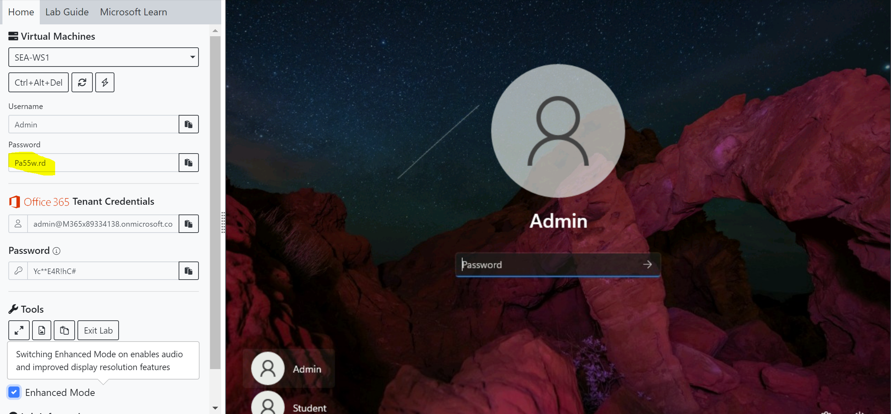
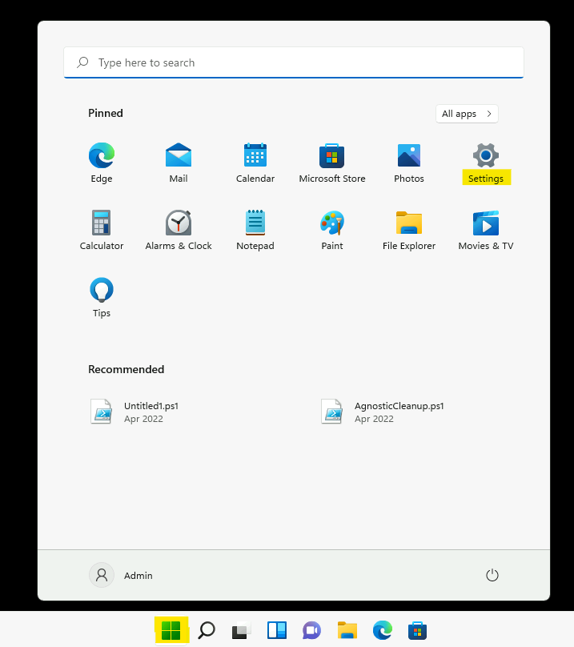
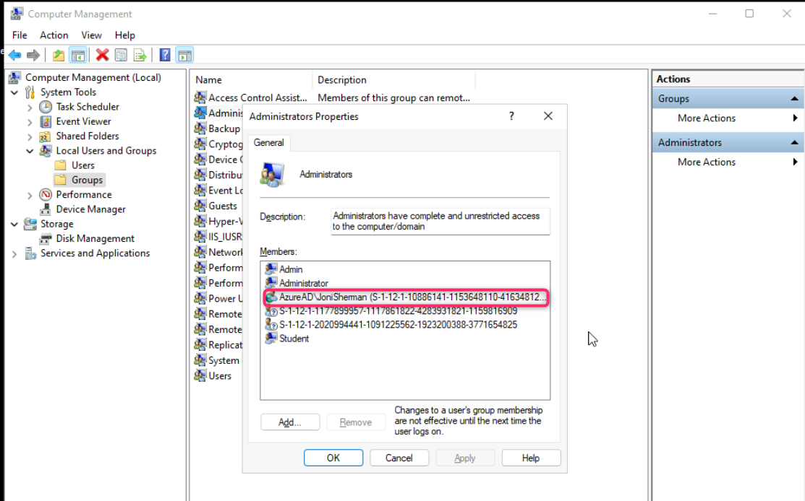
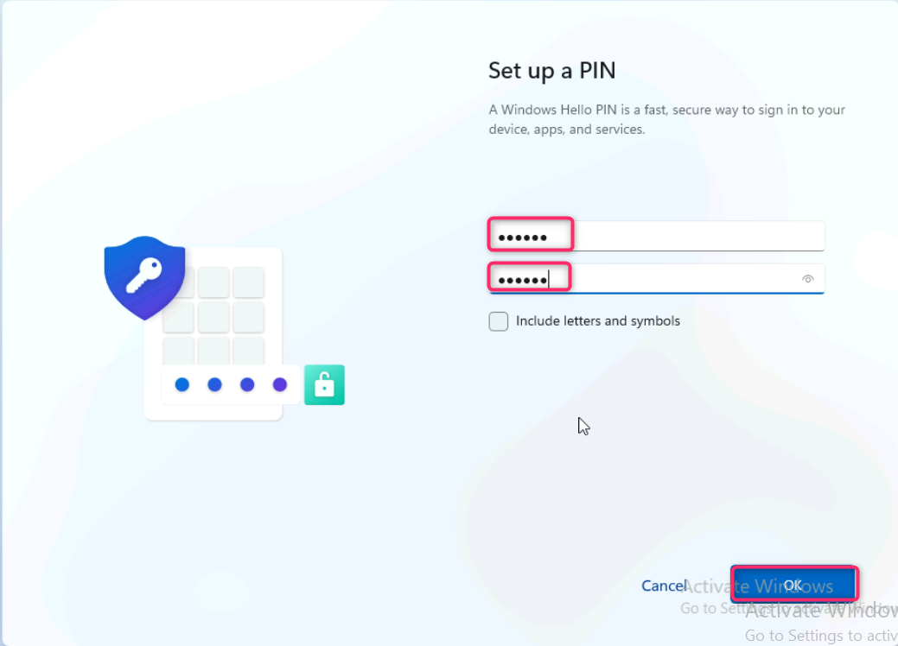
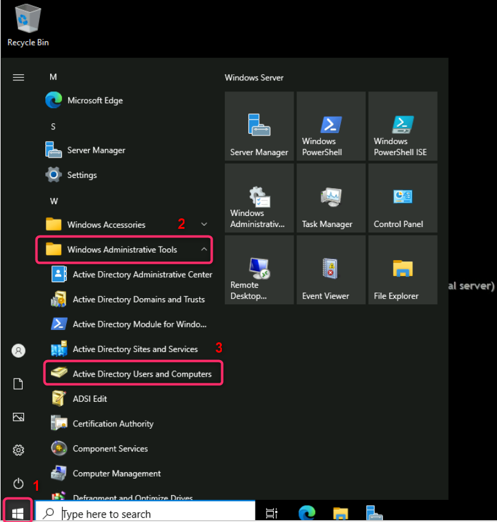
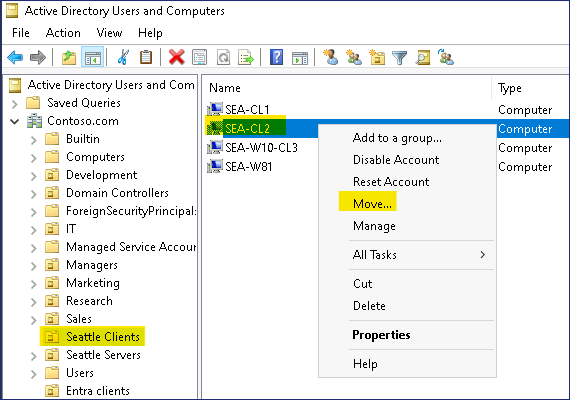
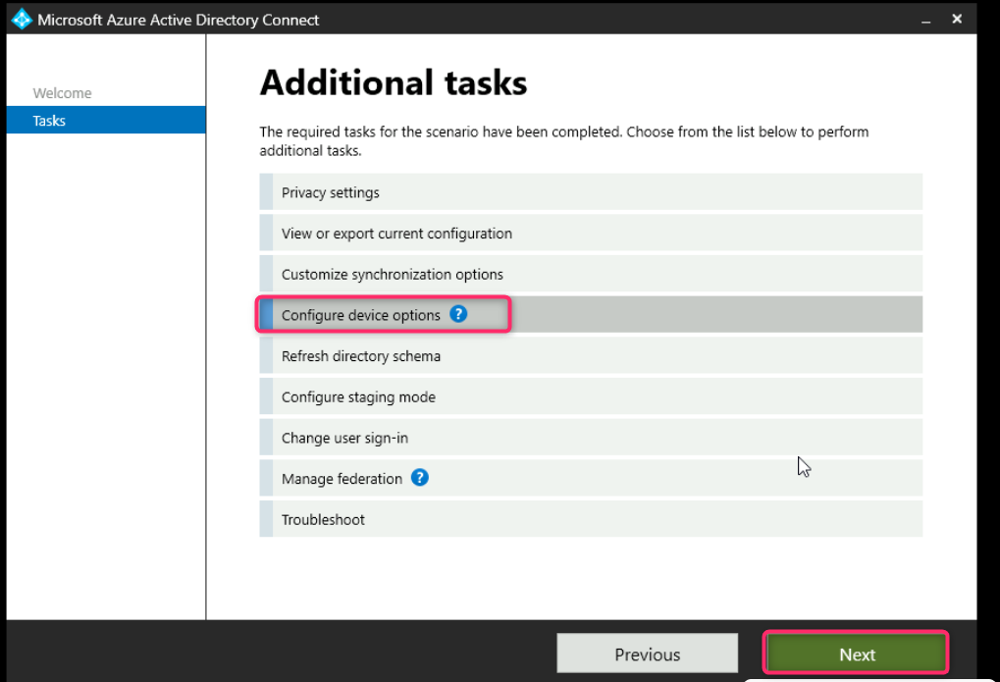
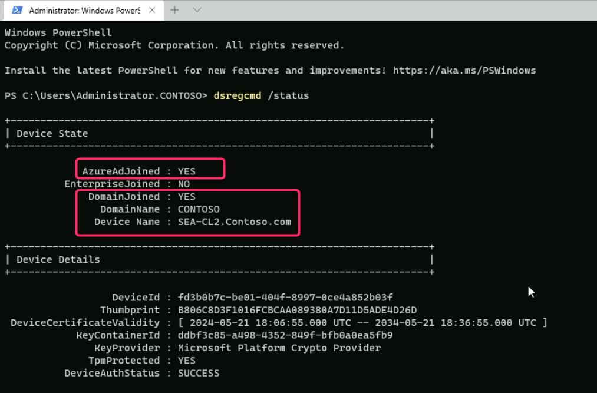

实验 03：配置和管理 Microsoft Entra ID Join

**总结**

在本实验中，您将配置 Microsoft Entra ID 加入设置，并为 Windows
设备执行标准和 Microsoft Entra 混合加入方案。

**先决条件**

在此实验之前，必须完成以下实验：

- 实验 \#2：使用 Microsoft Entra Connect 同步标识

**注意：**您还需要一部可以接收短信的移动电话，该短信用于保护 Windows
Hello 登录对 Entra ID 的身份验证。

**练习 1：配置 Microsoft Entra Join**

**场景**

您需要配置 Entra ID 设备设置，以确保允许所有用户将设备加入 Entra
ID。您还需要确保用户最多只能加入 20 台设备，并且 Allan Deyoung
已添加为所有已加入 Microsoft Entra 的设备的本地管理员。最后，您将通过让
Joni Sherman 将 SEA-WS1 加入租户来验证 Microsoft Entra Join
是否按预期工作。

## 任务 0：使用 PowerShell 脚本启用 TLS 1.2。

1.  在 SEA-WS1 上，使用密码 Pa55w.rd 以 Contoso\Administrator 身份登录

2.  在开始菜单上，键入 [**PowerShell**](urn:gd:lg:a:send-vm-keys) ，右键单击
    PowerShell，然后选择以管理员身份运行。

3.  在 PowerShell 上运行以下脚本。

**If** (-Not (Test-Path
'HKLM:\SOFTWARE\WOW6432Node\Microsoft\\NETFramework\v4.0.30319'))

{

New-Item 'HKLM:\SOFTWARE\WOW6432Node\Microsoft\\NETFramework\v4.0.30319'
-Force | Out-Null

}

New-ItemProperty -Path
'HKLM:\SOFTWARE\WOW6432Node\Microsoft\\NETFramework\v4.0.30319' -Name
'SystemDefaultTlsVersions' -Value '1' -PropertyType 'DWord' -Force |
Out-Null

New-ItemProperty -Path
'HKLM:\SOFTWARE\WOW6432Node\Microsoft\\NETFramework\v4.0.30319' -Name
'SchUseStrongCrypto' -Value '1' -PropertyType 'DWord' -Force | Out-Null

**If** (-Not (Test-Path
'HKLM:\SOFTWARE\Microsoft\\NETFramework\v4.0.30319'))

{

New-Item 'HKLM:\SOFTWARE\Microsoft\\NETFramework\v4.0.30319' -Force |
Out-Null

}

New-ItemProperty -Path
'HKLM:\SOFTWARE\Microsoft\\NETFramework\v4.0.30319' -Name
'SystemDefaultTlsVersions' -Value '1' -PropertyType 'DWord' -Force |
Out-Null

New-ItemProperty -Path
'HKLM:\SOFTWARE\Microsoft\\NETFramework\v4.0.30319' -Name
'SchUseStrongCrypto' -Value '1' -PropertyType 'DWord' -Force | Out-Null

**If** (-Not (Test-Path
'HKLM:\SYSTEM\CurrentControlSet\Control\SecurityProviders\SCHANNEL\Protocols\TLS
1.2\Server'))

{

New-Item
'HKLM:\SYSTEM\CurrentControlSet\Control\SecurityProviders\SCHANNEL\Protocols\TLS
1.2\Server' -Force | Out-Null

}

New-ItemProperty -Path
'HKLM:\SYSTEM\CurrentControlSet\Control\SecurityProviders\SCHANNEL\Protocols\TLS
1.2\Server' -Name 'Enabled' -Value '1' -PropertyType 'DWord' -Force |
Out-Null

New-ItemProperty -Path
'HKLM:\SYSTEM\CurrentControlSet\Control\SecurityProviders\SCHANNEL\Protocols\TLS
1.2\Server' -Name 'DisabledByDefault' -Value '0' -PropertyType 'DWord'
-Force | Out-Null

**If** (-Not (Test-Path
'HKLM:\SYSTEM\CurrentControlSet\Control\SecurityProviders\SCHANNEL\Protocols\TLS
1.2\Client'))

{

New-Item
'HKLM:\SYSTEM\CurrentControlSet\Control\SecurityProviders\SCHANNEL\Protocols\TLS
1.2\Client' -Force | Out-Null

}

New-ItemProperty -Path
'HKLM:\SYSTEM\CurrentControlSet\Control\SecurityProviders\SCHANNEL\Protocols\TLS
1.2\Client' -Name 'Enabled' -Value '1' -PropertyType 'DWord' -Force |
Out-Null

New-ItemProperty -Path
'HKLM:\SYSTEM\CurrentControlSet\Control\SecurityProviders\SCHANNEL\Protocols\TLS
1.2\Client' -Name 'DisabledByDefault' -Value '0' -PropertyType 'DWord'
-Force | Out-Null

写-Host 'TLS 1.2 has been enabled. You must restart the Windows Server
for the changes to take affect.' -ForegroundColor Cyan

4.  重新启动 Windows Server VM。

## 任务 1：配置 Microsoft Entra ID 加入设备设置

1.  切换到 **SEA-SVR1**。在 **Microsoft Edge** 浏览器地址栏中，键入以下
    URL：!\!!，然后按
    Enter 按钮。

2.  使用您的 O365 租户 ID
    登录：!!**admin@M365xXXXXXXXX.onmicrosoft.com**!!
    ,并使用租户管理员密码。

3.  在 **Stay signed in?** 对话框中，选择 **Yes** 按钮。

4.  在 **Microsoft Entra admin center**
    窗口中，导航并单击“**Identity**”。

5.  在“**Identity**”部分下，选择“**Devices**”，然后导航并单击“**All
    devices**”，如下图所示。

请注意，由于您尚未加入任何设备，因此未找到任何设备。

6.  在 **Devices**|“所有设备”页上，选择 “**Device settings**”。

7.  在 **Devices | Device settings** 页面的详细信息窗格中的 “**Users may
    join devices to Entra**” 下，验证是否已选择 “**All**”。

这表示允许所有 Entra 用户将 Windows 10 或更高版本的设备加入 Microsoft
Entra。请注意，此设置不适用于已加入 Entra 混合的设备，或使用 Windows
Autopilot 自部署模式加入的设备。

8.  在 “**Require Multi-factor Authentication to register or join
    devices with Entra**” 部分中，验证该设置是否设置为 “**No**”。

9.  在 **Maximum number of devices per user** （每个用户的最大设备数）
    部分中，选择 **20 （Recommended）**。

10. 单击 “**Manage Additional local administrators on all Microsoft
    Entra Joined devices**”链接。此时将打开 **Device Administrators
    页面**。

11. 在 **Device Administrators |Assignments** （分配） 页面，选择 **Add
    assignments**（添加分配）。

12. 在 Search （搜索） 框中，输入 !!**Allan Deyoung**!!，选择 **Allan
    Deyoung** 用户对象，然后选择 **Add**。

13. Allan Deyoung 现在将被添加为所有已加入 Microsoft Entra
    的设备上的设备管理员。

14. 点击 **Devices | Device settings Azure** 门户搜索栏下的链接可返回到
    “**Device Settings**” 页。

15. 在 **Device settings** （设备设置） 页面上，选择 **Save** （保存）。

**任务 2：执行 Microsoft Entra ID 联接**

1.  切换到[SEA-WS1](https://labclient.labondemand.com/Instructions/e7cc4ae1-e3d9-4c55-accc-696f537e1e17?rc=10) 并以
    **Admin** 身份登录，密码为 !!**Pa55w.rd**!!。

2.  在任务栏上，选择 **Windows Start button**
    图标，然后选择“**Settings**”。

3.  在 **Settings** （设置） 窗口中，选择 **Accounts** （帐户）。

4.  在 “**Accounts**”页上，选择 “**Access work or school**”。

5.  在 “**Access work or school**” 页面中，选择 “**Connect**”。

6.  在 **Microsoft account** 窗口中，选择 **Join this device to
    Microsoft Entra ID**。

7.  在 **Sign in** （登录） 页面上，键入 
    !!JoniS@M365xXXXXXXX.onmicrosoft.com!!  ，然后选择 **Next**。

8.  在 **Enter password** （输入密码） 页面上，输入租户密码：
    !\!!，然后选择 **Sign in**
    （登录）。

9.  在 **Make sure this is your organization** （确保这是您的组织）
    对话框中，选择 **Join** （加入）。

10. 在 **You're all set！**页面上，选择 “**Done**”。

11. 在 “**Access work or school**”页上，验证是否显示“**Connected to
    Contoso's Azure AD**”。

12. 关闭 **Settings** （设置） 页面。

**任务 3：验证 Microsoft Entra Join**

1.  在 [SEA-WS1](https://labclient.labondemand.com/Instructions/e7cc4ae1-e3d9-4c55-accc-696f537e1e17?rc=10)上，右键单击
    **Windows Start button** 图标，然后选择 **Windows Terminal
    (Admin)**，如下图所示。

2.  在 **User Account Control** （用户帐户控制） 对话框中，选择 **Yes**
    （是）。

3.  在 PowerShell 控制台中，键入以下命令，然后按 **Enter** 按钮：

!!**dsregcmd /status**!!

4.  在输出中，在 **Device State**（设备状态）下，验证是否显示
    **AzureAdJoined ： YES**。

这表示设备已加入 Microsoft Entra。

5.  关闭 PowerShell。

6.  再次右键单击 **Windows Start button** 图标，然后选择“**Computer
    Management**”。

7.  在 **Computer Management** （计算机管理） 窗口中，展开 **Local Users
    and Groups**（本地用户和组），然后选择 **Groups**（组）。

8.  双击 **Administrators** 组。

请注意，Joni Sherman 已添加为 SEA-WS1
上的本地管理员。另请注意两个安全主体，由其安全标识符 （SID）
表示。这两个 SID 表示 Entra 全局管理员角色和 Microsoft Entra Joined
设备管理员角色。

9.  关闭所有打开的窗口并注销 SEA-WS1，方法是单击 **Windows Start button
    icon \> Admin \> Sign out**。

10. 切换到 **SEA-SVR1** 并使用凭据 **Contoso\Administrator** 和密码登录
    !!**Pa55w.rd**!!

11. 在 **Microsoft Entra admin center**，导航并单击“**Identity**”。

12. 导航并选择 **Devices**（设备），然后单击 **All
    devices**（所有设备）。

13. 在 **Devices | All devices** 页面上，请注意 **SEA-WS1** 已列出。

14. 验证 **Join Type** 是否列为 **Microsoft Entra
    Joined**，以及所有者是否为 **Joni Sherman**。

15. 另请注意，MDM 列显示 **None**。这表示此设备尚未由 Microsoft Intune
    管理。

**任务 4：以 Microsoft Entra 用户身份登录到 Windows**

1.  切换到 **SEA-WS1** 并单击 **Other user**。

2.  **登录**身份 !!**JoniS@M365xXXXXXXX.onmicrosoft.com**!!
     使用租户密码： !!**P@55w.rd1234**!!

**注意：等待配置文件创建完成。**

**注意 –** 如果系统提示您使用 **Windows
Hello**，请相应地完成登录过程，然后在 **Set up a PIN** 页面的 **New
PIN** 和 **Confirm PIN** 框中，键入 !!**102938**!!，然后选择 **OK**。

**任务 5：从 Entra 中删除 Windows 设备**

1.  在 [SEA-WS1](https://labclient.labondemand.com/Instructions/e7cc4ae1-e3d9-4c55-accc-696f537e1e17?rc=10)上，如果出现提示，请使用
    Joni Sherman 登录，如果输入 PIN 的选项可用，则输入 PIN：
    !!**102938**!! 或输入密码为 !!**P@55w.rd1234**!!

2.  在 **Settings** （设置） 窗口中，选择 **Accounts** （帐户）。

3.  在左侧导航窗格中，导航并单击 **Account**（账户）。在
    “**Accounts**”页上，选择 “**Access work or school**”。

4.  在 “**Access work or school**”页中，选择“**Connected to Contoso's
    Azure AD**”旁边的下拉列表，如下图所示。单击
    **Disconnect**（断开连接），然后选择 **Yes**（是）。

5.  在 **Disconnect from the organization** （断开与组织的连接）
    页面上，选择 **Disconnect** （断开连接）。

6.  在 **Windows Security** 对话框的 **电子邮件地址**
    框中，输入 !!Admin!! 管理！！，然后在 **Password**
    框中，键入 !!Pa55w.rd!!。选择 **OK**。

7.  在 **Restart your PC** 对话框中，选择 **Restart now**
    （立即重启）。**SEA-WS1** 重新启动。

**结果：**完成本练习后，您将配置 Microsoft Entra 设备设置，将设备加入
Entra，并从 Entra 中删除设备。

**练习 2：配置 Microsoft Entra 混合联接**

**场景**

某些 Contoso Windows 设备当前已加入本地 Active Directory
域服务。要使这些设备能够无缝访问云服务，您计划启用 Microsoft Entra
混合加入。您将通过重新配置 Azure AD Connect 并在 SEA-CL2
上测试该过程来测试 Microsoft Entra 混合联接。

**任务 1：准备环境**

1.  切换到[SEA-SVR1](https://labclient.labondemand.com/Instructions/e7cc4ae1-e3d9-4c55-accc-696f537e1e17?rc=10)。

2.  选择 **Windows Start 图标** 按钮，展开 **Windows Administrative
    Tools**，然后选择 **Active Directory Users and Computers**。

3.  在 **Active Directory Users and Computers** 中，右键单击
    **Contoso.com**，指向 **New** 建，然后选择 **Organizational Unit**。

4.  在 **New-Object - Organizational Unit** 对话框中，键入 !!**Entra
    clients**!!，然后选择 **OK**。

5.  在导航窗格中，选择 **Seattle Clients**。右键单击
    **SEA-CL2**，然后选择 **Move**。

6.  在 “**Move**”对话框中，选择 “**Entra clients**”，然后选择 “**OK**”。

7.  关闭 **Active Directory Users and Computers**。

**任务 2：重新配置 Entra Connect**

1.  在 [SEA-SVR1](https://labclient.labondemand.com/Instructions/e7cc4ae1-e3d9-4c55-accc-696f537e1e17?rc=10)上，
    双击桌面上的 Azure AD Connect

2.  在 **Microsoft Azure Active Directory Connect** 窗口中，选择
    **Configure**。

3.  在 **Additional tasks** （其他任务） 页面上，选择 **Customize
    synchronization options** （自定义同步选项），然后选择 **Next**
    （下一步）。

4.  在 “**Connect to Entra**” 页面的 “**USERNAME**” 和 “**PASSWORD**”
    框中，输入您的 **Office 365 租户凭据**，然后选择 “**Next**” 。

5.  在 **Connect your directories** （连接目录） 页面上，单击 Next
    （下一步） 按钮。

6.  在 **Domain and OU filtering** （域和 OU 筛选） 页面上，确保 **Sync
    selected domains and Ous** （同步所选域和 OU） 处于选中状态。

7.  Expand **Contoso.com**, select **Entra clients,** and then click
    on **Next**.

8.  在 **Optional features** （可选功能） 页面上，确保 **Password hash
    synchronization** （密码哈希同步） 处于选中状态，然后选择 **Next**
    （下一步）。

9.  在 **Ready to configure** 页面上，确保选中 **Start the
    synchronization process when configuration completes**，然后选择
    **Configure**（配置）。

10. 配置完成后，选择 **Exit** （退出）。

注意：等待大约 5 分钟以完成同步。

**任务 3：使用 Azure AD Connect 配置 Microsoft Entra 混合加入**

1.  在 [SEA-SVR1](https://labclient.labondemand.com/Instructions/e7cc4ae1-e3d9-4c55-accc-696f537e1e17?rc=10)
    VM **桌面**上，双击 **Azure AD Connect**。

2.  在 **Microsoft Azure Active Directory Connect** 窗口中，选择
    **Configure**。

3.  在 **Additional tasks** （其他任务） 页面上，选择 **Configure device
    options** （配置设备选项），然后选择 **Next** （下一步）。

4.  在 **Overview** （概述） 页面上，选择 **Next** （下一步）。

5.  在 “**Connect to Entra**”页上，在 “**PASSWORD**”框中输入
    管理员租户密码，然后选择 “**Next**”。

6.  在 **Device options** （设备选项） 页面上，选择 **Configure Hybrid
    Azure AD Join**（配置混合 Azure AD 联接），然后选择
    **Next**（下一步）。

7.  在 “**Device operating systems**”页上，选择“**Windows 10 or later
    domain-joined devices**”，然后选择“**Next**”。

8.  在 **SCP configuration** （SCP 配置） 页面上，选中 **Contoso.com**
    旁边的复选框。从 **Authentication Service** 下拉列表中选择 **Azure
    Active Directory**，然后选择 **Add**。

9.  在 **Enterprise Admin Credentials** （企业管理员凭据）
    窗口中，输入 **Contoso\Administrator** 作为 **Username** 和
    !!**Pa55w.rd**!! 作为 **Password**。选择 “**OK** ”，然后选择
    “**Next**”。

10. 在 **Ready to configure** （准备配置） 页面中，选择 **Configure**
    （配置） 以运行配置。

11. 配置完成后，选择 **Exit** （退出）。

12. 在任务栏上，右键单击 **Windows Start button 图标**，然后选择
    **Windows Powershell (Admin)**。

13. 在 **Windows PowerShell** 窗口中，键入以下命令，然后按 **Enter**：

!!**Start-ADSyncSyncCycle -PolicyType Initial**!!

14. 关闭 PowerShell 窗口。

注意：等待大约 5 分钟以完成同步。

**任务 4：验证 Entra 注册**

1.  切换到
     [SEA-CL2](https://labclient.labondemand.com/Instructions/e7cc4ae1-e3d9-4c55-accc-696f537e1e17?rc=10)。

2.  在登录页面上，选择 **Power** 按钮，然后选择 **Restart**。

***请注意：**
重新启动将触发 [SEA-CL2](https://labclient.labondemand.com/Instructions/e7cc4ae1-e3d9-4c55-accc-696f537e1e17?rc=10)上的混合
Microsoft Entra Join。*

3.  After **SEA-CL2** has restarted, 以
    **Contoso\Administrator** 身份登录，密码为 !!**Pa55w.rd**!!

4.  在任务栏上，右键单击 **Windows Start icon button** 并选择 **Windows
    Terminal (Admin)**。

5.  在 **Windows PowerShell** 窗口中，键入以下命令，然后按 **Enter**：

!!**dsregcmd /status**!!

6.  在 **Device State**（设备状态）下的输出中，验证这一点。 

- **AzureAdJoined : YES** 

- **DomainJoined :** 显示 **YES。**

***请注意： 如果设备尚未加入 Entra，请等待 Entra Connect
同步完成并再次重新启动 SEA-CL2。状态可能需要 5-10 分钟才能更新。***

此外，您可以登录 **SEA-SVR1** 并在 **Windows PowerShell**
窗口中键入以下命令以加快同步速度。

!!**Start-ADSyncSyncCycle -PolicyType Initial**!!

7.  关闭 [SEA-CL2](https://labclient.labondemand.com/Instructions/e7cc4ae1-e3d9-4c55-accc-696f537e1e17?rc=10) 上的所有窗口并注销。

8.  切换到 [SEA-SVR1](https://labclient.labondemand.com/Instructions/e7cc4ae1-e3d9-4c55-accc-696f537e1e17?rc=10) 并移至
    **Microsoft Entra admin center** 窗口，导航并单击**Identity**。

9.  在“**Identity**”部分下，选择“**Devices**”，然后导航并单击“**All
    devices**”，如下图所示。

10. 验证 **SEA-CL2** 是否已将 **Microsoft Entra hybrid joined**
    联接作为行 **Join type** 的值。点击 **Refresh** 按钮，如果 SEA-CL2
    未列出。

11. 关闭 [SEA-SVR1](https://labclient.labondemand.com/Instructions/e7cc4ae1-e3d9-4c55-accc-696f537e1e17?rc=10)上的所有窗口。

**结果：**完成本练习后，您将成功配置和验证 Microsoft Entra 混合联接。
