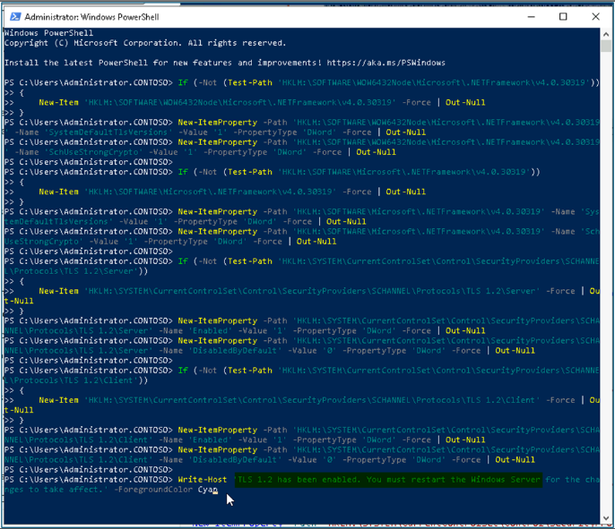
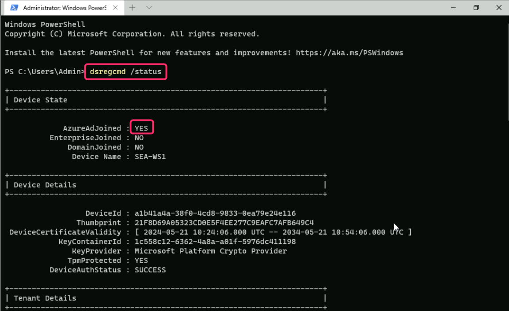
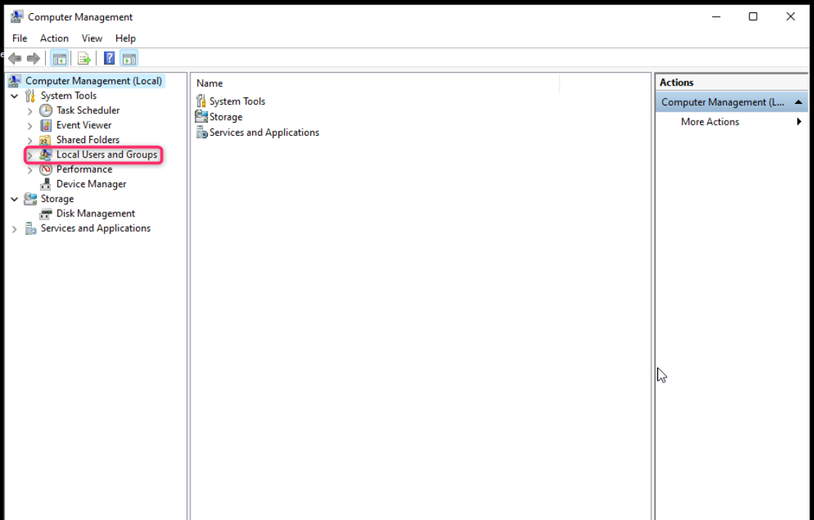
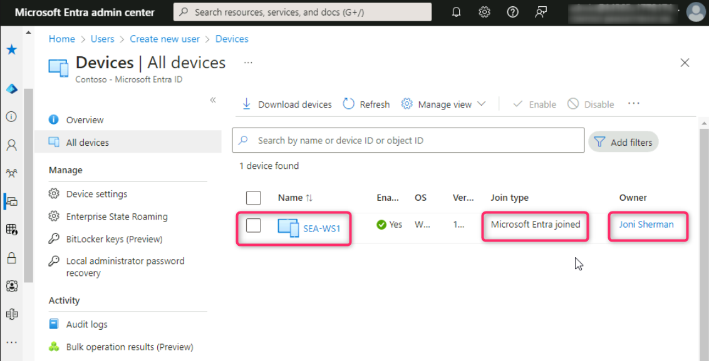
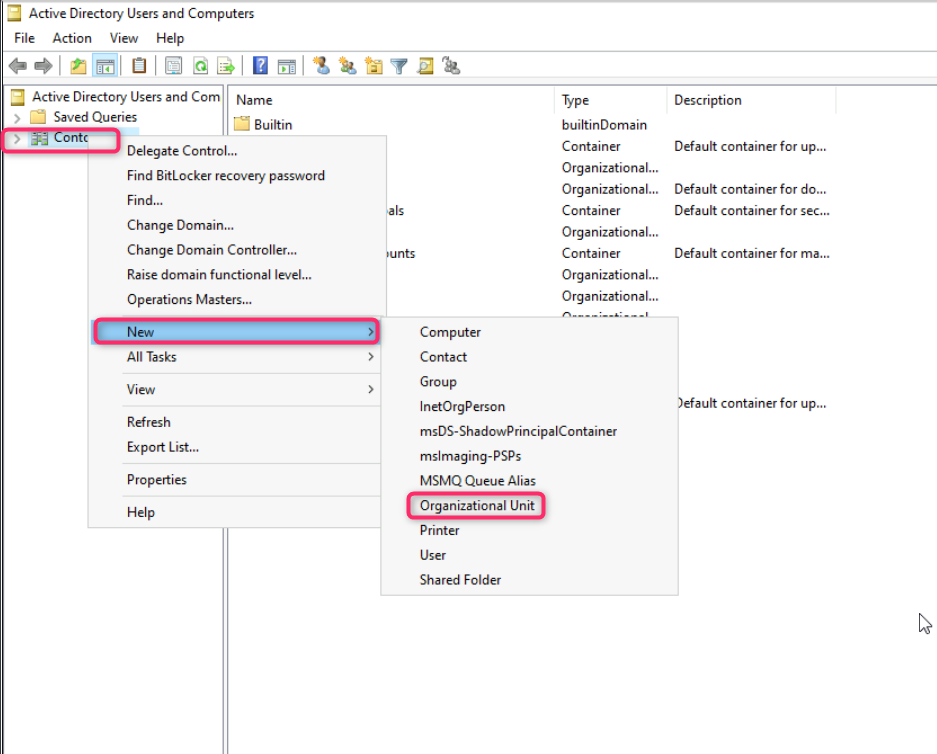
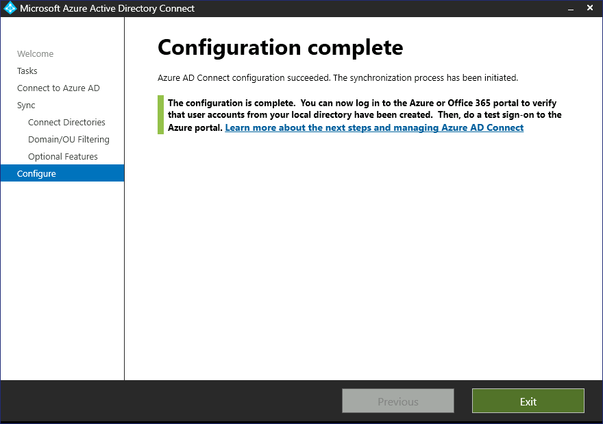
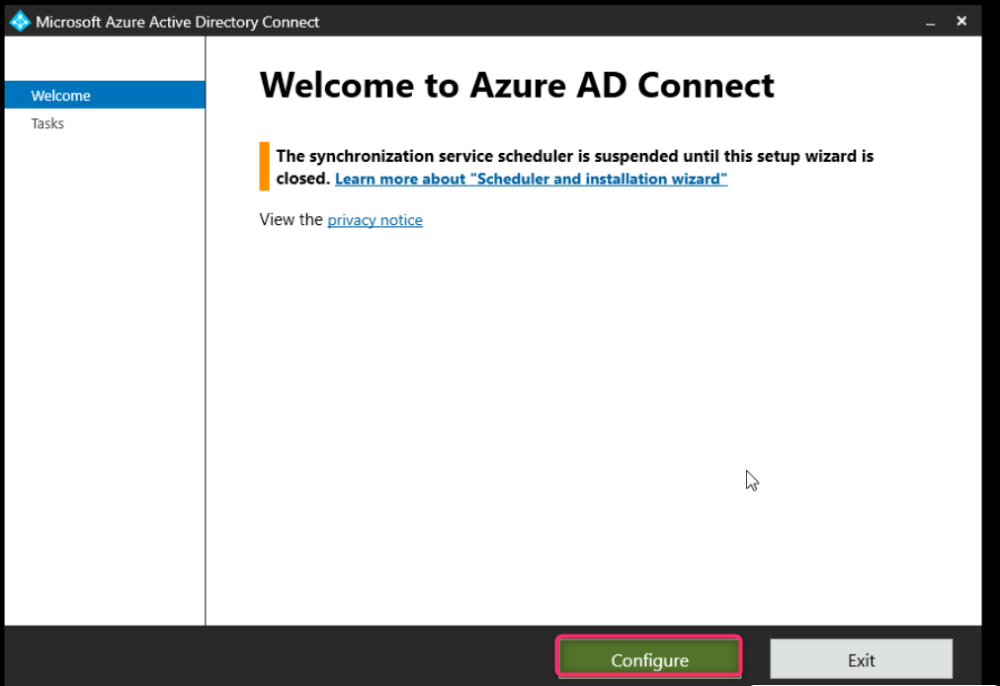
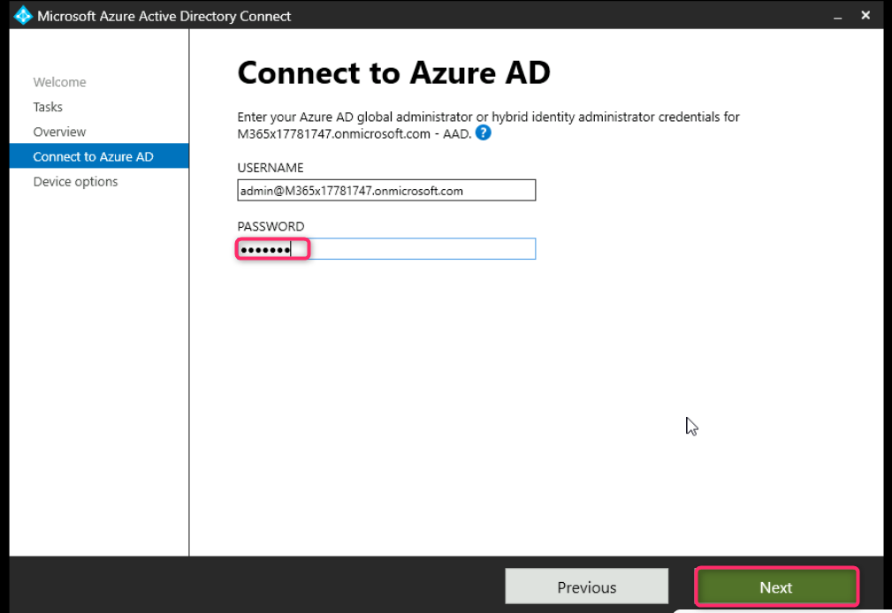
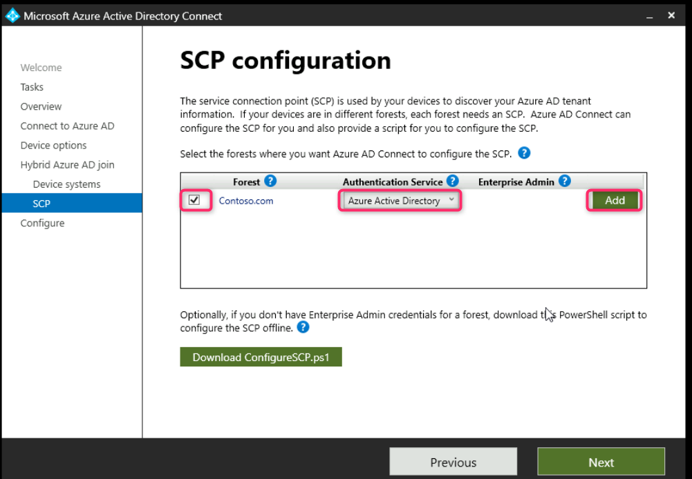
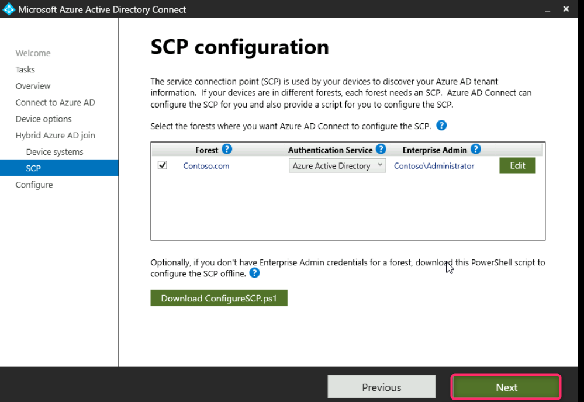

Atelier 0 3 : Configuration et gestion de Microsoft Entra ID Join

**Résumé**

Dans cet atelier, vous configurerez les paramètres de Microsoft Entra ID
Join et exécuterez des scénarios Microsoft Entra hybrid join pour les
appareils Windows..

**Conditions préalables**

Le(s) Ateliers suivant(s) doit(vent) être completé(s) avant cet atelier:

- Atelier \#2 : Synchronisation des identités à l'aide de Microsoft
  Entra Connect

**Remarque** : Vous aurez également besoin d'un téléphone mobile capable
de recevoir des SMS utilisés pour sécuriser l'authentification de
connexion Windows Hello à Entra ID.

**Exercice 1 : Configuration de Microsoft Entra join**

**Scénario**

Vous devez configurer les paramètres de périphérique Entra ID pour vous
assurer que tous les utilisateurs sont autorisés à joindre des
périphériques à Entra ID. Vous devez également vous assurer que les
utilisateurs ne peuvent rejoindre qu'un maximum de 20 appareils et
qu'Allan Deyoung est ajouté en tant qu'administrateur local sur tous les
appareils joints à Microsoft Entra. Enfin, vous vérifierez que Microsoft
Entra Join fonctionne comme prévu en demandant à Joni Sherman de joindre
SEA-WS1 au tenant .

## Tâche 0 : Activer TLS 1.2 à l'aide du script PowerShell.

1.  Sur SEA-WS1, connectez-vous en tant que Contoso\Administrator avec
    le mot de passe Pa55w.rd

2.  Dans le menu Démarrer, tapez
    [**PowerShell**](urn:gd:lg:a:send-vm-keys), faites un clic droit sur
    PowerShell et sélectionnez Exécuter en tant qu'administrateur.

Exécutez le script suivant sur PowerShell.

**If** (-Not (Test-Path
'HKLM:\SOFTWARE\WOW6432Node\Microsoft\\NETFramework\v4.0.30319'))

{

New-Item 'HKLM:\SOFTWARE\WOW6432Node\Microsoft\\NETFramework\v4.0.30319'
-Force | Out-Null

}

New-ItemProperty -Path
'HKLM:\SOFTWARE\WOW6432Node\Microsoft\\NETFramework\v4.0.30319' -Name
'SystemDefaultTlsVersions' -Value '1' -PropertyType 'DWord' -Force |
Out-Null

New-ItemProperty -Path
'HKLM:\SOFTWARE\WOW6432Node\Microsoft\\NETFramework\v4.0.30319' -Name
'SchUseStrongCrypto' -Value '1' -PropertyType 'DWord' -Force | Out-Null

**If** (-Not (Test-Path
'HKLM:\SOFTWARE\Microsoft\\NETFramework\v4.0.30319'))

{

New-Item 'HKLM:\SOFTWARE\Microsoft\\NETFramework\v4.0.30319' -Force |
Out-Null

}

New-ItemProperty -Path
'HKLM:\SOFTWARE\Microsoft\\NETFramework\v4.0.30319' -Name
'SystemDefaultTlsVersions' -Value '1' -PropertyType 'DWord' -Force |
Out-Null

New-ItemProperty -Path
'HKLM:\SOFTWARE\Microsoft\\NETFramework\v4.0.30319' -Name
'SchUseStrongCrypto' -Value '1' -PropertyType 'DWord' -Force | Out-Null

**If** (-Not (Test-Path
'HKLM:\SYSTEM\CurrentControlSet\Control\SecurityProviders\SCHANNEL\Protocols\TLS
1.2\Server'))

{

New-Item
'HKLM:\SYSTEM\CurrentControlSet\Control\SecurityProviders\SCHANNEL\Protocols\TLS
1.2\Server' -Force | Out-Null

}

New-ItemProperty -Path
'HKLM:\SYSTEM\CurrentControlSet\Control\SecurityProviders\SCHANNEL\Protocols\TLS
1.2\Server' -Name 'Enabled' -Value '1' -PropertyType 'DWord' -Force |
Out-Null

New-ItemProperty -Path
'HKLM:\SYSTEM\CurrentControlSet\Control\SecurityProviders\SCHANNEL\Protocols\TLS
1.2\Server' -Name 'DisabledByDefault' -Value '0' -PropertyType 'DWord'
-Force | Out-Null

**If** (-Not (Test-Path
'HKLM:\SYSTEM\CurrentControlSet\Control\SecurityProviders\SCHANNEL\Protocols\TLS
1.2\Client'))

{

New-Item
'HKLM:\SYSTEM\CurrentControlSet\Control\SecurityProviders\SCHANNEL\Protocols\TLS
1.2\Client' -Force | Out-Null

}

New-ItemProperty -Path
'HKLM:\SYSTEM\CurrentControlSet\Control\SecurityProviders\SCHANNEL\Protocols\TLS
1.2\Client' -Name 'Enabled' -Value '1' -PropertyType 'DWord' -Force |
Out-Null

New-ItemProperty -Path
'HKLM:\SYSTEM\CurrentControlSet\Control\SecurityProviders\SCHANNEL\Protocols\TLS
1.2\Client' -Name 'DisabledByDefault' -Value '0' -PropertyType 'DWord'
-Force | Out-Null

Write-Host 'TLS 1.2 has been enabled. You must restart the Windows
Server for the changes to take affect.' -ForegroundColor Cyan

4.  Redémarrez la machine virtuelle Windows Server.

## Tâche 1 : Configurer Microsoft Entra ID join Device settings

## 

1.  Passez à **SEA-SVR1**. Dans la barre d'adresse du navigateur
    **Microsoft Edge**, tapez l'URL suivante :
    !\ !!
    et appuyez sur le bouton **Enter**.

2.  Connectez-vous avec votre identifiant lde O365 tenant :
    !!**admin@M365xXXXXXXXX.onmicrosoft.com** !!et utilisez le mot de
    passe administrateur du locataire.

3.  Sur **Stay signed in?**, sélectionnez le bouton **yes**.

4.  Dans la fenêtre du **Microsoft Entra admin center**, naviguez et
    cliquez sur **Identity**.

5.  En dessous de la section **Identity**, sélectionnez **Devices**,
    puis naviguez et cliquez sur **All devices**, comme illustré dans
    l'image ci-dessous.

Notez qu'aucun appareil n'a été trouvé, car vous n'avez pas encore
rejoint d'appareil.

6.  Sur les **Device**s| Tous les appareils, sélectionnez **Device
    settings**..

7.  Sur les **Devices | Device settings** , dans le volet de détails,
    sous **Les utilisateurs peuvent joindre des appareils à Entra**,
    vérifiez que l' option **Tout** est sélectionnée.

Cela indique que tous les utilisateurs d'Entra sont autorisés à joindre
des appareils Windows 10 ou plus récents à Microsoft Entra. Notez que ce
paramètre ne s'applique pas aux appareils joints hybrides Entra ou aux
appareils joint à l'aide du mode d'auto-déploiement Windows Autopilot.

8.  Dans la section **Exiger l'authentification multifacteur pour
    enregistrer ou joindre des appareils avec Entra**, vérifiez que le
    paramètre est défini sur **No**.

9.  Dans la section **Nombre maximal d'appareils par utilisateur**,
    sélectionnez **20 (recommandé).**

10. Cliquez sur le lien **Manage** **Additional local administrators on
    all Microsoft Entra Joined devices** . La **Device Administrators
    page** s'ouvre.

11. Dans la page **Device Administrators | Assignments**, sélectionnez
    **Add assignments**

12. Dans la zone de recherche, entrez !!**Allan Deyoung** !!,
    sélectionnez l' objet utilisateur **Allan Deyoung**, puis **Add**.

13. Allan Deyoug sera désormais ajouté en tant qu'administrateur de
    périphérique sur tous les appareils joints à Microsoft Entra.

14. Cliquez sur le Lien **Devices | Device settings** sous la barre de
    recherche du portail Azure pour revenir à la page **Device
    Settings**.

15. Sur la page **Device settings**, sélectionnez **Save**.

**Tâche 2 : Effectuer le Microsoft Entra join**

1.  Passez à
    [SEA-WS1](https://labclient.labondemand.com/Instructions/e7cc4ae1-e3d9-4c55-accc-696f537e1e17?rc=10)
    et connectez-vous en tant qu**'administrateur** avec le mot de passe
    de !!**Pa55w.rd** !!.

2.  Dans la barre des tâches, sélectionnez l'icône du **bouton Windows
    Start **, puis électionnez **Settings**.

3.  Dans la fenêtre **Settings**, sélectionnez **Accounts** .

4.  Sur la page **Accounts,** sélectionnez **Access work or school**

5.  Sur la page **Access work or school**, sélectionnez **connect**.

6.  Dans la fenêtre de **Microsoft account** , sélectionnez **Join this
    device to Microsoft Entra ID**.

7.  Sur la page **Sign in** , tapez
    !!JoniS@M365xXXXXXXX.onmicrosoft.com !! , puis sélectionnez
    **Next**.

8.  Sur la page **Enter password** , entrez le mot de passe du locataire
    : !\ !! , puis sélectionnez
    **Sign in** .

9.  Dans la boîte de dialogue **Assurez-vous qu'il s'agit de votre
    organisation, s**électionnez **join**.

10. Sur la page **Vous êtes prêt !** , sélectionnez **done**.

11. Sur la page **Access work or school**  vérifiez que l'option
    **Connected to Contoso's Azure AD** s'affiche.

12. Fermez la page **Settings**.

**Tâche 3 : Valider Microsoft Entra join**

1.  Sur
    [SEA-WS1](https://labclient.labondemand.com/Instructions/e7cc4ae1-e3d9-4c55-accc-696f537e1e17?rc=10),
    cliquez avec le bouton droit de la souris sur l' icône du **button
    Windows** **Start** , puis sélectionnez **Windows Terminal
    (Admin)**comme indiqué dans l'image ci-dessous.

2.  Dans la boîte de dialogue **User Account Control** sélectionnez
    **yes**.

3.  Dans la console PowerShell, tapez la commande suivante et appuyez
    sur le bouton **Enter** :

!!**dsregcmd /status** !!

4.  Dans la sortie, sous **Device State**, vérifiez que **AzureAdJoined
    : YES** s'affiche.

Cela indique que l'appareil est joint à Microsoft Entra.

5.  Fermez PowerShell.

6.  Cliquez à nouveau avec le bouton droit de la souris sur l'icône du
    **bouton Windows** **Start** , puis sélectionnez **Computer
    Management**.

7.  Dans la fenêtre **Computer Management** , développez **Local Users
    and Groups** puis sélectionnez **Groups**.

8.  Double-cliquez sur le groupe **Administrators.**

Notez que Joni Sherman a été ajoutée en tant qu'administrateur locale
sur
[SEA-WS1](https://labclient.labondemand.com/Instructions/e7cc4ae1-e3d9-4c55-accc-696f537e1e17?rc=10).
Notez également deux entités de sécurité représentées par leurs
identificateurs de sécurité (SID). Ces deux SID représentent le rôle
d'administrateur général Entra et le rôle d'administrateur d'appareil
joint à Microsoft Entra.

9.  Fermez toutes les fenêtres ouvertes et déconnectez-vous de SEA-WS1
    en cliquant sur le **boutton de licone Windows Start \> Admin \>
    Sign out**

10. Passez à **SEA-SVR1** et connectez-vous avec les identifiants
    **Contoso\Administrator** et le mot de passe !!**Pa55w.rd** !!

11. Dans le **Microsoft Entra admin center** naviguez et cliquez sur
    **Identity**.

12. Naviguez et sélectionnez **Devices**, puis cliquez sur **All
    Devices**.

13. Dans la page **Devices | All Devices**, notez que **SEA-WS1** est
    répertorié.

14. Vérifiez que le type de **jonction** est répertorié comme
    **Microsoft Entra Joined** et que le propriétaire est **Joni
    Sherman**.

15. Notez également que la colonne MDM affiche **none**. Cela indique
    que cet appareil n'est pas encore géré par Microsoft Intune.

**Tâche 4 : Se connecter à Windows en tant qu'utilisateur Microsoft
Entra**

1.  Passer à **SEA-WS1** et cliquez sur **Other user.**

2.  **Connectez-vous** en tant que
    !!**JoniS@M365xXXXXXXX.onmicrosoft.com** !!  avec le mot de passe du
    locataire : !!**P@55w.rd1234** !!

**Remarque : Attendez que le profil soit créé.**

**Remarque** - Si vous êtes invité à utiliser **Windows Hello**,
terminez le processus de connexion en conséquence et sur la page **Set
up a PIN**  dans les zones **New PIN** et **Confirm PIN**, tapez
!!**102938** !! , puis sélectionnez **OK**.

**Tâche 5 : Supprimer un appareil Windows d'Entra**

1.  Sur
    [SEA-WS1](https://labclient.labondemand.com/Instructions/e7cc4ae1-e3d9-4c55-accc-696f537e1e17?rc=10),
    connectez-vous avec Joni Sherman si vous y êtes invité et si
    l'option permettant d'entrer le code PIN est disponible, entrez le
    code PIN : !!**102938** !! ou entrez le mot de passe comme
    !!**P@55w.rd1234** !!

2.  Dans la fenêtre **Settings**, sélectionnez **Accounts**.

3.  Dans le volet de navigation de gauche, naviguez et cliquez sur
    **Accounts**. Sur la page **Accounts**. sélectionnez **Access work
    or school.**

4.  Dans la page **Access work or school**  sélectionnez la liste
    déroulante en regard **Connected to Contoso's Azure AD** comme
    indiqué dans l'image ci-dessous. Clickez sur **Disconnect**  puis
    sélectionnez **yes**.

5.  Sur la page **Déconnecter de l'organisation**, sélectionnez
    **Disconnect**.

6.  Dans la boîte de dialogue **Windows Security**, dans la zone
    **Adresse e-mail**, entrez !!Admin !! et dans la zone **Mot de
    passs**, tapez !!Pa55w.rd !!. Sélectionnez **OK**.

7.  Dans la boîte de dialogue **Redémarrer votre PC**, sélectionnez
    **restart now**. **SEA-WS1** redémarre.

**Résultats** : Une fois cet exercice terminé, vous avez configuré les
paramètres de l'appareil Microsoft Entra, joint un appareil à Entra et
supprimé un appareil d'Entra.

**Exercice 2 : Configuration de Microsoft Entra hybrid join**

**Scénario**

Certains appareils Windows Contoso sont actuellement joints aux services
de domaine Active Directory locaux. Pour permettre à ces appareils
d'accéder de manière transparente aux services cloud, vous prévoyez
d'activer la Microsoft Entra hybrid join. Vous allez tester e Microsoft
Entra hybrid join en reconfigurant Azure AD Connect et en testant le
processus sur SEA-CL2.

**Tâche 1 : Préparer l'environnement**

1.  Passez à
    [SEA-SVR1](https://labclient.labondemand.com/Instructions/e7cc4ae1-e3d9-4c55-accc-696f537e1e17?rc=10).

2.  Sélectionnez le bouton **de l'icône Windows** **Start** , développez
    **Outils Windows Administrative**, puis sélectionnez **Active
    Directory Users and Computers** .

3.  Dans **Active Directory Users and Computers**, cliquez avec le
    bouton droit sur **Contoso.com**, pointez sur **New**, puis
    sélectionnez **Organizational Unit**.

4.  Dans la boîte de dialogue **New-Object - Organizational Unit** 
    tapez !!**Entra clients**!! , puis sélectionnez **OK**.

5.  Dans le volet de navigation, sélectionnez **Seattle clients**.
    Faites un clic droit sur **SEA-CL2,** puis sélectionnez **Move**.

6.  Dans la boîte de dialogue **Move**, sélectionnez **Entra clients** ,
    puis sélectionnez **OK.**

7.  Fermez **Active Directory Users and Computers**

**Tâche 2 : Reconfigurer Entra Connect**

1.  Sur
    [SEA-SVR1](https://labclient.labondemand.com/Instructions/e7cc4ae1-e3d9-4c55-accc-696f537e1e17?rc=10),
    double-cliquez sur Azure AD Connect sur le bureau

2.  Dans la **Microsoft Azure Active Directory Connect** , sélectionnez
    **Configure**.

3.  Dans la page **Tâches supplémentaires**, sélectionnez **Customize
    synchronization options**  puis **next**

4.  Dans la page **Connect to Entra**  dans les zones **USER NAME** et
    **PASSWORD**, entrez vos **Office 365 Tenant credentials**, puis
    sélectionnez **next**.

5.  Sur la page de **Connect your directories**  cliquez sur le bouton
    next.

6.  Sur la page **Filtrage des domaines et des unités d'organisation**,
    assurez-vous que **Sync selected domains and Ous** est sélectionnée.

7.  Développez **Contoso.com**, sélectionnez **Entra clients,** puis
    cliquez sur **next**.

8.  Sur la page **Optional features** , assurez-vous que l' option
    **Password hash synchronization**  est sélectionnée, puis
    sélectionnez **next**.

9.  Sur la page **Ready to configure** , assurez-vous que l'option
    **Start the synchronization process when configuration completes** 
    est sélectionnée, puis sélectionnez **Configure**.

10. Une fois la configuration terminée, sélectionnez **Exit** .

Remarque : Attendez environ 5 minutes pour que la synchronisation soit
terminée.

**Tâche 3 : Configurer le Microsoft Entra hybrid Join à l'aide d'Azure
AD Connect**

1.  Sur
    [SEA-SVR1](https://labclient.labondemand.com/Instructions/e7cc4ae1-e3d9-4c55-accc-696f537e1e17?rc=10)
    VM **Desktop**, double-cliquez sur **Azure AD Connect**.

2.  Dans la **f**enêtre **Microsoft Azure Active Directory Connect**,
    sélectionnez **Configure**.

3.  Sur la page **Additional tasks**  sélectionnez **Configure device
    options** , puis sélectionnerz **next**.

4.  Sur la page **Overview**  , sélectionnez **next**.

5.  Sur la page **connect to Entra**, entrez le mot de passe du
    locataire administrateur dans la zone **PASSWORD**, puis
    sélectionnez **Next**.

6.  Dans la page **Devices options** , sélectionnez **Configure Hybrid
    Azure AD Join**, puis sélectionnez **next**.

7.  Dans la page **Device operating systems** , sélectionnez **Windows
    10 or later domain-joined devices**, puis sélectionnez **next**.

8.  Sur la page de **configuration SCP**, cochez la case en regard de
    **Contoso.com**. Sélectionnez **Azure Active Directory** dans la
    **liste déroulante** Service d'authentification**,** puis **Add**.

9.  Dans la fenêtre **Enterprise Admin Credentials**  entrez
    **Contoso\Administrator**  comme **Username** et !!**Pa55w.rd**
    !! comme **mot de passe**. Sélectionnez **OK,** puis **next**.

10. Dans la page **Ready to configure** , sélectionnez **Configure**
    pour exécuter la configuration.

11. Une fois la configuration terminée, sélectionnez **exit**.

12. Dans la barre des tâches, cliquez avec le bouton droit de la souris
    sur **Windows Start button icon** et sélectionnez **Windows
    Powershell (Admin).**

13. Dans la fenêtre **Windows PowerShell**, tapez la commande suivante,
    puis appuyez sur **Enter** :

!!**Start-ADSyncSyncCycle -PolicyType Initial** !!

14. Fermez la fenêtre PowerShell.

Remarque : Attendez environ 5 minutes pour que la synchronisation soit
terminée.

**Tâche 4 : Vérifier l'enregistrement Entra**

1.  Passez à
    [SEA-CL2](https://labclient.labondemand.com/Instructions/e7cc4ae1-e3d9-4c55-accc-696f537e1e17?rc=10).

2.  Sur la page de connexion, sélectionnez le bouton **power** puis
    sélectionnez **Restart**.

***Remarque** : Le redémarrage déclenche la jonction Microsoft Entra
hybride sur
[SEA-CL2](https://labclient.labondemand.com/Instructions/e7cc4ae1-e3d9-4c55-accc-696f537e1e17?rc=10).*

3.  Une fois **SEA-CL2** redémarré, connectez-vous en tant que
    **Contoso\Administrator** avec le mot de passe !! **Pa55w.rd** !!

4.  Dans la barre des tâches, cliquez avec le bouton droit de la souris
    sur **Windows Start icon button** et sélectionnez **Windows Terminal
    (Admin)**.

5.  Dans la fenêtre **Windows PowerShell**, tapez la commande suivante,
    puis appuyez sur **Enter** :

!!**dsregcmd /status** !!

6.  Dans la sortie sous **État du périphérique**, vérifiez cela.

- **AzureAdInscrit : YES**

- **DomainJoined : YES** sont affichés.

***Remarque : Si l'appareil n'est pas encore connecté à Entra, attendez
que la synchronisation Entra Connect soit terminée et redémarrez à
nouveau SEA-CL2. La mise à jour de l'état peut prendre 5 à 10
minutes.***

En outre, vous pouvez vous connecter à **SEA-SVR1** et, dans la fenêtre
**Windows PowerShell**, taper la commande suivante pour accélérer la
synchronisation.

!!**Start-ADSyncSyncCycle -PolicyType Initial** !!

7.  Fermez toutes les fenêtres Sur
    [SEA-CL2](https://labclient.labondemand.com/Instructions/e7cc4ae1-e3d9-4c55-accc-696f537e1e17?rc=10)
    et déconnectez-vous.

8.  Passez à
    [SEA-SVR1](https://labclient.labondemand.com/Instructions/e7cc4ae1-e3d9-4c55-accc-696f537e1e17?rc=10)
    et accédez à la fenêtre de **Microsoft Entra admin center**,
    naviguez et cliquez sur **Identity**.

9.  Dans la section **Identity**, sélectionnez **Devices**, puis
    naviguez et cliquez sur **All devices** , comme illustré dans
    l'image ci-dessous.

10. Vérifiez que **SEA-CL2** a **Microsoft Entra hybrid est connect**é
    **en** valeur pour le **type de junction** de ligne. Cliquez sur le
    bouton **refresh** si SEA-CL2 n'est pas répertorié.

11. Fermez toutes les fenêtres sur
    [SEA-SVR1](https://labclient.labondemand.com/Instructions/e7cc4ae1-e3d9-4c55-accc-696f537e1e17?rc=10).

**Résultats** : Une fois cet exercice terminé, vous aurez correctement
configuré et validé le Microsoft Entra hybrid join.
