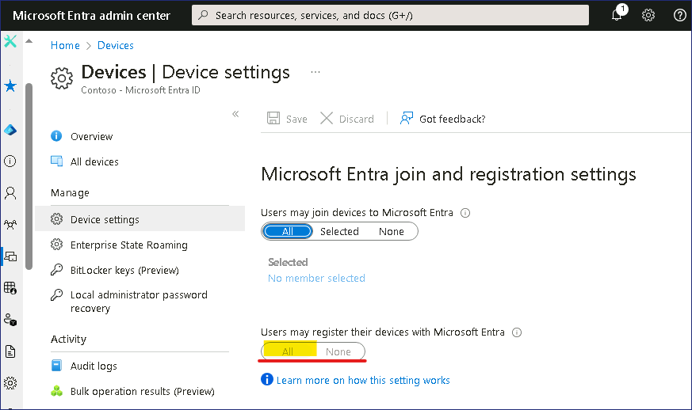
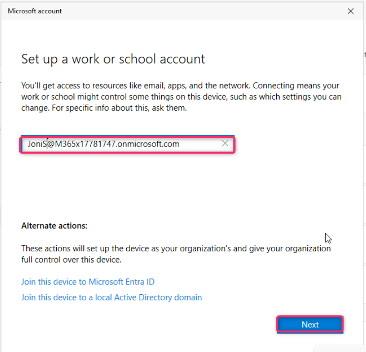

# Laboratorio 4 – Gestione el Microsoft Entra Device registration.

**Resumen**

En este laboratorio, realicemos Microsoft Entra registration con un
dispositivo Windows.

**Ejercicio 1: Configurar Microsoft Entra device registration**

**Escenario**

Varios usuarios han pedido usar sus dispositivos personales de iOS,
Android, y Windows para acceder Contoso cloud resources. Dado que
Contoso no posee los dispositivos, no se debe hacer que los usuarios
realicen un Entra join para full device management. En cambio, tiene que
asegurar que los usuarios pueden registrar sus dispositivos con
Microsoft Entra, lo que le permite aplicar las políticas de su empresa a
las aplicaciones según las necesidades, y seguir permitiendo a los
usuarios acceder a los recursos de Contoso. Probará el Microsoft Entra
device registration mediante un dispositivo Windows 11.

**Tarea 1: Configure la Azure AD device registration**

1.  En el
    [*SEA-SVR1*](https://labclient.labondemand.com/Instructions/e7cc4ae1-e3d9-4c55-accc-696f537e1e17?rc=10),
    abra una nueva pestaña en el navegador Edge e introduzca el
    siguiente URL, !!**https://entra.microsoft.com**!!, y presione el
    botón **Enter**.

2.  Inicie sesión con su O365 tenant ID
    !!**admin@M365xXXXXXXXX.onmicrosoft.com**!! y use el tenant Admin
    password.

> 
>
> 

3.  En el cuadro de diálogo **Stay signed in?**, seleccione el botón
    **Yes**.

> 

4.  En la ventana **Microsoft Entra admin center**, navegue y haga clic
    en **Identity**.

5.  Seleccione **Devices**, y la página **Device settings**, en el panel
    de detalles, verifique que **Users may register their devices with
    Microsoft Entra** está establecido a **All** y y desactivado.

> Esta opción está desactivado y establecido a **All** por defecto
> cuando se habilitado Microsoft Intune en el tenant. Esto asegura que
> los usuarios pueden registrar sus dispositivos Windows 10 o los nuevos
> dispositivos iOS, Android, and macOS personales con Azure AD.
>
> 

**Tarea 2: Realice Microsoft Entra registration**

1.  Cambie
    a [*SEA-WS1*](https://labclient.labondemand.com/Instructions/e7cc4ae1-e3d9-4c55-accc-696f537e1e17?rc=10) e
    inicie sesión como **Admin** con la contraseña !!**Pa55w.rd**!!.

2.  En el taskbar, seleccione **Start** y seleccione **Settings**.

3.  En la ventana **Settings**, seleccione **Accounts**.

4.  En la página **Accounts**, seleccione **Access work or school**.

5.  En la página **Access work or school**, seleccione **Connect**.

6.  En la página **Sign in**, tecle
    !!**JoniS@M365xXXXXXXX.onmicrosoft.com**!!  Y seleccione **Next**.

7.  En la página **Enter password**, introduzca su tenant password:
    !\!! y seleccione **Sign
    in**

8.  En la página **You're all set!**, seleccione **Done**.

9.  En la página **Access work or school**, verifique que se ve el
    **Work or school account** de Joni.

10. Cierre la página **Settings**.

**Tarea 3: Valide Microsoft Entra registration**

1.  En [*SEA-WS1*](https://labclient.labondemand.com/Instructions/e7cc4ae1-e3d9-4c55-accc-696f537e1e17?rc=10),
    haga clic derecho en **Start button**, y seleccione **Windows
    Terminal (Admin)**.

> 

2.  En el cuadro de diálogo **User Account Control**,
    seleccione **Yes**.

> 

3.  En el PowerShell console, tecle lo siguiente y presione **Enter**:

> !!**dsregcmd /status**!!

4.  En el output en **User State**, verifique que se
    ve **WorkplaceJoined : YES**. Esto indica que el usuario ha
    realizado un device registration en Microsoft Entra.

> 

5.  Cierre PowerShell y cierre la sesión de **SEA-WS1**.

6.  Cambie a SEA-SVR1. Vaya a la venta **Microsoft Entra admin center**,
    navegue y haga clic en **Identity**.

> 

7.  En la sección **Identity**, seleccione **Devices**, y navegue y haga
    clic en **All devices** como se ve en la imagen.

> 

8.  Verifique que está enumerado **Join Type** como **Microsoft Entra
    registered** y que el owner es **Joni Sherman**.

> 
>
> Note que el dispositivo está Microsoft Entra registered, NO Microsoft
> Entra joined. Entra registered devices normalmente son los
> dispositivos que no pueden ser Entra joined, o dispositivos
> proprietarios del usuario. Registrar un dispositivo va a proporcionar
> acceso a los recursos basados en Cloud.

9.  Cierre Microsoft Edge.

**Tarea 4: Inicie sesión en Windows y desconéctese de la organización**

1.  Cambie
    a *[SEA-WS1](https://labclient.labondemand.com/Instructions/e7cc4ae1-e3d9-4c55-accc-696f537e1e17?rc=10).* En
    el taskbar, seleccione el botón **Windows Start icon** y
    seleccione **Settings**.

2.  En la ventana **Settings**, seleccione **Accounts**.

> 

3.  En la página **Accounts**, seleccione **Access work or school**.

> 

4.  En la página **Access work or school**, haga clic en el dropdown
    junto a la cuenta **JoniS@M3654xXXXXXXXX** **Work or school** como
    se ve en la siguiente imagen.

> 

5.  Haga clic en el botón **Disconnect**.

> 

6.  Haga clic en el botón **Yes** para confirmar la eliminación de la
    cuenta.

> 
>
> Note que no tiene que reiniciar para desconectar un Microsoft Entra
> registered device.

7.  Cierre sesión de **SEA-WS1**.

**Resultados**: Después de completar este ejercicio, tendrá configurado
el Microsoft Entra device registration.
