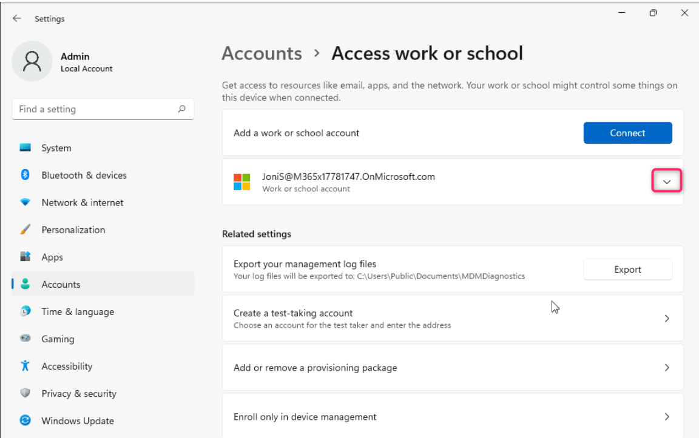

# Atelier04 : gestion de Microsoft Entra Device registration.

**Résumé**

Dans cet atelier, nous allons effectuer l'enregistrement Microsoft Entra
à l'aide d'un appareil Windows.

**Exercice 1 : Configuration de Microsoft Entra device registration**

**Scénario**

Plusieurs utilisateurs ont demandé à utiliser leurs appareils personnels
iOS, Android et Windows pour accéder aux ressources Contoso cloud. Étant
donné que Contoso n'est pas propriétaire des appareils, vous ne
souhaitez pas que les utilisateurs effectuent une jonction Entra pour
une gestion complète des appareils. Au lieu de cela, vous devez vous
assurer que les utilisateurs sont en mesure d'inscrire leurs appareils
auprès de Microsoft Entra, ce qui vous permet toujours d'appliquer la
stratégie d'entreprise aux applications si nécessaire, tout en
autorisant les utilisateurs à accéder aux ressources Contoso. Vous allez
tester Microsoft Entra device registration à l'aide d'un appareil
Windows 11.

**Tâche 1 : Configurer l'inscription d'un appareil Azure AD**

1.  Sur le
    [*SEA-SVR1*](https://labclient.labondemand.com/Instructions/e7cc4ae1-e3d9-4c55-accc-696f537e1e17?rc=10),
    ouvrez un nouvel onglet dans le navigateur Edge et entrez l'URL
    suivante, !!**https://entra.microsoft.com** !!, puis appuyez sur le
    **bouton Enter**.

2.  Connectez-vous avec votre identifiant O365 tenant
    !!**admin@M365xXXXXXXXX.onmicrosoft.com** !! et utilisez le mot de
    passe administrateur du locataire.

> 
>
> 

3.  Sur **Stay signed in?** , sélectionnez le bouton **yes**.

> 

4.  Dans la fenêtre de **Microsoft Entra admin center**, naviguez et
    cliquez sur **Identity**.

5.  Sélectionnez **Devices**, puis la page **Device settings** , dans le
    volet d'informations, vérifiez que **les utilisateurs peuvent
    inscrire leurs appareils auprès de Microsoft Entra** est défini sur
    **All** et est grisé.

> Cette option est grisée et définie sur **All** par défaut lorsque
> Microsoft Intune est activé dans le locataire. Cela garantit que tous
> les utilisateurs sont en mesure d'inscrire des appareils personnels
> Windows 10 ou plus récents, iOS, Android et macOS avec Azure AD.
>
> 

**Tâche 2 : Effectuer le Microsoft Entra registration**

1.  Passez à
    [*SEA-WS1*](https://labclient.labondemand.com/Instructions/e7cc4ae1-e3d9-4c55-accc-696f537e1e17?rc=10)
    et connectez-vous en tant qu**'administrateur** avec le mot de passe
    de !!**Pa55w.rd** !!.

2.  Dans la barre des tâches, sélectionnez **Démarrer**, puis
    Paramètres.

3.  Dans la fenêtre **Settings**, sélectionnez **Account**.

4.  Sur la page **ccount,** sélectionnez **Access work or school**.

5.  Sur la page **Access work or school**  sélectionnez **connect**.

6.  Sur la page **Sign in** , tapez
    !!**JoniS@M365xXXXXXXX.onmicrosoft.com** !! , puis sélectionnez
    **next**.

7.  Sur la page **Entrer le mot de passe**, entrez le mot de passe du
    locataire : !\ !! , puis
    sélectionnez **Se Sign in**

8.  Sur le site **Vous êtes prêt !** , sélectionnez **done**.

9.  Sur la page **Access work or school**, vérifiez que le **work or
    school account** de Joni est affiché.

10. Fermez la page **Settings**.

**Tâche 3 : Valider le Microsoft Entra registration**

1.  Sur
    [*SEA-WS1*](https://labclient.labondemand.com/Instructions/e7cc4ae1-e3d9-4c55-accc-696f537e1e17?rc=10),
    cliquez avec le bouton droit de la souris sur **le bouton
    Démarrer**, puis sélectionnez **Terminal Windows (Admin).**

> 

2.  Dans la boîte de dialogue **Contrôle de compte d'utilisateur,**
    sélectionnez **yes**.

> 

3.  Dans la console PowerShell, tapez ce qui suit et appuyez sur
    **Enter** :

> !!**dsregcmd /status** !!

4.  Dans le résultat sous **État de l'utilisateur**, vérifiez que
    **WorkplaceJoined : YES** s'affiche. Cela indique que l'utilisateur
    a effectué l'enregistrement d'un appareil dans Microsoft Entra.

> 

5.  Fermez PowerShell, puis déconnectez-vous de **SEA-WS1**.

6.  Passez à SEA-SVR1. Accédez à la fenêtre **Microsoft Entra admin
    center**, naviguez et cliquez sur **Identity**.

> 
>
> 7\. Dans la section **Identity**, sélectionnez **Devices**, puis
> naviguez et cliquez sur **All devices**, comme indiqué dans l'image
> ci-dessous.
>
> 

8.  Vérifiez que le **type de connexion** est répertorié comme
    **Microsoft Entra registered** et que le propriétaire est **Joni
    Sherman**.

> 
>
> Notez que l'appareil est enregistré auprès de Microsoft Entra et qu'il
> n'est PAS joint à Microsoft Entra. Les appareils enregistrés Entra
> sont généralement des appareils qui ne peuvent pas être joints à Entra
> ou des appareils qui appartiennent personnellement à l'utilisateur.
> L'enregistrement d'un appareil permet d'accéder aux ressources basées
> sur le cloud.

9.  Fermez Microsoft Edge.

**Tâche 4 : Se connecter à Windows et se déconnecter de l'organisation**

1.  Passez à
    *[SEA-WS1](https://labclient.labondemand.com/Instructions/e7cc4ae1-e3d9-4c55-accc-696f537e1e17?rc=10).*
    Dans la barre des tâches, sélectionnez le **Windows Start icon**,
    puis sélectionnez **Devices**.

2.  Dans la fenêtre **Setting** , sélectionnez **Accounts**.

> 

3.  Sur la page **Accounts**, sélectionnez **Access work or school.**

> 

4.  Sur la page **Access work or school** , cliquez sur le menu
    déroulant à côté de compte de **JoniS@M3654xXXXXXXXX Work or
    school** comme illustré dans l'image ci-dessous.

> 

5.  Cliquez sur le bouton **Diconnect**.

> 

6.  Cliquez sur le bouton **yes** pour confirmer la suppression du
    compte.

> 
>
> Notez qu'il n'est pas nécessaire de redémarrer pour déconnecter un
> Microsoft Entra registered device.

7.  Se déconnecter de **SEA-WS1**.

**Résultats** : Une fois cet exercice terminé, vous aurez configuré
Microsoft Entra device registration.
