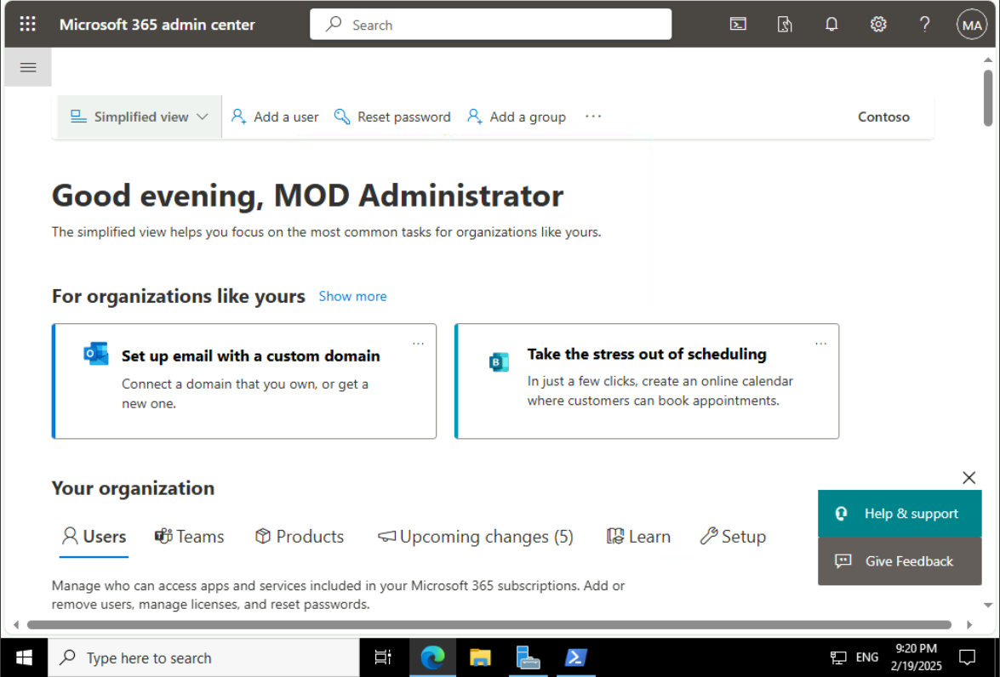
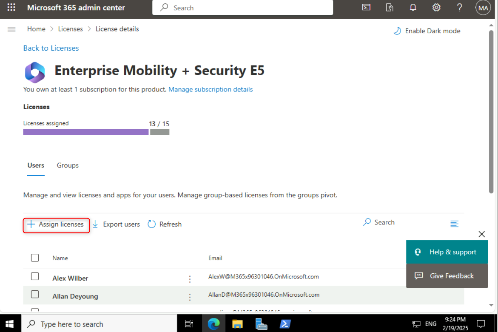
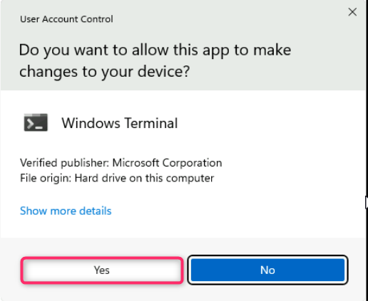
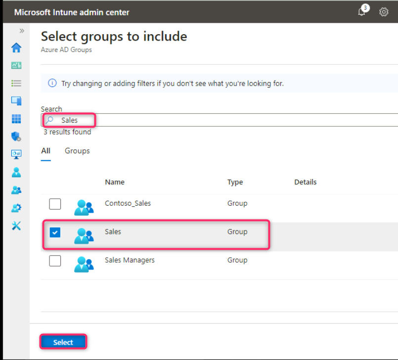
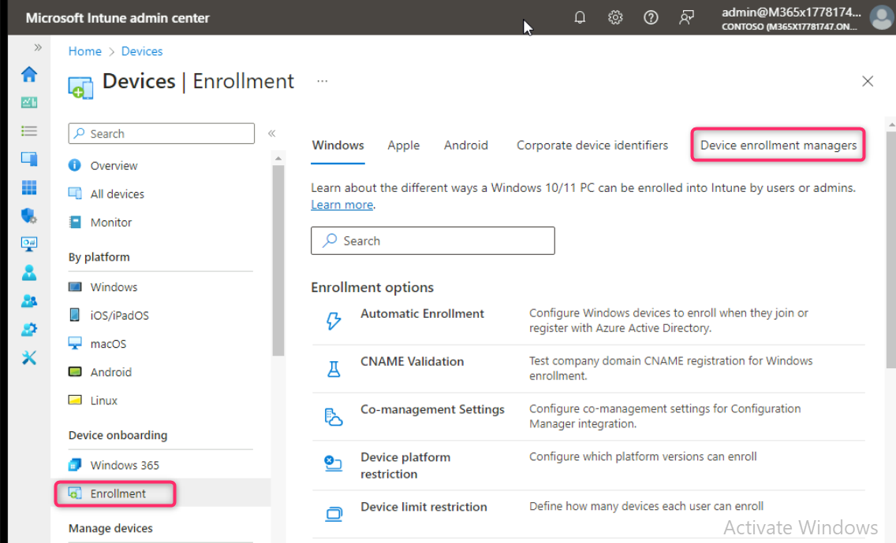

**實驗 5 - 管理設備註冊到 Microsoft Intune**

**總結**

在本實驗中，您將通過查看和分配許可證、配置 Windows
自動註冊和配置註冊限制，為使用 Microsoft Intune 進行設備管理做準備。

**先決條件**

在此實驗之前，必須完成以下實驗：

- 實驗 \#1 - 在 Microsoft Entra ID 中管理身份

- 實驗 \#2 - 使用 Microsoft Entra Connect 同步標識

**注意：**您還需要一部可以接收短信的移動電話，該短信用於保護 Windows
Hello 登錄對 Entra ID 的身份驗證。

**場景**

您需要準備使用 Microsoft Intune
進行設備管理。首先，您需要確保為用戶分配了適當的設備管理許可證。作為驗證測試，您將為
Aaron Nicholls 分配所需的許可證。您還需要確保加入或註冊到 Microsoft
Entra ID 的任何 Windows 設備都將自動註冊到 Intune。系統還要求你確保限制
Sales 組的成員將個人 Android 和 iOS 設備註冊到
Intune，並將註冊設備限制增加到 10 台設備。最後，您需要將 Allan Deyoung
配置為設備註冊管理員，以允許他註冊 1000 台設備。

**任務 1：查看和分配設備管理許可證**

1.  在 [*SEA-SVR1*](https://labclient.labondemand.com/Instructions/e7cc4ae1-e3d9-4c55-accc-696f537e1e17?rc=10)上，導航到
    **Microsoft 365 管理中心**窗口。

2.  導航並選擇 **Billing** （計費），然後單擊 **Licenses** （許可證）。

3.  在 **Licenses** （許可證） 頁面中，記下租戶中可用的許可證。

4.  選擇並單擊“**Enterprise Mobility + Security
    E5**”。請注意已分配此許可證的所有用戶。您可以從此位置分配和刪除許可證。

5.  選擇一個用戶以查看分配給該用戶的許可證。記下企業移動性 + 安全性 E5
    許可證中包含的服務。Microsoft Intune 是此許可證支持的服務之一。

6.  在 **Microsoft 365 管理中心**導航窗格中，選擇 “**Active users**”。

7.  搜索並選擇 !!**Cindy White**!!

8.  在 **Cindy White 用戶**頁面上，單擊 **Licenses and
    apps**（許可證和應用程序）。

9.  在“**Settings**”下的“**Usage location**”字段中，選擇“**United
    States**”，然後單擊“**Enterprise Mobility + Security E5 and Office
    365 E5 (no teams)**”複選框，然後單擊“**Save changes**”。

***注：** 在為用戶分配許可證之前，必須為用戶設置使用位置。*

**任務 2：使用 PowerShell 設置用戶的密碼**

1.  在 [***SEA-SVR1***](urn:gd:lg:a:select-vm)中 右鍵單擊 **Start
    button**，然後選擇 **Windows PowerShell (Admin)**。

2.  在 **User Account Control** （用戶帳戶控制） 對話框中，選擇 **Yes**
    （是）。

3.  在 **Windows PowerShell** 窗口中，鍵入以下命令，然後按 **Enter**：

!!**Connect-MsolService**!!

4.  在 “**Sign in to your account**” 對話框中，使用 “主頁” 選項卡中的
    Office 365 租戶憑據登錄。

**注意 – 如果系統提示您更改 Tenant admin credentials
密碼，請確保提供更新的密碼。**

5.  在 **Windows PowerShell** 窗口中，鍵入以下命令以重置 **Cindy White**
    的密碼

!!**Get-MsolUser | Where-Object DisplayName -EQ "Cindy White" |
Set-MsolUserPassword -NewPassword P@55w.rd1234 -ForceChangePassword
$false**!!

**任務 3：啟用 Windows 自動註冊到 Microsoft Intune**

1.  在 **SEA-SVR1** 中，在 **Microsoft Edge**
    中打開一個新選項卡，然後在地址欄中鍵入 !!**https://Endpoint.microsoft.com**!!
    ，然後按 **Enter** 鍵。如果系統提示登錄，請提供 **Office 365
    租戶管理員**的憑據。

2.  在 Microsoft Intune 管理中心，選擇“**Devices**”。

3.  導航並單擊 **Enrollment** （註冊）。確保選擇 **Windows**
    選項卡，然後導航到 **Enrollment options** 部分並單擊 **Automatic
    Enrollment**。

4.  在 **MDM user scope** 行上，選擇 **All** 單選按鈕，然後選擇 **Save**
    。

5.  點擊 **Devices | Enrollment** 鏈接，如下圖所示。

**注意：**通過執行此步驟，您為使用 Windows 設備執行 Azure AD
加入的任何用戶啟用了自動註冊到 Intune。

**任務 4：配置註冊限制**

1.  導航到 **Devices onboarding** 部分，然後單擊
    **Enrollment**。然後，單擊 **Android** 選項卡，如下圖所示。

2.  向下滾動到 **Enrollment options** （註冊選項） 部分，然後單擊
    **Device platform restriction**（設備平臺限制）。

3.  選擇 “**Android restrictions**” 選項卡，然後選擇 **“+Create
    restriction**”。

4.  在 **Create restriction** （創建限制） 頁面的 **Name** （名稱）
    框中，輸入 !!**Android Personal Device Restriction**!! 選擇
    **Next**（下一步）。

5.  在 Platform settings （平臺設置） 頁面的 **Personal owned**
    （個人擁有） 下，為以下設備類型選擇 **Block** （阻止），然後單擊
    **Next** （下一步） 按鈕：

    - Android Enterprise（工作配置文件）

    - Android 設備管理員

6.  在 “**Scope tags**”頁上，選擇“**Next**”。

7.  在 **Assignments** （分配） 頁面的 **Included groups** （包含的組）
    下，選擇 **Add groups** （添加組）。

8.  在 **Select groups to include** （選擇要包含的組） 窗格 **Search
    bar** （搜索欄） 中，鍵入並選擇 **Sales**，然後單擊 **Select**
    按鈕。

9.  在 **Assignments** 選項卡中，單擊 **Next** 按鈕。

10. 在 “**Review + create**”頁上，選擇“**Create**”。

請注意，為 Android Personal Device Restriction 分配了優先級 1。

11. 在 **Devices | Enrollment**
    頁面的“**Windows**”選項卡中，導航到“**Enrollment
    options**”部分，然後單擊“**Device limit restriction**”限制。

請注意，有一個分配給 All Users
的默認設備限制。此默認限制將設備註冊限制設置為每個用戶 5 台設備。

12. 在 “**Enrollment device limit restrictions**” 中，選擇 “+ **Create
    restriction**”。

13. 在 Create restriction （創建限制） 頁面的 **Name** （名稱）
    框中，輸入 !!**Sales Device Enrollment Limit**!! 選擇
    **Next**（下一步）。

14. 在 **Device limit** （設備限制） 頁面上，選擇 **10**，然後選擇
    **Next** （下一步）。

15. 在 “**Scope tags**”頁上，選擇“**Next**”。

16. 在 **Assignments** （分配） 頁面的 **Included groups** （包含的組）
    下，選擇 **Add groups** （添加組）。

17. 在 **Select groups to include page** 搜索框中，鍵入並選擇 **Sales**
    然後單擊 **Select** 按鈕。

18. 點擊 **Next** 按鈕。

19. 在 “**Review + create**”頁上，選擇“**Create**”。

20. 重新加載頁面。請注意 Sales Device Enrollment Limit，它配置了 Device
    Limit 10，並分配了優先級 1。

**任務 5：配置設備註冊管理器**

1.  在 **Microsoft Intune 管理中心**，選擇“**Devices**”。

2.  導航到 **設備載入** 部分，單擊 **Enrollment**，然後單擊 **Device
    enrolment managers** 選項卡。

3.  在 “**Enroll devices**”窗格中，選擇 “**Device enrollment
    managers**”。

請注意，默認情況下，未配置任何設備註冊管理器。

4.  在 **Enroll devices|Device enrollment managers**
    頁上，選擇“**Add**”。

5.  在 **Add user** （添加用戶） 頁面的 User name （用戶名）
    下，輸入Allan DeYoung 的電子郵件地址
    [* !!**AllanD@M365xXXXXXXX.onmicrosoft.com***](mailto:DeYoung%E2%80%AF!!AllanD@M365xXXXXXXX.onmicrosoft.com)
    !!（將 **XXXXXX** 替換為您的租戶名稱），然後選擇 **Add** （添加）。

**Allan 現在最多可以註冊 1000 台設備。**

6.  在 Microsoft Intune 管理中心的導航窗格中，選擇“**Home**”。

7.  關閉Microsoft Edge。

**結果：**完成本練習後，您將成功查看和分配許可證、配置 Windows
自動註冊、啟用和分配註冊限制，以及配置設備註冊管理器。
