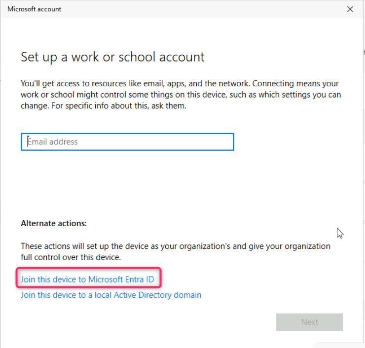
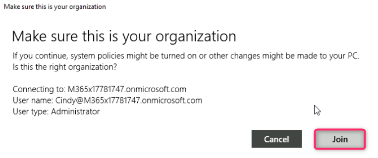
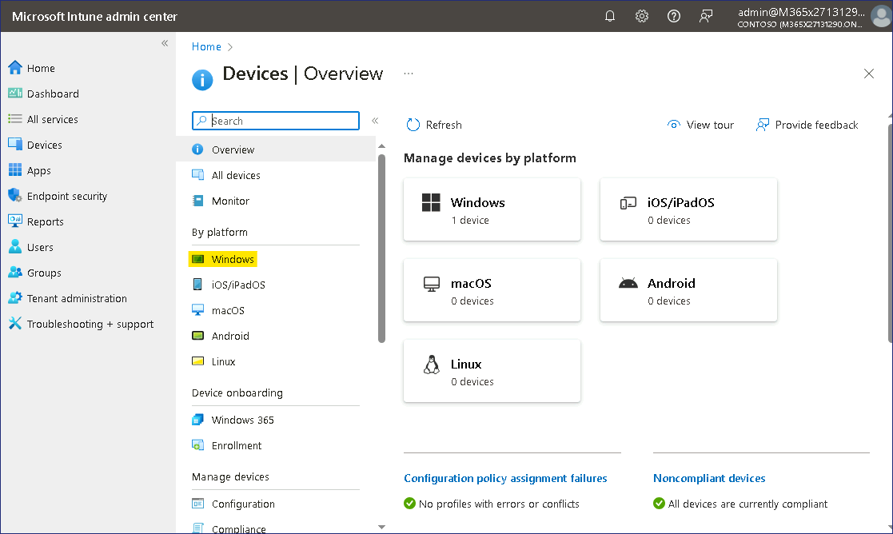

**實驗 6 - 將設備註冊到 Microsoft Intune**

**總結**

在本實驗中，你將將 Windows 客戶端加入 Entra
ID，並驗證設備是否已自動註冊到 Microsoft Intune。

**先決條件**

在此實驗之前，必須完成以下實驗：

- 實驗 \#1 - 在 Microsoft Entra ID 中管理身份

- 實驗 \#2 - 使用 Microsoft Entra Connect 同步標識

- 實驗 \#5 - 管理設備註冊到 Microsoft Intune

注意：您可能還需要一部可以接收短信的移動電話，該短信用於保護 Windows
Hello 登錄對 Entra ID 的身份驗證。

**場景**

您已為 Cindy White 分配了適當的許可證，現在將測試將 Windows 設備加入
Entra ID 的過程，並使其自動註冊到 Microsoft Intune。

**任務 1：自動將 Windows 設備註冊到 Microsoft Intune**

1.  切換到
     [*SEA-WS1*](https://labclient.labondemand.com/Instructions/e7cc4ae1-e3d9-4c55-accc-696f537e1e17?rc=10) 並以
    Admin 身份登錄，密碼為 !!**Pa55w.rd**!!

2.  在任務欄上，選擇“**Start**”，然後選擇“**Settings**”。

3.  在 **Settings** （設置） 窗口中，選擇 **Accounts** （帳戶）。

4.  在 “帳戶 ”頁上，選擇 “**Access work or school**”。

5.  在 “**Access work or school**” 頁面中，選擇 “**Connect**”。

6.  在 **Microsoft 帳戶**窗口中，選擇 **Join this device to Microsoft
    Entra ID**。

7.  在 **Sign in** （登錄）
    頁面上，鍵入 !\!!，然後選擇
    **Next**。

8.  在 **Enter password** （輸入密碼） 頁面上，輸入密碼：
    !\!!，然後選擇 **Sign in**
    （登錄）。

9.  **Make sure this is your organization** （這是您的組織）
    對話框，然後選擇 **Join** （加入）。

10. 在 **You're all set！**頁面上，閱讀信息，然後選擇 **Done**。

11. 在 “**Access work or school**” 部分中，驗證是否顯示 “**Connected to
    Contoso's Azure AD**”。

12. 選擇“**Connected to Contoso's Azure AD**”，然後選擇“**Info**”。

13. 記下有關 Contoso 管理的區域的信息，向下滾動，然後選擇 **Sync**
    （同步）。這將強制設備與 Intune 同步。

14. 關閉 **Settings** （設置） 窗口。

**任務 2：驗證設備註冊到 Microsoft Entra 和 Intune**

1.  在 **SEA-WS1** 任務欄上，選擇 **Start**
    開始，鍵入 !!**certlm.msc**!! 按 **Enter** 鍵。

2.  在 User Account Control （用戶帳戶控制） 對話框中，選擇 **Yes**
    （是） 按鈕。

3.  在 **Certificates** （證書） 控制台的導航窗格中，展開 **Personal**
    （個人） 並選擇 **Certificate** （證書）
    節點。驗證詳細信息窗格中是否列出了以下證書：

- Microsoft Intune MDM 設備 CA

- MS-組織訪問

- MS-Organization-P2P-Access \[2024\]

這表示設備已在 Microsoft Entra 和 Intune 中註冊。

4.  關閉 Certificates （證書） 窗口。

5.  右鍵單擊 **Start** 開始 按鈕，然後選擇 **Windows Terminal
    (Admin)**。

6.  在 **User Account Control** （用戶帳戶控制） 對話框中，單擊 **Yes**
    （是） 按鈕。

7.  在 PowerShell 控制台中，鍵入以下內容，然後按 **Enter**：

!!**dsregcmd /status**!!

8.  在輸出中，在 **Device State**（設備狀態）下，驗證是否顯示
    **AzureAdJoined ： YES**。這表示設備已加入 Azure AD。

9.  在 **Tenant Details** （租戶詳細信息）
    下的輸出中，驗證是否存在以下三個條目：

- mdmUrl:https://enrollment.manage.microsoft.com/enrollmentserver/discovery.svc

- mdmTouUrl:https://portal.manage.microsoft.com/TermsofUse.aspxmdm

- ComplianceUrl:https://portal.manage.microsoft.com/?portalAction=Compliance

*注意：這些條目表示設備已在 Intune 中註冊。*

**任務 3：以 Microsoft Entra ID 用戶身份登錄**

1.  當您使用本地管理員帳戶登錄時注銷 **SEA-WS1**。

2.  在 登錄 屏幕上，選擇 其他用戶 並以
     !!**Cindy@M365xXXXXXXX.onmicrosoft.com**!!  使用密碼：
     !\!!

3.  等待創建配置文件

**注意 –** 如果系統提示您使用 **Windows
Hello，**請相應地完成登錄過程，然後在 **Set up a PIN** 頁面的 **New
PIN** 和 **Confirm PIN** 框中，鍵入 !!**102938**!!  ，然後選擇 **OK**。

4.  注銷 **SEA-WS1**。

**任務 4：在 Microsoft Intune 控制台中驗證設備註冊**

1.  切換到 *[SEA-SVR1](https://labclient.labondemand.com/Instructions/e7cc4ae1-e3d9-4c55-accc-696f537e1e17?rc=10)*
    並使用提供的憑據登錄。

2.  在 Microsoft Edge
    瀏覽器中，鍵入 !!**https://intune.microsoft.com**!! ，然後按
    **Enter**。使用您的 Office 365 租戶管理員帳戶登錄。

3.  在導航窗格中，選擇 **Devices**（設備）。

4.  在 **Devices | Overview** 頁面，導航並單擊 **Windows**。

5.  導航並單擊 **Windows devices**。驗證 **SEA-WS1** 是否已列出。

請注意，對於 SEA-WS1，“**託管者**”列顯示 **Intune**，“**Ownership**”
列顯示“**Corporate**”。

**注意：**此視圖列出了已註冊到 Intune 的設備。請記住，您在 Microsoft
Entra 和 Microsoft Intune 之間配置了自動註冊，因此，加入或註冊到
Microsoft Entra 的任何設備都會自動註冊到 Microsoft
Intune。在設置註冊之前加入的任何設備僅加入或註冊到 Entra，但不會在
Intune 中註冊。

6.  打開一個新選項卡並導航到 **Microsoft Entra 管理中心**
    !!**https://entra.microsoft.com**!!。單擊 **Devices**，然後選擇
    **All devices**。

7.  請注意 **SEA-WS1**。請注意，“**Join Type**”列顯示“已加入 Microsoft
    Entra”，而“**MDM**”列顯示“Microsoft Intune”。

**結果：**完成本練習後，您將成功將 Windows 客戶端加入 Microsoft Entra
ID，並驗證設備是否已自動註冊到 Microsoft Intune。
