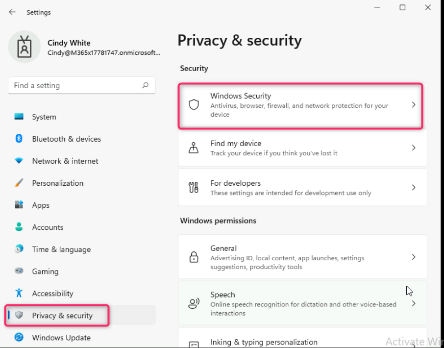
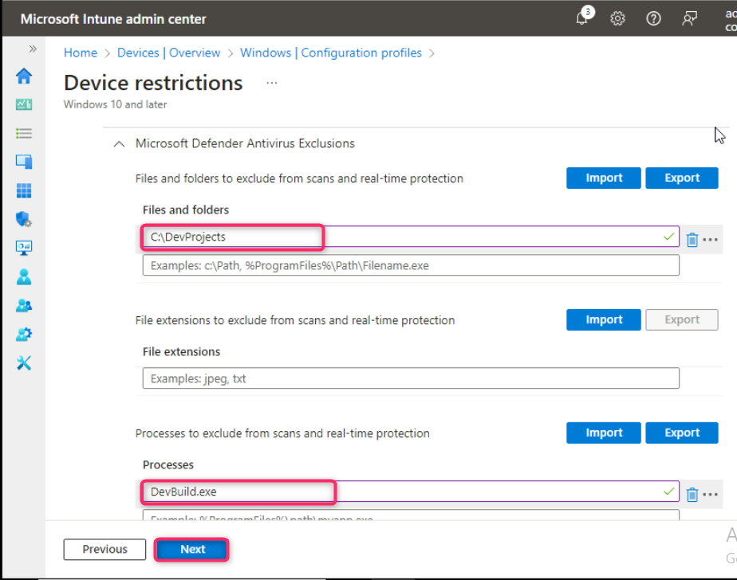
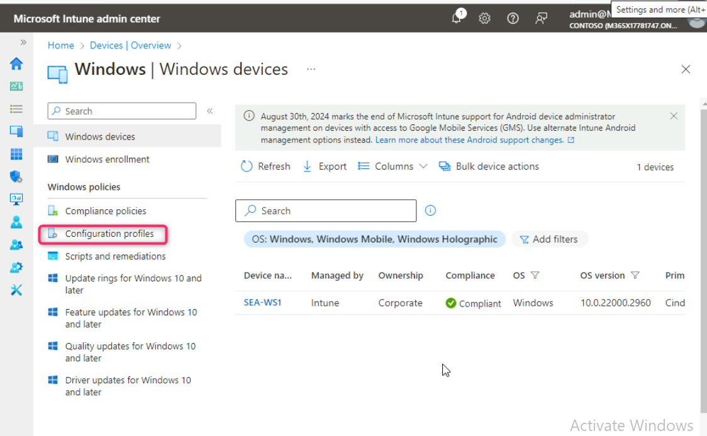
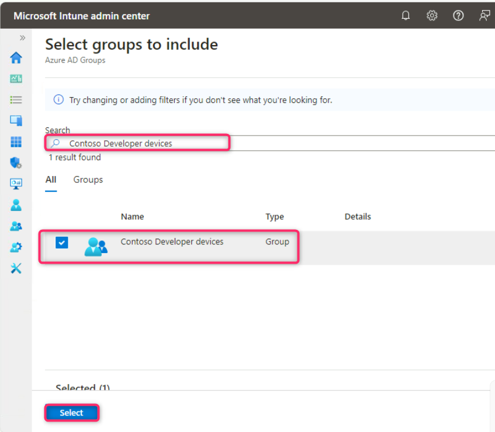
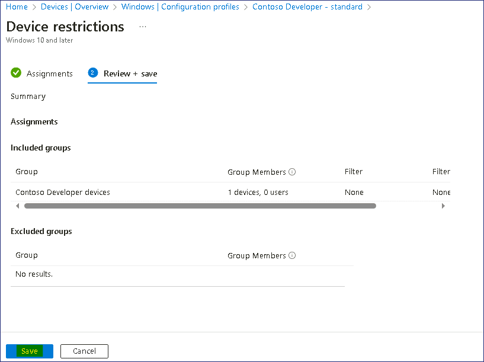
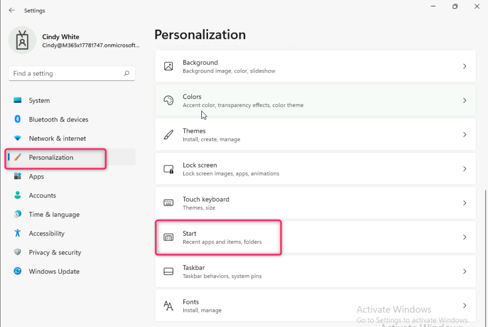

**實驗 7 - 創建和部署配置文件**

**總結**

在本實驗中，我們將使用 Microsoft Intune 為 Windows 11
設備創建和應用配置文件。

**先決條件**

在此實驗之前，必須完成以下實驗：

- 實驗 \#1 - 在 Microsoft Entra ID 中管理身份

- 實驗 \#2 - 使用 Microsoft Entra Connect 同步標識

- 實驗 \#5 - 管理設備註冊到 Microsoft Intune

- 實驗 \#6 - 將設備註冊到 Microsoft Intune

注意：您還需要一部可以接收短信的移動電話，該短信用於保護 Windows Hello
登錄身份驗證對 Microsoft Entra ID 的安全。

**練習 1：創建並應用配置文件。**

**場景**

您需要使用 Microsoft Entra 和 Microsoft Intune 來管理 Contoso
開發人員部門的成員。您被要求評估使用戶能夠在 Windows 11
設備上有效且安全地工作的解決方案。Cindy White
自願幫助您測試和評估解決方案並提供反饋。他還為您提供了一些初始要求，這些要求必須包含並應用於開發人員的
Windows 設備：

- Settings （設置） 中的 Gaming （遊戲） 部分應該不可見。

- 應盡可能限制 Settings （設置） 中的 Privacy （隱私） 部分。

- **C：\DevProjects** 文件夾必須從 Windows Defender 中排除。

- 必須從 Windows Defender 中排除devbuild.exe進程。

- 最常用的應用程序和最近添加的應用程序不應顯示在“開始”菜單上。

**任務 1：驗證設備設置**

1.  使用她的憑據以 **Cindy** White
    的身份登錄 [*SEA-WS1*](https://labclient.labondemand.com/Instructions/e7cc4ae1-e3d9-4c55-accc-696f537e1e17?rc=10) 
    !!**Cindy@M365xXXXXXX.onmicrosoft.com**!! 用 PIN 碼 !!**102938**!!
    或密碼!!**P@55w.rd1234**!!

2.  在任務欄上，選擇“**Start**”，然後選擇“**Settings**”。

3.  在 **Settings** （設置） 導航列表中，驗證您是否可以看到 **Gaming**
    （遊戲） 設置。

4.  選擇 **Personalization** 設置，然後在 個性化 頁面上，選擇
    **Start**。記下 **Show recently added apps**
    （顯示最近添加的應用程序） 和 **Show most used apps**
    （顯示最常用的應用程序） 設置。

5.  在 **Settings** 應用中，選擇 **Privacy & security**。

6.  在 **Privacy & security**
    頁面上，**注意安全、Windows權限**和**應用程序權限**下的選項。

7.  在 **Privacy & security** 頁面上，選擇**Windows
    Security**，然後選擇**Open Windows Security**。

8.  在 **Windows Security** 頁面上，選擇 **Virus & threat protection**。

9.  在 **Virus & threat protection** 頁面的 **Virus & threat protection
    settings**下，選擇 **Manage settings**。

10. 向下滾動到 **Exclusions** （排除項），然後選擇 **Add or remove
    exclusions** （添加或刪除排除項）。在 User Account Control
    （用戶帳戶控制） 對話框中，選擇 **Yes** （是）。

11. 在 **Exclusions** （排除項） 頁面上，驗證是否未配置任何排除項。

12. 關閉 **Windows 安全**窗口。

13. 關閉 **Settings** （設置） 窗口。

**任務 2：根據方案要求創建配置文件**

1.  切換到 [*SEA-SVR1*](https://labclient.labondemand.com/Instructions/e7cc4ae1-e3d9-4c55-accc-696f537e1e17?rc=10)。

2.  切換回打開**Microsoft
    Intune管理中心**的選項卡，從導航欄中選擇“**Devices**”。

3.  在 **Devices | Overview** 頁中，選擇 “**Windows**”，如下圖所示。

4.  在 **Windows | Windows devices** 頁面上，導航並單擊 **Configuration
    profiles**。

5.  在 **Windows | Configuration profiles** 頁面的 **Policies**
    選項卡中，單擊 **+ Create** 並選擇 **+ New Policy**。

6.  在右側顯示的 **Create a profile** （創建配置文件）
    窗格中，選擇以下選項，然後選擇 **Create** （創建）：

- 平臺： **Windows 10 and later**

- 配置文件類型： **Templates**

- 模板名稱： !!!!

7.  在 **Basics** 邊欄選項卡中，輸入以下信息，然後選擇“**Next**”：

- 名字： !!Contoso Developer - standard!!

- 描述： !!Basic restrictions and configuration for Contoso
  Developers.!!

8.  在 “**Configurations settings**” 邊欄選項卡上，展開 “**Control Panel
    and Settings**”。

9.  選擇 **Block** 在 **Gaming** 和 **Privacy** 選項。

10. 在 **Device restrictions** （設備限制） 邊欄選項卡上，展開
    **Start**（啟動）。

11. 向下滾動並選擇 “ **Most used apps**, **Recently added
    apps** 和 **Recently opened items in Jump Lists**” 旁邊的
    “**Block**”。

12. 在“**Device restrictions**”邊欄選項卡上，向下滾動並展開“**Microsoft
    Defender Antivirus**”。

13. 在 **Microsoft Defender Antivirus**下，向下滾動並展開 **Microsoft
    Defender Antivirus Exclusions**。

14. 在 **Microsoft Defender Antivirus Exclusions**
    下，提供以下詳細信息，然後單擊“**Next**”按鈕：

- 文件和文件夾框 - !!**C:\DevProjects**!!

- 流程盒 -  !!**DevBuild.exe**!!

15. 在 **Assignments** 選項卡中，單擊 **Next** 按鈕。

16. 在 **Applicability Rules** 選項卡中，單擊 **Next** 按鈕。

17. 在 **Review + create** 選項卡中，單擊 **Create** 按鈕。

18. Configuration profile （配置文件） 現在應該列出。

**任務 3：創建 Contoso 開發人員設備組**

1.  在 Microsoft Intune 管理中心的導航窗格中，選擇“**Groups**”。

2.  在 “**Groups | All groups**” 邊欄選項卡中，選擇“**New group**”。

3.  在 **New Group** （新建組） 邊欄選項卡上，輸入以下信息：

- 組類型： **Security**

- 組名： !!Contoso Developer devices!!

- 組介紹： !!All Windows devices in Contoso Developer department!!

- 成員身份類型： **Assigned**

4.  在 **Members** （成員） 下，選擇 **No members selected**
    （未選擇成員）。

5.  在 **Add members** 邊欄選項卡的 **Search** 框中鍵入 !!Sea!!。選擇
    **SEA-WS1**，然後選擇 **Select**。

6.  在 **New Group** 邊欄選項卡上，選擇 **Create**。

7.  在 “**Groups | All groups**” 邊欄選項卡中，驗證是否顯示“**Contoso
    developer devices**”組。

**任務 4：創建動態 Azure AD 設備組**

1.  在“**Groups | All Groups**”邊欄選項卡的詳細信息窗格上，選擇“**New
    group**”。

2.  在 **Group** （組） 邊欄選項卡上，提供以下值：

- 組類型： **Security**

- 組名： !!Windows Devices!!

- 成員身份類型： **Dynamic Device**

3.  在 **Dynamic Device Members** 部分下，選擇 **Add dynamic query**。

4.  在 **Dynamic membership rules** 邊欄選項卡上的 **Rule syntax**
    部分，選擇 **Edit**。

5.  在 **Edit rule syntax** （編輯規則語法）
    文本框中，添加以下簡單成員身份規則，然後選擇 **OK** （確定）。

!!**(device.deviceOSType -contains "Windows")**!!

6.  在 **Dynamic membership rules** （動態成員身份規則）
    邊欄選項卡上，選擇 **Save** （保存）。

7.  在 **New Group** （新建組） 頁面上，選擇 **Create** （創建）。

**任務 5：將配置文件分配給 Windows 設備**

1.  在 **Microsoft Intune
    管理中心**頁面上，從導航欄中選擇“**Devices**”。

2.  在 **Devices | Overview** 頁中，選擇 “**Windows**”，如下圖所示。

3.  在 **Windows | Windows devices** 頁面上，導航並單擊 **Configuration
    profiles**。

4.  在 **Devices | Configuration profiles**
    邊欄選項卡，在詳細信息窗格中，選擇 **Contoso Developer – standard**
    配置文件。

5.  在“**Contoso Developer –
    standard**”邊欄選項卡上，向下滾動到“**Assignments**”部分，然後選擇“**Edit**”。.

6.  在 Assignments （分配） 頁面的 **Included groups** （包含的組）
    下，選擇 **Add groups** （添加組）。

7.  在 **Select groups to include** 邊欄選項卡的 **Search**
    框中，鍵入並選擇 !!**Contoso Developer devices**!!  然後單擊
    **Select** 按鈕。

14. 返回“**Device restrictions**”邊欄選項卡，選擇“**Review +
    save**”，然後選擇“**Save**”。

**任務 6：驗證是否已應用配置文件**

1.  切換到 [*SEA-WS1*](https://labclient.labondemand.com/Instructions/e7cc4ae1-e3d9-4c55-accc-696f537e1e17?rc=10)。使用
    Cindy White 的帳戶登錄。

- 用戶名 - !!**Cindy@M365xXXXXXXX.onmicrosoft.com**!!

- 密碼 – !!**P@55w.rd1234**!!

2.  在任務欄上，選擇“**Start**”，然後選擇“**Settings**”。

> 

3.  在 **Settings** （設置） 窗口中，選擇 **Accounts** （帳戶）。在
    “帳戶 ”頁上，選擇 “**Access work or school**”。

4.  單擊 “**Connected to Contoso’s Azure AD**”
    旁邊的下拉列表，然後選擇“**Info**”按鈕。

5.  在 “**Managed by Contoso**”頁中，向下滾動，然後在
    “設備同步狀態”下，選擇 “**Sync**”。等待同步完成。

6.  

7.  關閉 **Settings** 應用程序。

> **注意：**同步進度可能需要長達 15 分鐘的時間，然後才能將配置文件應用於
> Windows 11 設備。注銷或重啟設備可以加速此過程。

8.  在 [*SEA-WS1*](https://labclient.labondemand.com/Instructions/e7cc4ae1-e3d9-4c55-accc-696f537e1e17?rc=10)上，
    再次選擇 **Start** 開始 然後選擇 **Settings**。驗證 **Gaming**
    （遊戲） 設置是否已刪除。

9.  選擇 **Privacy & security** ，並注意到許多隱私設置現在都被隱藏了。

10. 選擇 **Personalization** 設置，然後選擇 **Start**。確認 **Show
    recently added apps** 和 **Show most used apps** 已設置為 **Off**
    並灰顯。

11. 在“**Settings**”應用中，選擇“**Privacy and Security**”。

12. 在 **Privacy and Security** 頁面上，選擇**Windows
    Security**，然後選擇**Open Windows Security**。

13. 在 **Windows Security** 頁面上，選擇 **Virus & threat protection**。

14. 在 **Virus & threat protection** 頁面上，選擇 **Virus & threat
    protection settings** 下的**Manage settings**。

15. 向下滾動到 **Exclusions** （排除項），然後選擇 **Add or remove
    exclusions** （添加或刪除排除項）。在 User Account Control
    消息中選擇 **Yes**。

16. 在 **Exclusions** （排除項） 頁面上，驗證是否顯示
    **C：\DevProjects** 和 **DevBuild.exe**。

17. 關閉 **Windows Security** 頁面，然後關閉 **Settings** 應用程序。

**結果：**完成本練習後，您將成功為 Windows 11 設備創建並分配配置文件。

**練習 2：修改分配的配置文件策略。**

**場景**

Contoso
的策略有一個例外，該策略指定開發人員部門的成員不應在其設備上的“設置”中阻止“隱私”選項。應實施和測試此更改。

**任務 1：更改分配的配置文件中的設置**

1.  切換到 **SEA-SVR1**。切換回 **Microsoft Intune admin center**
    選項卡，從導航欄中選擇“**Devices**”。

2.  在 **Devices | Overview** 頁中，選擇 “**Windows**”，如下圖所示。

3.  在 **Windows | Windows devices** 頁面上，導航並單擊 **Configuration
    profiles**。

4.  在 **Devices | Configuration profiles**
    邊欄選項卡中，在詳細信息窗格中選擇“**Contoso Developer -
    standard**”。

5.  在 “**Contoso Developer - standard**” 邊欄選項卡上，向下滾動到
    “**Configuration settings**” 部分，然後選擇 “**Edit**”。

6.  在 **Device restrictions** （設備限制） 頁面上，展開 **Control Panel
    and Settings**。

7.  在 **Privacy** （隱私） 旁邊，確保 **Not configured** （未配置）
    處於選中狀態。

8.  選擇 “**Review + save** ”，然後選擇 “**Save**”。

**任務 2：從 Microsoft Intune 管理中心強制同步設備**

1.  在 [*SEA-SVR1*](https://labclient.labondemand.com/Instructions/e7cc4ae1-e3d9-4c55-accc-696f537e1e17?rc=10)
    上，在 **Microsoft Intune
    管理中心**，選擇導航窗格中的“**Devices**”，然後選擇 “**All
    devices**”，然後選擇“**SEA-WS1**”。

2.  在 **SEA-WS1** 邊欄選項卡上，選擇 “**Sync**”，並在出現提示時選擇
    “**Yes**”。

**注意：**Intune 將連接設備並同步所有策略。這可能需要長達 5 分鐘的時間。

**任務
3：驗證 [*SEA-WS1*](https://labclient.labondemand.com/Instructions/e7cc4ae1-e3d9-4c55-accc-696f537e1e17?rc=10)
上的更改**

1.  切換到
     [*SEA-WS1*](https://labclient.labondemand.com/Instructions/e7cc4ae1-e3d9-4c55-accc-696f537e1e17?rc=10)。在任務欄上，選擇“**Start**”，然後選擇“**Settings**”。

2.  在 **Settings** 應用中，選擇 **Privacy &
    security**，並驗證所有自定義選項都已恢復。

3.  關閉所有打開的窗口並注銷 **SEA-WS1**。

**結果：**完成本練習後，您將成功修改已分配的配置文件、修改配置文件並驗證更改。
