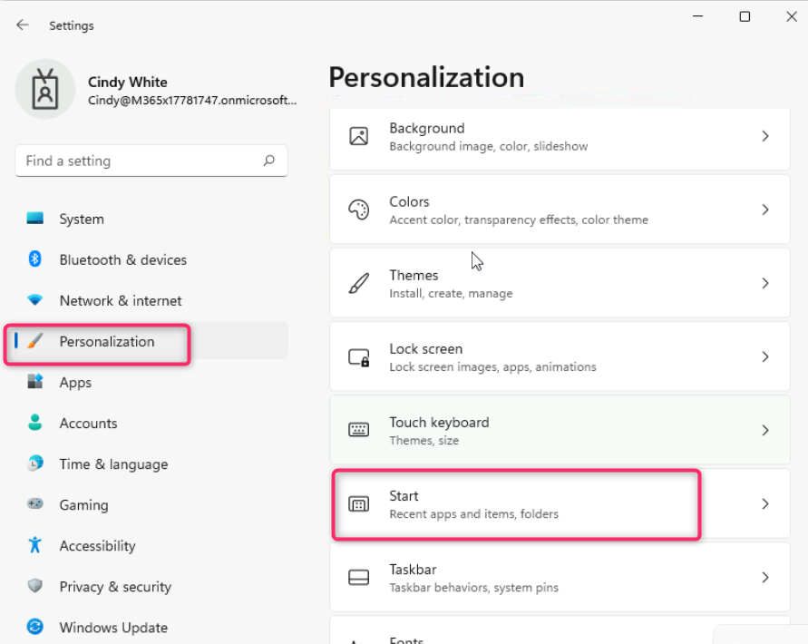
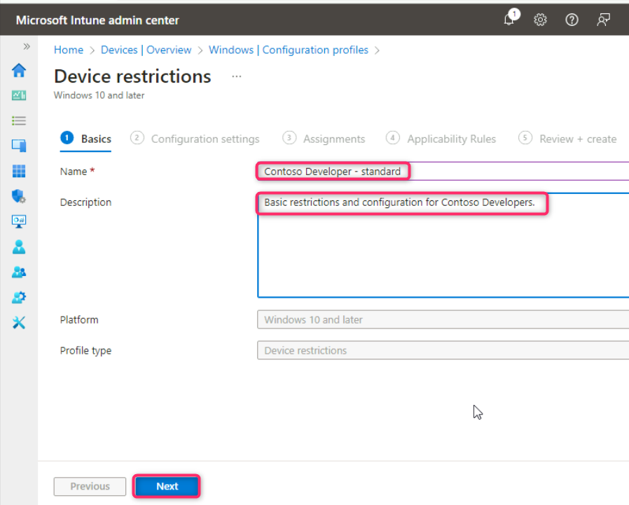
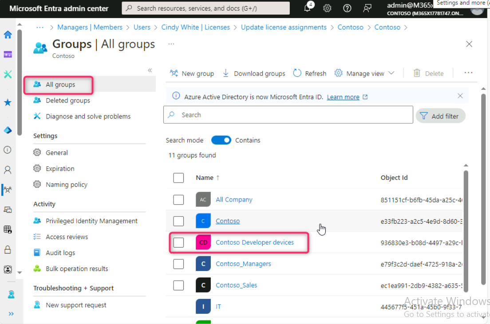
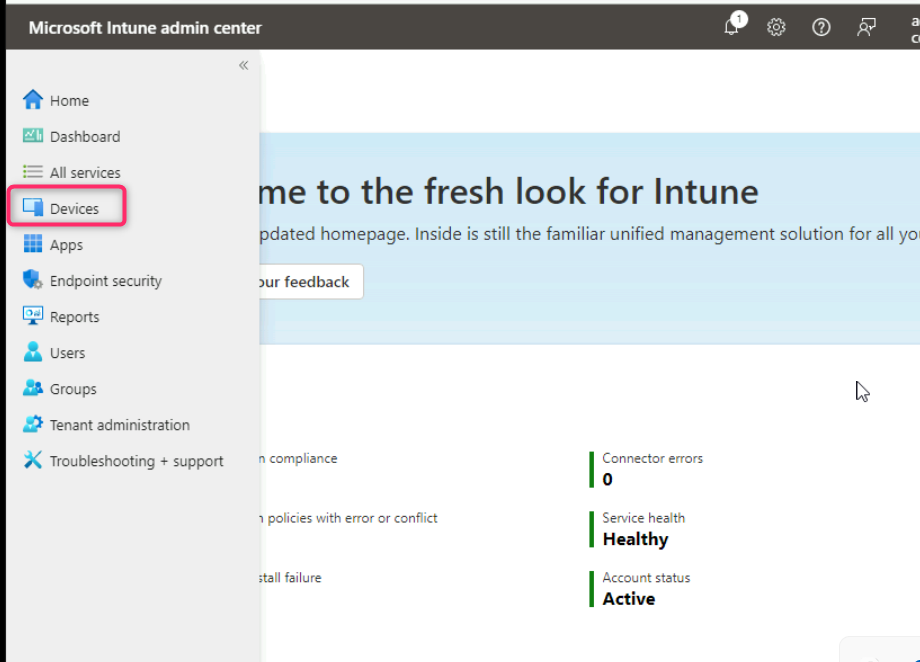
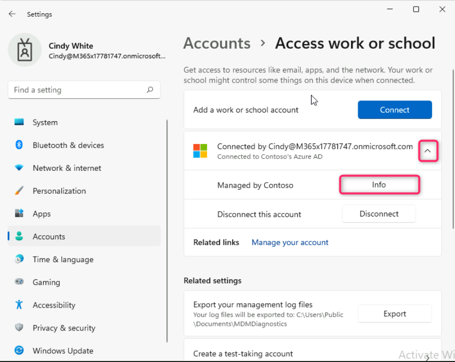
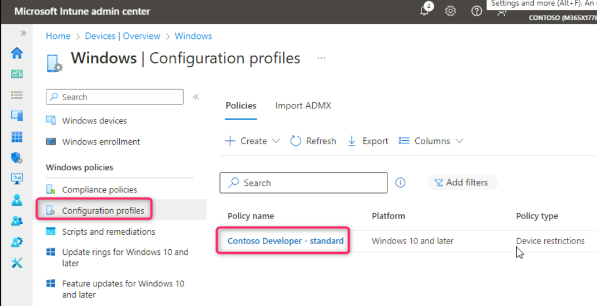
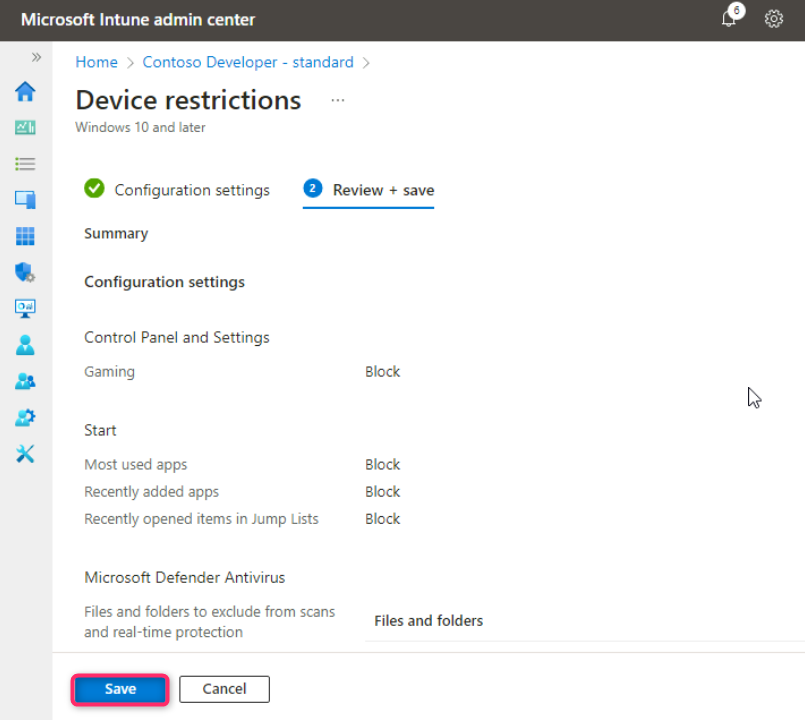
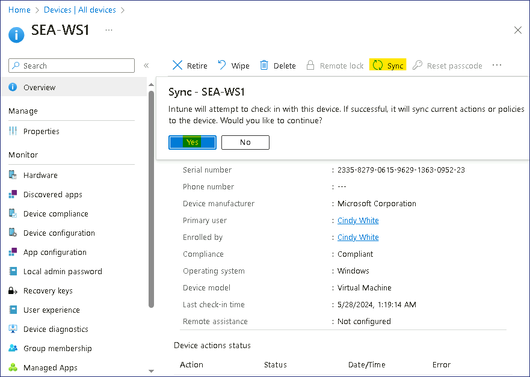

**Atelier 07 : création et déploiement de profils de configuration**

**Résumé**

Dans cet atelier, nous allons utiliser Microsoft Intune pour créer et
appliquer un profil de configuration pour un appareil Windows 11.

**Conditions préalables**

Le(s) Ateliers suivant(s) doit(vent) être completé(s) avant cet atelier
:

- Atelier \#1-Gestion des identités dans Microsoft Entra ID

- Atelier \#2 : Synchronisation des identités à l'aide de Microsoft
  Entra Connect

- Atelier \#5 : Gérer l'inscription d'un appareil dans Microsoft Intune

- Atelier \#6-Inscription d'appareils dans Microsoft Intune

Remarque : Vous aurez également besoin d'un téléphone mobile capable de
recevoir des SMS utilisés pour sécuriser l'authentification de connexion
Windows Hello à Microsoft Entra ID.

**Exercice 1 : Création et application d'un profil de configuration.**

**Scénario**

Vous devez utiliser Microsoft Entra et Microsoft Intune pour gérer les
membres du service Développeurs chez Contoso. Il vous a été demandé
d'évaluer les solutions qui permettraient aux utilisateurs de travailler
efficacement et en toute sécurité sur les appareils Windows 11. Cindy
White s'est portée volontaire pour vous aider à tester et à évaluer la
solution et à vous faire part de vos commentaires. Il vous a également
donné quelques exigences initiales qui doivent être incluses et
appliquées aux appareils Windows du développeur :

- La section Jeux dans les paramètres ne doit pas être visible.

- La section Confidentialité des paramètres doit être restreinte autant
  que possible.

- Le dossier **C :\DevProjects** doit être exclu de Windows Defender.

- Le processus devbuild.exe doit être exclu de Windows Defender.

- Les applications les plus utilisées et les applications ajoutées
  récemment ne doivent pas s'afficher dans le menu Démarrer.

**Tâche 1 : Vérifier les paramètres de l'appareil**

1.  Connectez-vous à
    [*SEA-WS1*](https://labclient.labondemand.com/Instructions/e7cc4ae1-e3d9-4c55-accc-696f537e1e17?rc=10)
    en tant que **Cindy** White en utilisant ses identifiants
    !!**Cindy@M365xXXXXXX.onmicrosoft.com** !! avec le PIN
    !!**102938** !! ou Mot de passe !!**P@55w.rd1234** !!

2.  Dans la barre des tâches, sélectionnez **Start**, puis sélectionne
    **Settings**.

3.  Dans la liste de navigation **Settings**, vérifiez que vous pouvez
    voir le paramètre **Gaming**.

4.  Sélectionnez le paramètre **Personnalisation**, puis sur la page
    Personnalisation, sélectionnez **start**. Notez les paramètres
    **Show recently added apps**  et **Show most used apps**.

5.  Dans l' application **Settings**, sélectionnez **Privacy &
    security**.

6.  Sur la page **Privacy & security**, notez les options sous
    **Security**, **Windows permissions** et **App permissions**.

7.  Dans la page **Privacy & security**  sélectionnez **Windows
    Security** , puis sélectionnez **Open Windows Security**.

8.  Sur la page **Windows Security** , sélectionnez **Virus & threat
    protection**.

9.  Sur la page **Virus & threat protection**, sous **Virus & threat
    protection**, sélectionnez **Manage settings**.

10. Faites défiler la page jusqu'à **Exclusions** et sélectionnez **Add
    or remove exclusions**. Dans la boîte de dialogue Contrôle de compte
    d'utilisateur, sélectionnez **Yes**.

11. Sur la page **Exclusions**, vérifiez qu'aucune exclusion n'a été
    configurée.

12. Fermez la fenêtre **Windows security**.

13. Fermez la fenêtre **Settings**.

**Tâche 2 : Créer un profil de configuration basé sur les exigences du
scénario**

1.  Passez à
    [*SEA-SVR1*](https://labclient.labondemand.com/Instructions/e7cc4ae1-e3d9-4c55-accc-696f537e1e17?rc=10).

2.  Revenez à l'onglet avec le **Microsoft Intune admin center** ouvert,
    sélectionnez **Devices** dans la barre de navigation.

3.  Sur les Page **Devices | Overview** , sélectionnez **Windows** comme
    indiqué dans l'image ci-dessous.

4.  Sur les pages des **Windows | Windows devices**, naviguez et cliquez
    sur **Configuration profiles**.

5.  Sur les pages **Windows | Configuration profiles** , dans l' onglet
    **Polocies**, cliquez sur **+ Create** et sélectionnez **+ New
    Policy**.

6.  Dans le volet **Créer un profil** qui s'affiche sur le côté droit,
    sélectionnez les options suivantes, puis sélectionnez **Create** :

- Plate-forme : **Windows 10 et versions ultérieures**

- Type de profil : **Modèles**

- Nom du modèle : !! !!

7.  Dans le panneau **basics** , entrez les informations suivantes, puis
    sélectionnez **Next** :

- Nom : !!Contoso Developer - standard !!

- La description : !!Basic restrictions and configuration for Contoso
  Developers.!!

8.  Dans le panneau **Configurations settings** , développez **Control
    Panel and Settings**.

9.  Sélectionnez **Block** à côté des options **Gaming** et **Privacy**.

10. Dans le panneau **Device restrictions** , développez **Start**.

11. Faites défiler l'écran vers le bas et sélectionnez **Block** à côté
    des **applications les plus utilisées**, des **applications
    récemment ajoutées** et des **éléments récemment ouverts dans les
    listes de raccourcis**.

12. Dans le panneau **Device restrictions** faites défiler vers le bas
    et développez **Microsoft Defender Antivirus**.

13. Sous **Microsoft Defender Antivirus**.faites défiler vers le bas et
    développez **Exclusions de Microsoft Defender Antivirus**..

14. Sous **Exclusions de Microsoft Defender Antivirus** fournissez les
    détails ci-dessous et cliquez sur le bouton **Next** :

- Boîte de fichiers et dossiers - !!**C :\DevProjects** !!

- Boîte de processus - !!**DevBuild.exe** !!

15. Dans l' **Assignments**, cliquez sur le bouton **Next**.

16. Dans l' onglet **Applicability Rules**, cliquez sur le bouton
    **Next**.

17. Dans l' onglet **Review + create** , cliquez sur le bouton
    **Create**.

18. Le profil de configuration doit maintenant être répertorié.

**Tâche 3 : Créer le groupe d'appareils Contoso Developer**

1.  Dans le Microsoft Intune admin center, dans le volet de navigation,
    sélectionnez **Groups**.

2.  Sur les **Groups | All groups** , sélectionnez **New group**.

3.  Dans le panneau **New Group** , entrez les informations suivantes :

- Type de groupe : **Sécurity**

- Nom du groupe : !! Contoso Developer devices!!

- Description du groupe : !! All Windows devices in Contoso Developer
  department!

- Type d'adhésion : **Assigned**

4.  Sous **Membres**, sélectionnez **No members selected.**

5.  Dans le panneau **Add members**  dans la zone de **Search**  tapez
    !!Sea !! . Sélectionnez **SEA-WS1,** puis sélectionnez **Select**.

6.  Dans le panneau **New group**, sélectionnez **Create**.

7.  Sur les **Groups | All groups** , vérifiez que le groupe **Contoso
    developer devices**  est affiché.

**Tâche 4 : Créer un groupe d'appareils Azure AD dynamique**

1.  Sur le panneau **Groups | All Groups**  dans le volet
    d'informations, sélectionnez **New group**.

2.  Dans le panneau **Group,** fournissez les valeurs suivantes **:**

- Type de groupe : **Sécurity**

- Nom du groupe : !!Appareils Windows !!

- Type d'adhésion : **Dynamic Device**

3.  Dans la section **Membres de l'appareil dynamique**, sélectionnez
    **Add dynamic query**

4.  Dans le panneau **Dynamic membership rules** , dans la section
    **Syntaxe de la règle**, sélectionnez **Edit**.

5.  Dans la zone de texte **Modifier la syntaxe de la règle**, ajoutez
    la règle d'appartenance simple suivante et sélectionnez **OK.**

!!**(device.deviceOSType -contains "Windows")**!!

6.  Dans le panneau **Règles d'appartenance dynamiques**, sélectionnez
    **Save**.

7.  Sur la page **New Group** , sélectionnez **Create**.

**Tâche 5 : Attribuer un profil de configuration aux appareils Windows**

1.  Sur la page du **Microsoft Intune admin center**, sélectionnez
    **Devices** dans la barre de navigation.

2.  Sur la page de **Devices | Overview** , sélectionnez **Windows**
    comme indiqué dans l'image ci-dessous.

3.  Sur la page **Windows | Windows devices**, naviguez et cliquez sur
    **Configuration profiles**.

4.  Sur le panneau **Devices | Configuration profiles** . Dans le volet
    d'informations, sélectionnez le profil **Contoso Developer –
    standard**.

5.  Dans le panneau **Contoso Developer – standard**, faites défiler
    jusqu'à la section **Assignments** puis sélectionnez **Edit**.

6.  Sur la page Attributions, sous **included Groups** , sélectionnez
    **Add groups**.

7.  Dans la Panneau **Select groups to include**  dans la lame, dans la
    zone **Recherche,** tapez et sélectionnez !!**Contoso Developer
    device**!! puis cliquez sur le bouton **Sélect.**

14. De retour dans le panneau **Device restrictions**  sélectionnez
    **Review + save**, puis **Save**.

**Tâche 6 : Vérifier que le profil de configuration est appliqué**

1.  Passez à
    *[SEA-WS1](https://labclient.labondemand.com/Instructions/e7cc4ae1-e3d9-4c55-accc-696f537e1e17?rc=10).*
    Connectez-vous à l'aide du compte de Cindy White.

- Nom d'utilisateur - !!**Cindy@M365xXXXXXXX.onmicrosoft.com** !!

- Mot de passe – !!**P@55w.rd1234** !!

2.  Dans la barre des tâches, sélectionnez **Start**, puis électionnez
    **Setting**.

> 

3.  Dans la fenêtre **Settings**, sélectionnez **Accounts**. Sur la page
    Comptes, sélectionnez.

4.  Cliquez sur la liste déroulante à côté de **Connected to Contoso’s
    Azure AD** et sélectionnez le bouton **Info** .

5.  Dans la **page Géré par Contoso**, faites défiler l'écran vers le
    bas, puis sous État de la synchronisation de l'appareil,
    sélectionnez **Sync**. Attendez la fin de la synchronisation.

6.  

7.  Fermez l' app **Settings**.

> **Remarque** : La progression de la synchronisation peut prendre
> jusqu'à 15 minutes avant que le profil ne soit appliqué à l'appareil
> Windows 11. La déconnexion ou le redémarrage de l'appareil peut
> accélérer ce processus.

8.  Sur
    [*SEA-WS1*](https://labclient.labondemand.com/Instructions/e7cc4ae1-e3d9-4c55-accc-696f537e1e17?rc=10),
    sélectionnez à nouveau **Start** , puis **Settings**. Vérifiez que
    le paramètre de **Gaming vu** a été supprimé.

9.  Sélectionnez **Privacy & security**  et notez que de nombreux
    paramètres de confidentialité sont désormais masqués.

10. Sélectionnez le paramètre **Personnalisation**, puis sélectionnez
    **Start**. Vérifiez que l'**option Afficher les applications
    récemment ajoutées** et **Afficher les applications les plus
    utilisées** sont **off** et grisée.

11. Dans l' application **Setting**, sélectionnez **Privacy and
    Security**.

12. Sur la page **Privacy and Security**.sélectionnez **Windows
    security**, puis **Open** **Windows security**.

13. Sur la page **Windows security**, sélectionnez **Virus & threat
    protection**.

14. Sur la page **Virus & threat protection**, sélectionnez **Manage
    settings**  sous **Virus & threat protection settings**.

15. Faites défiler la page jusqu'à **Exclusions** et sélectionnez **Add
    or remove exclusions**. Sélectionnez **Yes** dans le message de
    contrôle de compte d'utilisateur.

16. Sur la page **Exclusions**, vérifiez que **C :\DevProjects** et
    **DevBuild.exe** sont affichés.

17. Fermez la page **Windows security**, puis fermez l' app
    **Settings**.

**Résultats** : Une fois cet exercice terminé, vous aurez créé et
attribué un profil de configuration pour un appareil Windows 11.

**Exercice 2 : Modifier une stratégie de profil de configuration
attribuée.**

**Scénario**

Il y avait une exception à la politique de Contoso qui spécifie que les
membres du service Développeur ne doivent pas voir les options de
confidentialité bloquées dans les paramètres sur leurs appareils. Ce
changement devrait être mis en œuvre et testé.

**Tâche 1 : Modifier les paramètres d'un profil de configuration
attribué**

1.  Passez à **SEA-SVR1**. Revenez à l' onglet **Microsoft Intune admin
    center**, sélectionnez **Devicess** dans la barre de navigation.

2.  Sur la page **Devices | Overview** , sélectionnez **Windows** comme
    indiqué dans l'image ci-dessous.

3.  Sur la page **windows | Windows devices**, naviguez et cliquez sur
    **Configuration profiles**..

4.  Sur le panneau **Devices | Configuration profiles** , dans le volet
    d'informations, sélectionnez **Contoso Developer - standard**.

5.  Dans le panneau **Contoso Developer - standard**, faites défiler
    jusqu'à la section **Paramètres de configuration**, puis
    sélectionnez **Edit**.

6.  Sur la page **Device restrictions** , développez **Control Panel and
    Settings**.

7.  À côté de **Privacy** assurez-vous que **ot configured** iest
    sélectionné.

8.  Sélectionnez **Review + save**, puis **Save**.

**Tâche 2 : Forcer la synchronisation de l'appareil à partir de
Microsoft Intune admin center**

1.  Sur
    [*SEA-SVR1*](https://labclient.labondemand.com/Instructions/e7cc4ae1-e3d9-4c55-accc-696f537e1e17?rc=10),
    dans le **Microsoft Intune admin center**, sélectionnez **Devices**
    dans le volet de navigation, puis Tous **All devices** et
    **SEA-WS1**.

2.  Sur la lame **SEA-WS1**, sélectionnez **Sync** et, lorsque vous y
    êtes invité, sélectionnez **Yes**.

**Remarque** : Intune connecte l'appareil et synchronise toutes les
stratégies. Cela peut prendre jusqu'à 5 minutes.

**Tâche 3 : Vérifier les modifications sur
[*SEA-WS1*](https://labclient.labondemand.com/Instructions/e7cc4ae1-e3d9-4c55-accc-696f537e1e17?rc=10)**

1.  Passez à
    [*SEA-WS1*](https://labclient.labondemand.com/Instructions/e7cc4ae1-e3d9-4c55-accc-696f537e1e17?rc=10).
    Dans la barre des tâches, sélectionnez **Start**, puis **Settings**.

2.  Dans l' app **PSettings**, sélectionnez **Privacy & security**  et
    vérifiez que toutes les options de personnalisation sont de retour.

3.  Fermez toutes les fenêtres ouvertes et déconnectez-vous de
    **SEA-WS1**.

**Résultats** : Une fois cet exercice terminé, vous aurez réussi à
modifier un profil de configuration attribué, à modifier un profil de
configuration et à vérifier les modifications.
