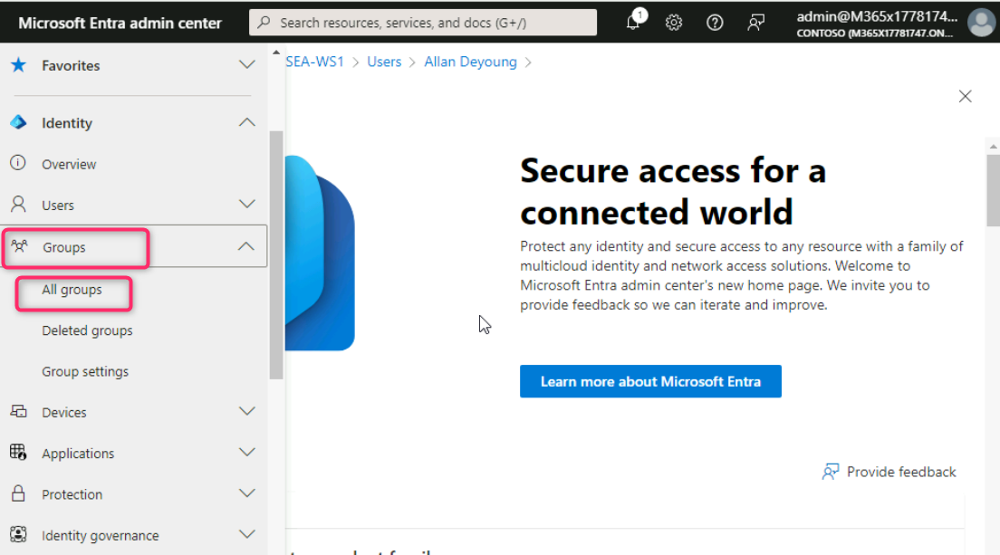
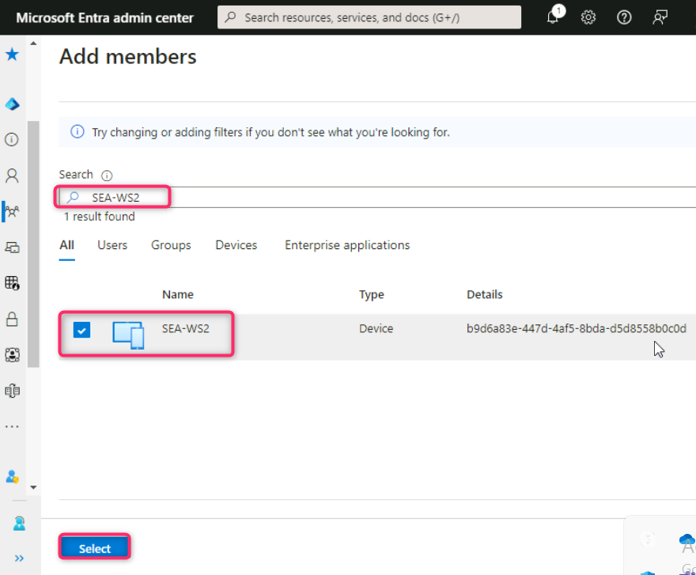
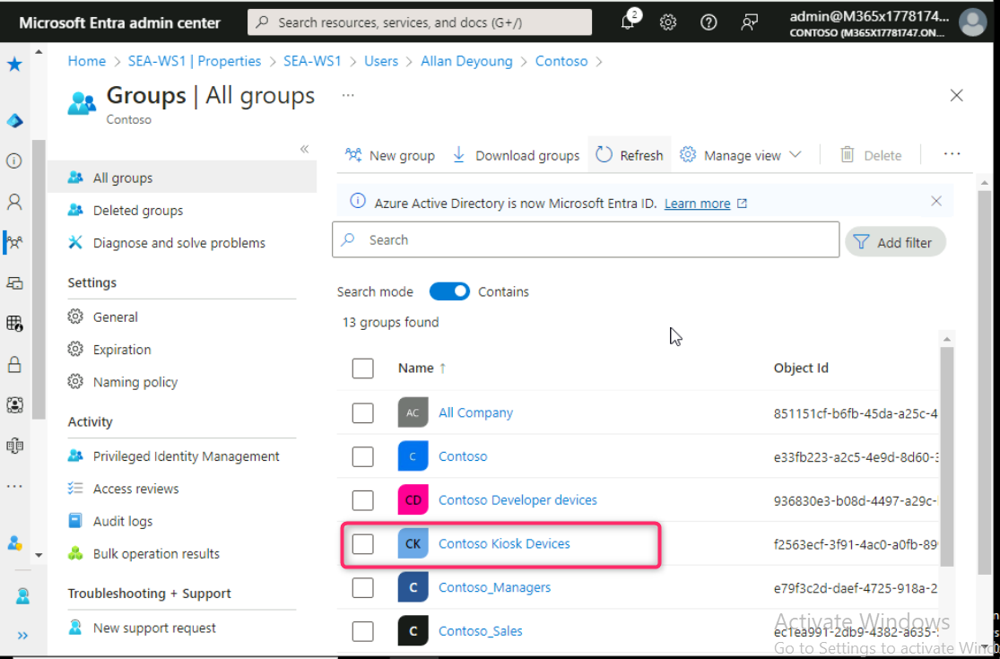
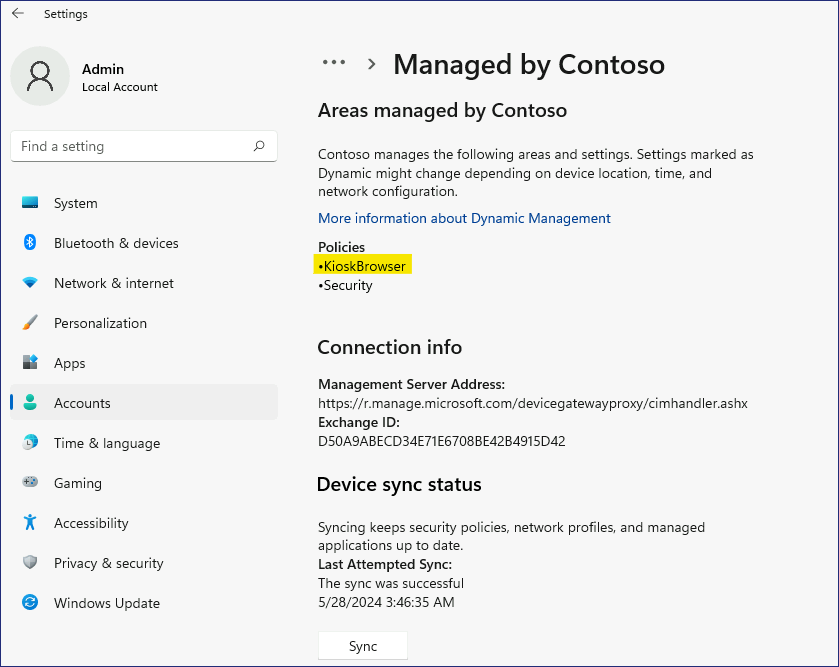

**ラボ 8 - 構成プロファイルを使用したキオスク モードの構成**

**要約**

このラボでは、Microsoft Intune を使用して、Windows 11 デバイスでシングル
アプリ キオスク
モードを実行するための構成プロファイルを作成して適用します.

**前提 条件**

この実習ラボの前に、以下の実習を完了する必要があります：

- ラボ 05 - Microsoft Intune へのデバイス登録の管理

注:Entra IDへのWindows
Helloサインイン認証を保護するために使用されるテキストメッセージを受信できる携帯電話も必要です。

**手順 1: Configurationプロファイルを作成して適用する**

**シナリオ**

Contoso 社の訪問者がインターネットを閲覧できるように、SEA-WS2 を Windows
11
キオスクとして構成するよう求められています。キオスクが以下のように構成されていることを確認する：

- 単一のアプリ、全画面表示のキオスク.

- 自動ログオン.

- パブリック ブラウジング (InPrivate) モードで構成される Microsoft Edge
  ブラウザーへのアクセスを提供します。ホーム
  ページは**、http://bing.com** 用に構成する必要があります。

**Task 1: SEA-WS2 を Microsoft Intune に登録する**

1.  アドミンとして[*SEA-WS2*](https://labclient.labondemand.com/Instructions/e7cc4ae1-e3d9-4c55-accc-696f537e1e17?rc=10) にサインインして!!**Pa55w.rd**!!を使用する。

2.  タスクバーで**Start**を選択して**、Settings**を選択する。

3.  **Settings**ウィンドに**Accounts**を選択する。

4.  Accountsページで**Access work or school**を選択する。

5.  **Access work or school**ページに**Connect**を選択する。

6.  **Microsoft account**ウィンドに **Join this device to Microsoft
    Entra ID**を選択する。

7.  **Sign**
    [**inページに**!!**AllanD@M365xXXXXXX.onmicrosoft.com**](mailto:inページに!!AllanD@M365xXXXXXX.onmicrosoft.com)!!を入力して**Next**を選択する。

8.  On the **Enter
    passwordページでテナントパスワードを入力する：**!!**P@55w.rd1234**!!
    **Sign in**を選択する。

9.  **Make sure this is your
    organization**ダイアログボックスで**Join**を選択する。

10. **You're all set!**ページで、情報を読んでから**Done**を選択する。

11. **Access work or school**セクションに **Connected to Contoso's Azure
    AD**が表示することを確認する。

12. **Connected to Contoso's Azure AD**を選択して**、Info**を選択する。

13. Scroll down, and then
    select スクロールダウンして**Sync**を選択する**。これは、Intune**とのデバイスの同期強制します**。**

14. **Settings**ウィンドを閉じる。

**タスク 2: Contoso Kiosk デバイス グループを作成する**

1.  [*SEA-SVR1*](https://labclient.labondemand.com/Instructions/e7cc4ae1-e3d9-4c55-accc-696f537e1e17?rc=10)で、**Microsoft
    Entra admin
    center**タブに切り替える。**Groups**に移動して選択し**、All
    groups**をクリックする。

2.  **Groups | All groups**ページで**New group**を選択する。

3.  **New Group**ブレードに以下の情報を入力する**：**

- Group type: **Security**

- Group name: !! Contoso Kiosk Devices!!

- Group description: !!All Windows devices configured as a Kiosk!!

- Membership type: **Assigned**

4.  **Memberの下にNo members selected**を入力する。

5.  **Add
    membersブレードにSearchボックスにSea**を入力する。**SEA-WS2**を選択してから**Select**を選択する。

6.  **New GroupブレードにCreate**を選択する。

7.  **Groups | All groups**ブレードでページを更新**Contoso Kiosk
    Devices**グループが表示されることを確認する。 

**Task 3: シナリオ要件に基づくConfigurationプロファイルの作成**

1.  Microsoft Intune admin
    centerに戻り、ナビゲーションバーから**Devices**を選択する

2.  **Devices |
    Overview**ページで以下の画像で示すよう**Windows**を選択する**。**

3.  **Windows | Windows devices**ページで**Configuration
    profiles**に移動してクリックする。

4.  **Windows | Configuration profiles**ページで**Policies**タブに+
    **Create**をクリックして**+ New Policy**を選択する**。**

5.  **Create a
    profile**ブレードに次のオプションを選択して**、Create**を選択する**：**

- Platform: **Windows 10 and later**

- Profile type: **Templates**

- Template name: !!**Kiosk**!!

6.  **Basics**ブレードに次の情報を入力して**Next**を選択する：

- Name: !!Contoso Kiosk Policy!!

- Description: !!Basic settings for Contoso Kiosk Devices.!!

7.  **Configuration settings**ブレードで、 **Select a kiosk
    mode**の横に、**Single app, full-screen kiosk**を選択する。

選択したモードに基づいて、追加のオプションが表示されます。

8.  **Configuration
    settings**ブレードで以下のオプションを選択してから**Next**を選択する：

- User logon type: **Auto logon (Windows 10, version 1803 and later, or
  Windows 11)**

- Application type: **Add Microsoft Edge browser**

- Edge Kiosk URL: !! **http://bing.com**!!

- Microsoft Edge kiosk mode type: **Public Browsing (InPrivate)**

- Refresh browser after idle time: **5**

- Specify Maintenance Window for App Restarts: **Not configured**

> 

9.  **Assignments**ブレードで**Included groups**の下にある**Add
    groups**を選択する。

10. **Select groups to include**ウィンドに !!**Contoso Kiosk
    Devices**!!を選択し、**Select**を選択する。

11. **Assignment**タブに**Next**ボタンをクリックする**。**

12. **Applicability Rules**タブに**Next**ボタンをクリックする**。**

13. **Review + create**タブに**Create**ボタンをクリックする**。**

14. Configurationプロファイルがリストされる。

**Task 4: Configurationプロファイルが適用されていることを確認する**

1.  [*SEA-WS2*](https://labclient.labondemand.com/Instructions/e7cc4ae1-e3d9-4c55-accc-696f537e1e17?rc=10)に**Adminとしてサインインし、**パスワード!!**Pa55w.rd**!!を使用する。

2.  タスクバーで**Start**を選択して**Settings**を選択する。

3.  **Settings**ウィンドに**Accounts**を選択する

4.  Accountsページで**Access work or school**を選択する。

5.  **Connected to Contoso's Azure AD**を選択して**Info**を選択する。

6.  スクロールダウンして**Syncを選択する。**これにより、Intuneとのデバイスの同期強制されます。

7.  **Settings**ウィンドを閉じる**。**

> 

5.  **SEA-WS2を再起動する。**

SEA-WS2
が自動的にサインインし、プロファイルを作成することに注意する。サインインが完了すると、InPrivate
ブラウジングが構成された Microsoft Edge が表示されます。SEA-WS2
が自動的にサインインしない場合は、手順 1 ～ 7
を繰り返して、デバイスのポリシーが更新されていることを確認する。

**結果**: この手順を完了すると、Windows 11 デバイスをシングル アプリ
キオスクとして構成するためのConfigurationプロファイルが正常に作成され、割り当てられます。
