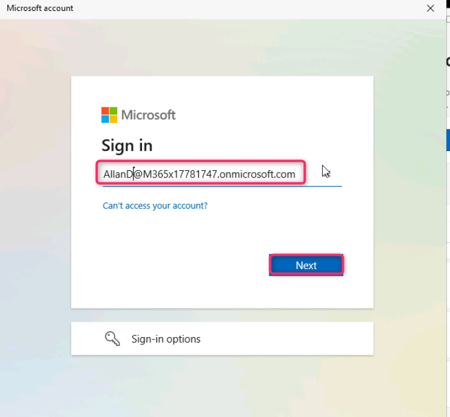
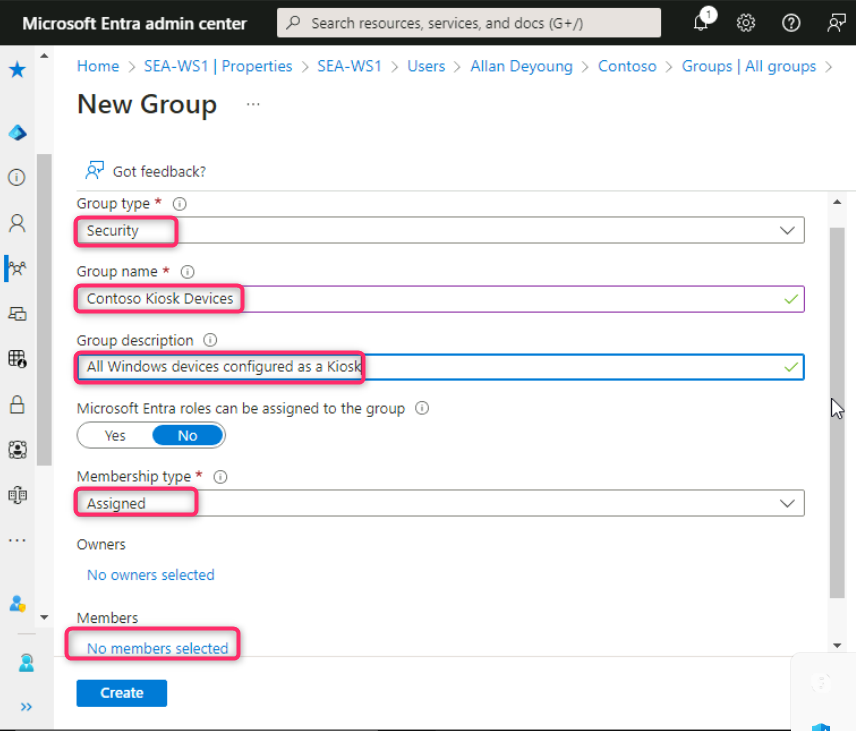

**Atelier 08 - Utilisation d'un profil de configuration pour configurer
le mode kiosk**

**Résumé**

Dans cet atelier, nous allons utiliser Microsoft Intune pour créer et
appliquer un profil de configuration afin d'exécuter le mode Kiosk à
application unique sur un appareil Windows 11.

**Conditions préalables**

Atelier(s) suivant(s) doit(vent) être completé(s) avant cet atelier :

- Atelier 05 - Gérer l'inscription d'un appareil dans Microsoft Intune

Remarque : Vous aurez également besoin d'un téléphone mobile capable de
recevoir des SMS utilisés pour sécuriser l'authentification de connexion
Windows Hello à Entra ID.

**Exercice 1 : Création et application d'un profil de configuration**

**Scénario**

Vous avez été invité à configurer **SEA-WS2** en tant que kiosk Windows
11 pour permettre aux visiteurs de Contoso de naviguer sur Internet.
Vous devez vous assurer que le kiosk est configuré comme suit :

- Une seule application, un kiosk plein écran.

- Connexion automatique.

- Permet d'accéder au navigateur Microsoft Edge, qui doit être configuré
  en mode de navigation publique (InPrivate). La page d'accueil doit
  être configurée pour **http://bing.com**.

**Tâche 1 : Inscrire SEA-WS2 à Microsoft Intune**

1.  Connectez-vous à
    [*SEA-WS2*](https://labclient.labondemand.com/Instructions/e7cc4ae1-e3d9-4c55-accc-696f537e1e17?rc=10)
    en tant qu'**administrateur** avec le mot de passe de !!**Pa55w.rd**
    !!.

2.  Dans la barre des tâches, sélectionnez **Start**, puis Paramètres.

3.  Dans la fenêtre **Settings**, sélectionnez **Accounts**.

4.  Sur la page Comptes, sélectionnez Accéder **Access work or school**

5.  Sur la page **Access work or school**  sélectionnez **connect**.

6.  Dans la fenêtre du **Microsoft account** , sélectionnez **Join this
    device to Microsoft Entra ID**

7.  Sur la page **Sign in** , tapez
    !!**AllanD@M365xXXXXXX.onmicrosoft.com** !! , puis sélectionnez
    **next**.

8.  Sur la page **Entrer le mot de passe**, entrez le mot de passe du
    locataire : !!**P@55w.rd1234** !! , puis sélectionnez **Sign in** .

9.  Dans la boîte de dialogue **Assurez-vous qu'il s'agit de votre
    organisation,** sélectionnez **join**.

10. Sur le site **Vous êtes prêt !** lisez les informations, puis
    sélectionnez **Done**.

11. Dans la section **Access work or school** , vérifiez que **Connected
    to Contoso's Azure AD**  **s'**affiche.

12. Sélectionnez **Connected to Contoso's Azure AD** , puis **Info**.

13. Faites défiler l'écran vers le bas, puis sélectionnez **Sync**. Cela
    forcera la synchronisation d'un appareil avec Intune.

14. Fermez la fenêtre **Settings**.

**Tâche 2 : Créer le groupe d'appareils Contoso Kiosk**

1.  Sur
    [*SEA-SVR1*](https://labclient.labondemand.com/Instructions/e7cc4ae1-e3d9-4c55-accc-696f537e1e17?rc=10),
    basculez vers l' onglet **Microsoft Entra admin center**. Naviguez
    et sélectionnez **Group,** puis cliquez sur **All groups**.

2.  Sur les **Groups | All groups**  sélectionnez **New group**..

3.  Dans le panneau **New group**, entrez les informations suivantes :

- Type de groupe : **Sécurity**

- Nom du groupe : !! Contoso Kiosk Devices!!

- Description du groupe : !! All Windows devices configured as a Kiosk!!

- Type d'adhésion : **Assigned**

4.  Sous **Members**, sélectionnez **No members selected**

5.  Dans le panneau **Add members**  dans la zone **Rechercher,** tapez
    **Sea**. Sélectionnez **SEA-WS2,** puis sélectionnez **Select**.

6.  Dans le panneau **New group**, sélectionnez **Create**.

7.  Sur les **Groups | All groups** actualisez la page et vérifiez que
    le groupe **Contoso Kiosk Devices** est affiché.

**Tâche 3 : Créer un profil de configuration basé sur les exigences du
scénario**

1.  Revenez au Microsoft Intune admin center, sélectionnez **Devices**
    dans la barre de navigation.

2.  Sur la page **Devices | Overview** , sélectionnez **Windows** comme
    indiqué dans l'image ci-dessous.

3.  Sur la page **Windows | Windows devices**, naviguez et cliquez sur
    **Configuration profiles**.

4.  Sur la page **Windows | Configuration profiles**  dans l' onglet
    **Policies**, cliquez sur **+ Create** et sélectionnez **+ New
    Policy**.

5.  Dans le panneau **Create a profile** , sélectionnez les options
    suivantes, puis sélectionnez **Create**:

- Plate-forme : **Windows 10 et versions ultérieures**

- Type de profil : **Modèles**

- Nom du modèle : !!**Kiosk**!!

6.  Dans le panneau **basics**, entrez les informations suivantes, puis
    sélectionnez **Next** :

- Nom : !!Contoso Kiosk Policy!!

- La description : !!Basic settings for Contoso Kiosk Devices.!!

7.  Dans le panneau **Configuration settings** , en regard de **Select a
    kiosk mode**, sélectionnez **Single app, full-screen kiosk**.

Des options supplémentaires s'affichent en fonction du mode sélectionné.

8.  Dans le panneau **Configuration settings**  sélectionnez les options
    suivantes, puis sélectionnez **Next** :

- Type d'ouverture de session de l'utilisateur : **Connexion automatique
  (Windows 10, version 1803 et ultérieure, ou Windows 11)**

- Type d'application : **Ajouter le navigateur Microsoft Edge**

- URL du kiosque Edge : !! **http://bing.com** !!

- Type de mode kiosk Microsoft Edge : **Public Browsing (InPrivate)**

- Actualiser le navigateur après une période d'inactivité : **5**

- Spécifier la fenêtre de maintenance pour les redémarrages de
  l'application : **Not configured**

> 

9.  Dans le panneau **Attributions**, sous **Included groups**,
    sélectionnez **Add groups**.

10. Dans la fenêtre **Select groups to include**  sélectionnez !!
    **Contoso Kiosk Devices**!!, puis cliquez sur **Select**.

11. Dans l' onglet **Assignment**, cliquez sur le bouton **Next**.

12. Dans l' onglet **Applicability Rules** cliquez sur le bouton
    **Next**.

13. Dans l' onglet **Review + create** , cliquez sur le bouton
    **Create**.

14. Le profil de configuration sera répertorié.

**Tâche 4 : Vérifier que le profil de configuration est appliqué**

1.  Connectez-vous à
    [*SEA-WS2*](https://labclient.labondemand.com/Instructions/e7cc4ae1-e3d9-4c55-accc-696f537e1e17?rc=10)
    en tant qu'**administrateur** avec le mot de passe de !!**Pa55w.rd**
    !!.

2.  Dans la barre des tâches, sélectionnez **Start**, puis **Setting**.

3.  Dans la fenêtre **Settings**, sélectionnez **Accounts**.

4.  Sur la page Comptes, sélectionnez Accéder **Access work or school**.

5.  Sélectionnez **Connected to Contoso's Azure AD** , puis Sélectionnez
    **Info**.

6.  Faites défiler l'écran vers le bas, puis sélectionnez **Sync**. Cela
    forcera la synchronisation d'un appareil avec Intune.

7.  Fermez la fenêtre **Settings**.

> 

5.  Redémarrez **SEA-WS2**.

Notez que **SEA-WS2** se connecte automatiquement et crée un profil. Une
fois la connexion terminée, Microsoft Edge s'affiche configuré avec la
navigation InPrivate. Si SEA-WS2 ne se connecte pas automatiquement,
répétez les étapes 1 à 7 pour vous assurer que la Politique a été
actualisée sur l'appareil.

**Résultats** : Une fois cet exercice terminé, vous aurez créé et
attribué un profil de configuration pour configurer un appareil Windows
11 en tant que kiosk à application unique.
