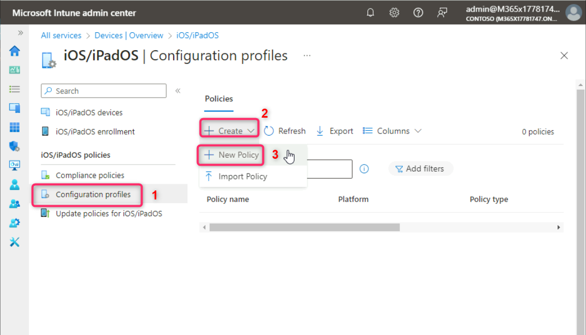
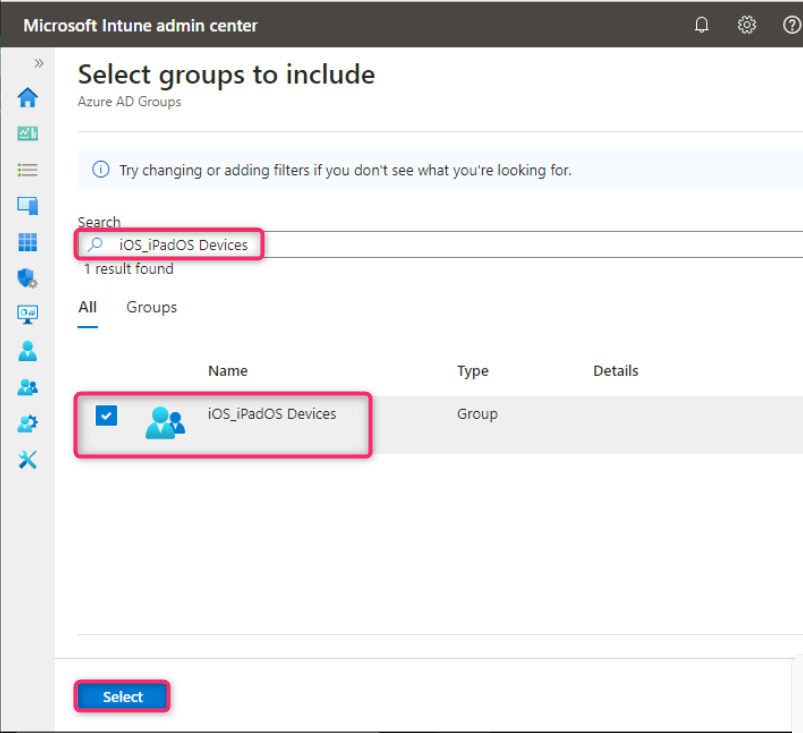

**Atelier 09 - Utilisation d'un profil de configuration pour configurer
les réglages Wi-Fi d'iOS et d'iPadOS.**

**Résumé**

Dans cet atelier, nous allons utiliser Microsoft Intune pour créer et
appliquer un profil de configuration afin d'exécuter la configuration
des paramètres Wi-Fi pour les appareils iOS et iPadOS.

**Exercice 1 : Création d'un profil de configuration.**

**Scénario**

Vous avez été invité à créer un profil de configuration à utiliser pour
configurer automatiquement les paramètres Wi-Fi pour les appareils iOS
et iPadOS inscrits. Vous devez vous assurer que les paramètres Wi-Fi
sont configurés comme suit :

- Nom du réseau : **Contoso Wi-Fi**

- SSID : **MainOffice**

- Se connecter automatiquement : **Activer**

- Type de sécurité : **WPA/WPA2-Personnel**

- Clé pré-partagée : **ContosoWiFi123**

- Attribué à : **un nouveau groupe de sécurité nommé iOS_iPadOS
  Devices**

**Tâche 1 : Créer le groupe iOS_iPadOS Devices**

1.  Passez à
    *[SEA-SVR1](https://labclient.labondemand.com/Instructions/e7cc4ae1-e3d9-4c55-accc-696f537e1e17?rc=10).
     *Dans la fenêtre de **Microsoft Entra admin center**, naviguez et
    sélectionnez **Groups**, puis cliquez sur **All groups**.

> 

2.  Sur les panneau **Groups | All groups** , sélectionnez **New
    group**.

> 

3.  Dans le panneau **New group**, entrez les informations suivantes et
    cliquez sur le bouton **Create**, comme illustré dans l'image
    ci-dessous :

    - Type de groupe : **Sécurité**

    - Nom du groupe : !!**iOS_iPadOS Devices**!!

    - Description du groupe : !! **All iOS and iPadOS devices**!!

    - Type d'adhésion : **Assigned**

> 

4.  Sur les **groups| All groups**, actualisez la page et vérifiez que
    le groupe **iOS_iPadOS Devices**  est affiché.

> 

**Tâche 2 : Créer un profil de configuration basé sur les exigences du
scénario**

1.  Basculez vers l' onglet **Microsoft Intune admin center**
    sélectionnez **Devices** dans la barre de navigation.

> 

2.  Sur la page **Devices | Overview**  sélectionnez **iOS/iPadOS**
    comme indiqué dans l'image ci-dessous.

> 

3.  Sur la page **iOS/iPadOS**, naviguez et cliquez sur **Profils de
    configuration**.

4.  Sur **iOS/iPadOS | Page Profils de configuration**, dans l' onglet
    **Policies**, cliquez sur **+ Create** et sélectionnez **+ New
    Policy**.

> 

5.  Dans le panneau **Créer un profil**, sélectionnez les options
    suivantes, puis sélectionnez **Create** :

    - Plate-forme : **iOS/iPadOS**

    - Type de profil : **Modèles**

    - Nom du modèle : **Wi-Fi**

> 

6.  Dans le panneau **basics**, entrez les informations suivantes, puis
    sélectionnez **Next** :

    - Nom : !! **iOS/iPadOS Wi-Fi Policy**!!

    - La description : !!**Wi-Fi settings for iOS/iPadOS Devices**!!

> 

7.  Dans le panneau **Configuration settings** , en regard de **Type
    Wi-Fi**, sélectionnez **De base**.

> Des options supplémentaires s'affichent en fonction du type
> sélectionné.

8.  Dans le panneau **Configuration settings** , sélectionnez les
    options suivantes, puis sélectionnez **Next** :

    - Nom du réseau : !!**Wi-Fi Contoso** !!

    - SSID : !! **Bureau principal** !!

    - Se connecter automatiquement : **Activer**

    - Type de sécurité : **WPA/WPA2-Personnel**

    - Clé pré-partagée : !!**ContosoWiFi123** !!

> 

9.  Dans le panneau **Assignments**, sous **Included groups**
    sélectionnez **Add groups**.

> 

10. Dans la fenêtre **Sélectionner les groupes à inclure**, sélectionnez
    **iOS_iPadOS Devices**, puis cliquez sur **Select**.

> 

11. Dans l' onglet **Assignments**, cliquez sur le bouton **Next**.

> 

12. Dans l' onglet **Review + create** , cliquez sur le bouton
    **Create**.

> 

13. Vérifiez que la **politique Wi-Fi d'iOS/iPadOS** est répertoriée.

> 
>
> **Résultats** : une fois cet exercice terminé, vous aurez créé et
> attribué un profil de configuration pour configurer les paramètres
> Wi-Fi pour les appareils iOS et iPadOS.
