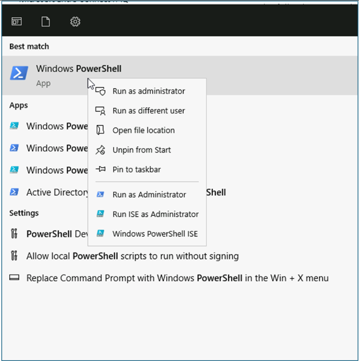
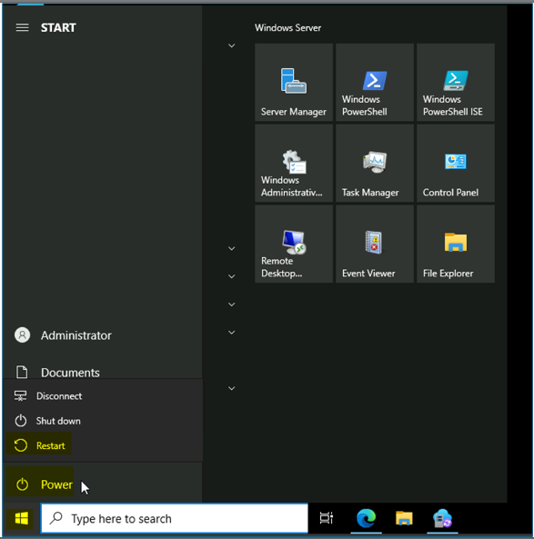
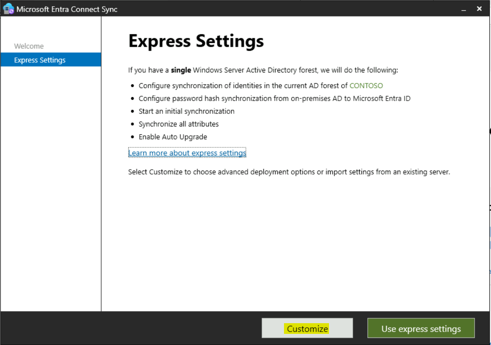
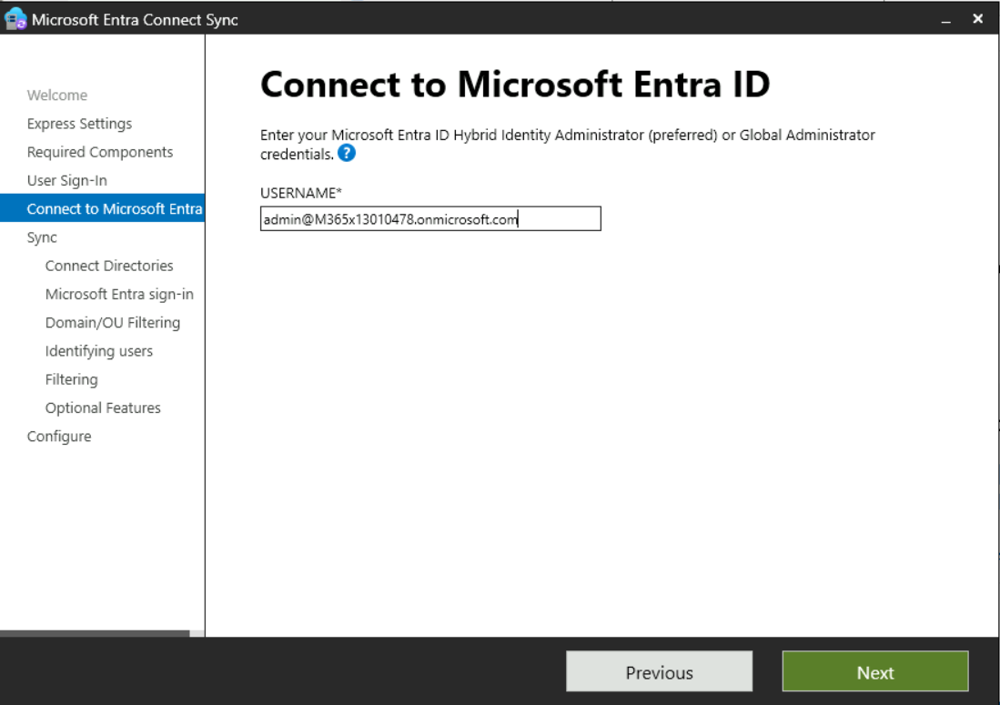

Atelier 02 - Synchronisation des identités à l'aide de Microsoft Entra
Connect

**Résumé**

Dans cet atelier, vous allez configurer la synchronisation des services
de domaine Active Directory vers Microsoft Entra ID

**Scénario**

Contoso Corporation gère actuellement les utilisateurs dans AD DS et
Microsoft Entra ID en tant que processus distincts. Cela prend du temps
et entraîne des informations incohérentes. Vous avez été chargé de
résoudre ce problème en connectant les deux répertoires à l'aide de
l'outil de synchronisation Microsoft Entra Connect.

## Tâche 0 : Activer TLS 1.2 à l'aide d'un script PowerShell

1.  Sur **SEA-SVR1**, connectez-vous en tant que
    **Contoso\Administrator** avec le mot de passe **Pa55w.rd**

2.  Dans le menu Démarrer, tapez
    [**PowerShell**](urn:gd:lg:a:send-vm-keys), faites un clic droit sur
    PowerShell et sélectionnez **run as administrator**.

Exécutez le script suivant sur PowerShell.

**If** (-Not (Test-Path
'HKLM:\SOFTWARE\WOW6432Node\Microsoft\\NETFramework\v4.0.30319'))

{

New-Item 'HKLM:\SOFTWARE\WOW6432Node\Microsoft\\NETFramework\v4.0.30319'
-Force | Out-Null

}

New-ItemProperty -Path
'HKLM:\SOFTWARE\WOW6432Node\Microsoft\\NETFramework\v4.0.30319' -Name
'SystemDefaultTlsVersions' -Value '1' -PropertyType 'DWord' -Force |
Out-Null

New-ItemProperty -Path
'HKLM:\SOFTWARE\WOW6432Node\Microsoft\\NETFramework\v4.0.30319' -Name
'SchUseStrongCrypto' -Value '1' -PropertyType 'DWord' -Force | Out-Null

**If** (-Not (Test-Path
'HKLM:\SOFTWARE\Microsoft\\NETFramework\v4.0.30319'))

{

New-Item 'HKLM:\SOFTWARE\Microsoft\\NETFramework\v4.0.30319' -Force |
Out-Null

}

New-ItemProperty -Path
'HKLM:\SOFTWARE\Microsoft\\NETFramework\v4.0.30319' -Name
'SystemDefaultTlsVersions' -Value '1' -PropertyType 'DWord' -Force |
Out-Null

New-ItemProperty -Path
'HKLM:\SOFTWARE\Microsoft\\NETFramework\v4.0.30319' -Name
'SchUseStrongCrypto' -Value '1' -PropertyType 'DWord' -Force | Out-Null

**If** (-Not (Test-Path
'HKLM:\SYSTEM\CurrentControlSet\Control\SecurityProviders\SCHANNEL\Protocols\TLS
1.2\Server'))

{

New-Item
'HKLM:\SYSTEM\CurrentControlSet\Control\SecurityProviders\SCHANNEL\Protocols\TLS
1.2\Server' -Force | Out-Null

}

New-ItemProperty -Path
'HKLM:\SYSTEM\CurrentControlSet\Control\SecurityProviders\SCHANNEL\Protocols\TLS
1.2\Server' -Name 'Enabled' -Value '1' -PropertyType 'DWord' -Force |
Out-Null

New-ItemProperty -Path
'HKLM:\SYSTEM\CurrentControlSet\Control\SecurityProviders\SCHANNEL\Protocols\TLS
1.2\Server' -Name 'DisabledByDefault' -Value '0' -PropertyType 'DWord'
-Force | Out-Null

**If** (-Not (Test-Path
'HKLM:\SYSTEM\CurrentControlSet\Control\SecurityProviders\SCHANNEL\Protocols\TLS
1.2\Client'))

{

New-Item
'HKLM:\SYSTEM\CurrentControlSet\Control\SecurityProviders\SCHANNEL\Protocols\TLS
1.2\Client' -Force | Out-Null

}

New-ItemProperty -Path
'HKLM:\SYSTEM\CurrentControlSet\Control\SecurityProviders\SCHANNEL\Protocols\TLS
1.2\Client' -Name 'Enabled' -Value '1' -PropertyType 'DWord' -Force |
Out-Null

New-ItemProperty -Path
'HKLM:\SYSTEM\CurrentControlSet\Control\SecurityProviders\SCHANNEL\Protocols\TLS
1.2\Client' -Name 'DisabledByDefault' -Value '0' -PropertyType 'DWord'
-Force | Out-Null

Write-Host 'TLS 1.2 has been enabled. You must restart the Windows
Server for the changes to take affect.' -ForegroundColor Cyan

4.  Redémarrez la machine virtuelle Windows Server.

Tâche 1 : Configurer la synchronisation de répertoire avec Microsoft
Entra Connect

1.  Sur [***SEA-SVR1***](urn:gd:lg:a:select-vm), si nécessaire,
    connectez-vous en tant que
    [**Contoso\Administrator**](urn:gd:lg:a:send-vm-keys) avec le mot de
    passe !! [**Pa55w.rd**](urn:gd:lg:a:send-vm-keys) !!

2.  Dans la barre des tâches, sélectionnez **Microsoft Edge**.

3.  Dans la barre d'adresse, entrez
    !\ !!

4.  Sur la page Microsoft Entra Connect, sélectionnez **Download**.

> Microsoft Entra Connect se télécharge automatiquement dans le dossier
> **Downloads** sur **SEA-SVR1**.
>
> 

5.  Cliquez sur **Open file** pour le fichier téléchargé
    **AzureADConnect.msi**.

> 

6.  Dans l' Assistant **Microsoft Azure Active Directory Connect**, dans
    la **Welcome to Azure AD Connect**, activez la case à cocher **I
    agree to the license terms and privacy notice** check box, and then
    select **Continue**., puis sélectionnez **Continue**.

> 

7.  Sur la page **Express Settings**  sélectionnez **Customise**.

> 

8.  Sur la page **Install required components** , sélectionnez
    **Install**.

> 

9.  Sur la page de **User sign-in** **,** assurez-vous que l' option
    **Password Hash Synchronization**  est sélectionnée, puis
    sélectionnez **Next.**

> 

10. Sur la page **Se connecter à Azure AD**, dans les zones **NOM**
     **USERNAME**  et **PASSWORD**, entrez vos **informations
    d'identification de Office 365 Tenant** , puis sélectionnez
    **Next**.

> 

11. Sur la page **Connect your directories** , assurez-vous que
    **Contoso.com** est répertorié sous **FOREST,** puis sélectionnez
    **Add Directory**.

> 

12. Dans la fenêtre **AD forest account**  sélectionnez l' option
    **Create New AD Account** , puis dans le champ **ENTERPRISE ADMIN
    USERNAME** , tapez
    [**Contoso\Administrator**](urn:gd:lg:a:send-vm-keys), puis tapez
    !\ !! dans le champ
    **PASSWORD**. Sélectionnez **OK,** puis sélectionnez **Next**.

> 
>
> 

13. Dans la page **Azure AD sign-in configuration**  assurez-vous que
    dans la liste déroulante **NOM DE L'UTILISATEUR PRINCIPAL,** la
    valeur **userPrincipalName** est sélectionnée.

> 

14. Sélectionnez **Continuer sans faire correspondre tous les suffixes
    UPN aux domaines vérifiés**, puis sélectionnez **Suivant**.

15. Sur la page **Filtrage des domaines et des unités d'organisation**,
    sélectionnez **Sync selected domains and OUs**..

16. Développez **Contoso.com**, décochez la case en regard de
    **Contoso.com** et assurez-vous que seules les cases suivantes sont
    cochées : **IT**, **managers**, **Marketing**, **Research** et
    **Sales**. Sélectionnez **Next**.

> 

17. Sur la page **Uniquely identifying your users** , sélectionnez
    **Next**.

18. Sur la page **Filter users and devices** , sélectionnez **Next**.

19. Sur la page **Optional features** , passez en revue les options
    disponibles, mais n'apportez aucune modification. Assurez-vous que
    **Password hash synchronization**  est sélectionnée, puis
    sélectionnez **Next**.

> 

20. Sur la page **Ready to configure**  assurez-vous que l'option
    **Start the synchronization process when configuration completes** 
    est sélectionnée, puis sélectionnez **Install**.

> 

21. Une fois la configuration terminée, sélectionnez **Exit**.

> 
>
> **Remarque** : À ce stade, la synchronisation des objets à partir de
> vos services de domaine Active Directory locaux (AD DS) et de
> Microsoft Entra ID commence. Vous devez attendre environ 3 à 4 minutes
> pour que ce processus se termine.

22. Fermez toutes les fenêtres ouvertes.

Tâche 2 : Vérifier la synchronisation dans Microsoft Entra ID

1.  Dans **Microsoft** **Edge,** ouvrez un nouvel onglet et accédez à la
    page des utilisateurs de Microsoft Entra admin Center -
    !\ !!
    Si vous êtes invité à vous connecter, utilisez les informations
    d'identification de Office 365 Tenant à partir de l'onglet Accueil
    de l'interface d’Atelier.

> 

2.  Vérifiez que vous voyez des utilisateurs de vos services de domaine
    locaux Active Directory AD DS. Assurez-vous que la valeur **yes**
    est attribuée à ces utilisateurs dans la colonne **On-premises sync
    enabled** 

> 

3.  Dans le volet de navigation, sélectionnez Développer les **groups**
    , puis sélectionnez **All groups**.

> 

4.  Vérifiez que vous voyez des groupes à partir de vos locaux AD DS ()

> 

5.  Sélectionnez le groupe **managers.**

> 

6.  Sur la page du groupe **managers,** sélectionnez **Membres,** puis
    assurez-vous de voir les utilisateurs.

> 
>
> 
>
> **Notez que vous ne pouvez pas ajouter ou supprimer des membres de ce
> groupe, car il provient de AD DS locaux.**

15. Fermez Microsoft Edge.

**Résultats** : Une fois cet exercice terminé, vous aurez configuré
Microsoft Entra Connect pour synchroniser l'identité des services de
domaine Active Directory vers Microsoft Entra ID
