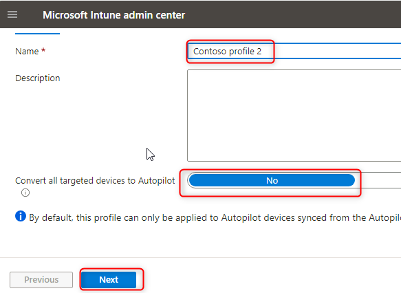
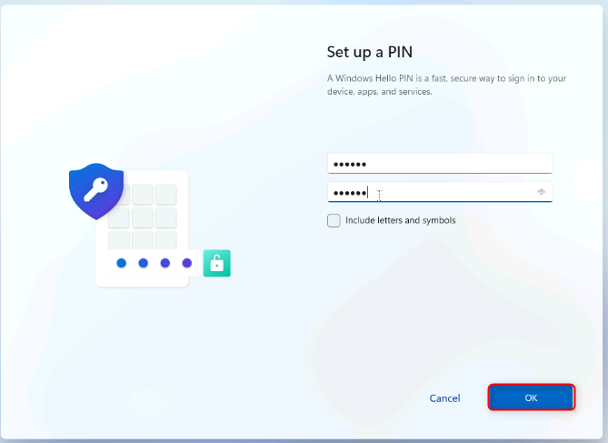
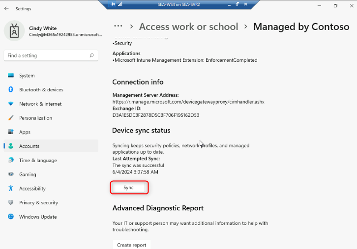

實驗 21：使用 Autopilot 重置和自部署模式刷新 Windows。

**總結**

在本實驗中，您將學習如何執行遠程 Autopilot 重置。

**先決條件**

在此實驗之前，必須完成以下實驗：

- 實驗 01 - 在 Microsoft Entra ID 中管理身份

- 實驗 02 - 使用 Azure AD Connect 同步身份

- 實驗 21 - 使用 Microsoft 部署工具包部署 Windows 11

- 實驗 20 - 使用 Autopilot 部署 Windows 11

**場景**

SEA-WS4 已使用 Windows Autopilot 進行部署。您需要測試另一個涉及
Autopilot 重置的預配方案。您將創建一個配置了 Windows Autopilot
自部署模式的新部署配置文件。

任務 1：配置自部署 Windows Autopilot 部署配置文件

1.  切換到  [***SEA-SVR1***](urn:gd:lg:a:select-vm)。

> 

2.  在 **Microsoft Edge** 中，打開一個新選項卡並導航到
     [**https://intune.microsoft.com**](https://intune.microsoft.com)。如果出現提示，請使用 [**admin@M365xXXXXXXXX.onmicrosoft.com**](mailto:admin@M365xXXXXXXXX.onmicrosoft.com) 和
    paswword 登錄。

3.  在 **Microsoft Intune 管理中心**，選擇 “**Devices**” 。

> 

4.  在 **Device onboarding** （設備載入） 部分中，選擇 **Enrollment**
    （註冊）。

> 

5.  在 Windows enrollment （Windows 註冊）
    邊欄選項卡上的詳細信息窗格中，選擇 **Deployment
    Profiles**（部署配置文件）。

> 

6.  在 “**Windows AutoPilot deployment profiles**” 邊欄選項卡上，選擇
    “**Contoso Profile 1**” ，然後選擇 “**Properties**” 。

> 
>
> 
>
> 

7.  向下滾動到 **Assignments**（分配），然後選擇 **Edit**（編輯）。

> 

8.  在 **IT Devices** 旁邊，選擇 **Remove**。

> 

9.  選擇 “**Review and save**” ，然後選擇 “**Save**” 。

> 

10. 關閉 **Contoso Profile 1|Properties**（屬性） 頁面。

11. 在 “**Windows AutoPilot deployment profiles**” 邊欄選項卡上，選擇
    “**Create profile**” ，然後選擇 “**Windows PC**” 。

> 

12. 在 **Basics** 選項卡的 **Name** 文本框中，鍵入 [**Contoso profile
    2**](urn:gd:lg:a:send-vm-keys)。

13. 對於 “**Convert all targeted devices to Autopilot**” ，選擇 “**No**”
    ，然後選擇 “**Next**” 。

> 

14. 在 “**Out-of-box experience (OOBE)**” 選項卡上，確保 “**Deployment
    mode**” 設置為 “**Self-Deploying**” 。

> 

15. 確保設置了以下選項：

    - 語言 （區域） ：**Operating system default**

    - 自動配置鍵盤：**Yes**

    - 應用設備名稱模板：**Yes**

    - 輸入名稱：[**Contoso-%RAND:2%**](urn:gd:lg:a:send-vm-keys)

> 

16. 選擇 **Next**（下一步）。

17. 在 **Assignments** （分配） 選項卡上的 **Included groups**
    （包含的組） 下，選擇 **Add groups** （添加組）。

> 

18. 選擇 **IT Devices** 組，然後單擊 **Select**。選擇
    **Next**（下一步）。

> 
>
> 

19. 在 “**Review + create**” 邊欄選項卡上，查看信息，然後選擇
    “**Create**” 。

> 

任務 2：執行 Autopilot 重置

1.  在 **Microsoft Intune 管理中心**，選擇 “**Devices**” ，然後選擇
    “**All devices**” 。

2.  選擇 Autopilot PC （以名稱 DESKTOP 開頭）。

> 

3.  在菜單欄中，選擇橢圓，然後選擇  **Autopilot Reset**。

> 

4.  在消息提示符處，選擇 **Yes** （是）。

> 

5.  切換到[***SEA-SVR2***](urn:gd:lg:a:select-vm) 並最大化 **SEA-WS4**
    窗口。

> **注意：**SEA-WS4 應仍從上一個實驗運行
>
> **注意：**將設備更新到最新版本，然後單擊重新啟動。

6.  重新啟動**SEA-WS4**。

> 
>
> **注意：** 此過程可能需要 30
> 分鐘，在此過程中會重啟幾次。在此任務完成時，您的教師可以繼續學習下一個模塊。請務必在下一次實驗會話中返回完成任務
> 3。

任務 3：驗證 Autopilot 部署

1.  在登錄頁面上，輸入 [**Cindy@M365x19242953.onmicrosoft.com**](mailto:Cindy@M365x19242953.onmicrosoft.com) 密碼為 
    [**P@55w.rd1234**](mailto:P@55w.rd1234)。

2.  在 “**Use Windows Hello with your account**” 中，選擇 “**OK**” 。

> 

3.  在 **Verify your identity** （驗證您的身份） 頁面上，選擇 Text
    verification method （文本驗證方法）。

4.  在 **Enter code** （輸入代碼）
    頁面上，輸入已發送到您的移動設備的代碼，然後選擇 **Verify**
    （驗證）。

> 

5.  在 **Setup up a PIN** 對話框的 **New PIN** 和 **Confirm PIN**
    字段中，輸入 [**102938**](urn:gd:lg:a:send-vm-keys)，然後選擇
    **OK**。

> 

6.  在 **All set！**頁面上，選擇 **OK**。

7.  選擇 **Start** （開始），然後選擇 **Settings** （設置）。

> 

8.  選擇 “**Accounts**” ，然後選擇 “**Access work or school**”
    。驗證設備是否已連接到 Contoso 的 Azure AD。

> 

9.  選擇 “**Connected to Contoso's Azure AD**”，然後選擇 “**Info**” 。

> 

10. 在 **Managed by Contoso** （由 Contoso 管理）
    頁面上，向下滾動，然後選擇 **Sync** （同步）。

> 

11. 在 **SEA-WS4** 上，關閉 **Settings** 窗口。

12. 關閉 **SEA-WS4** 並關閉 **SEA-WS4** 窗口。

13. 在 [***SEA-SVR2***](urn:gd:lg:a:select-vm)上，關閉 Hyper-V 管理器。

**結果：**完成本練習後，您將使用自部署模式為 Windows 11 設備配置了
Autopilot 重置。
