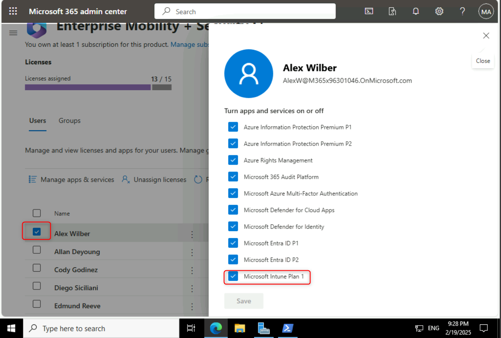
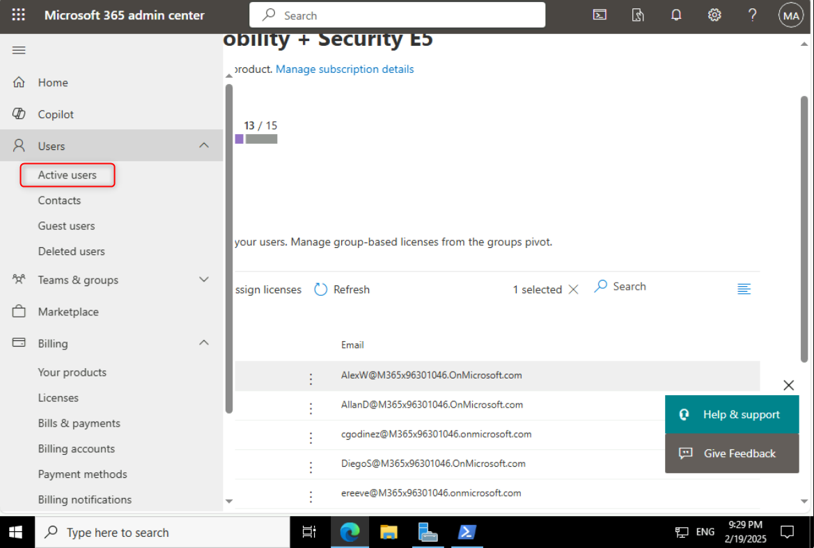
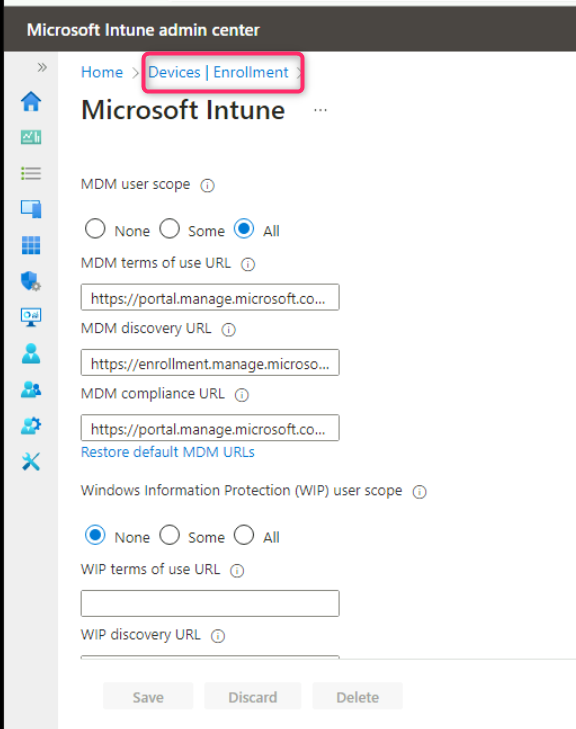
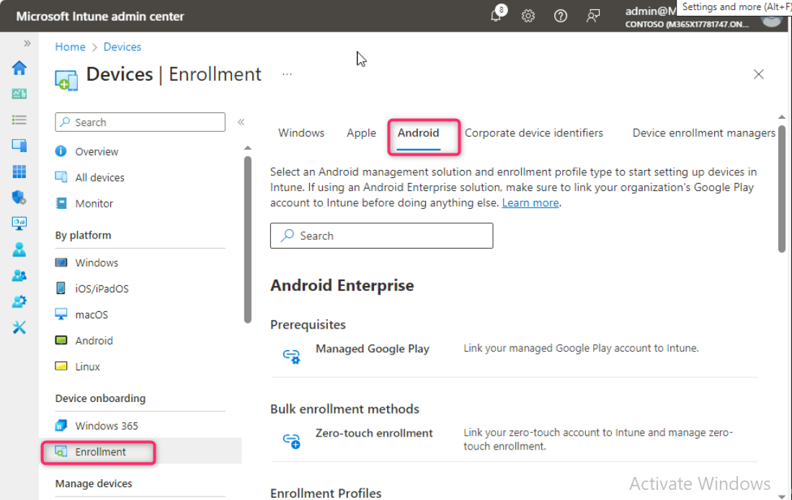
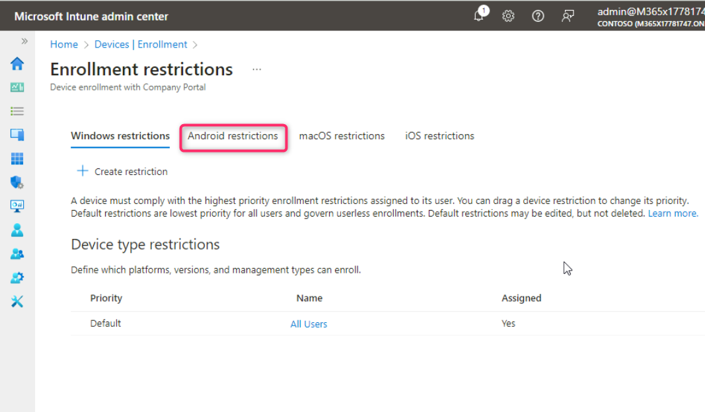
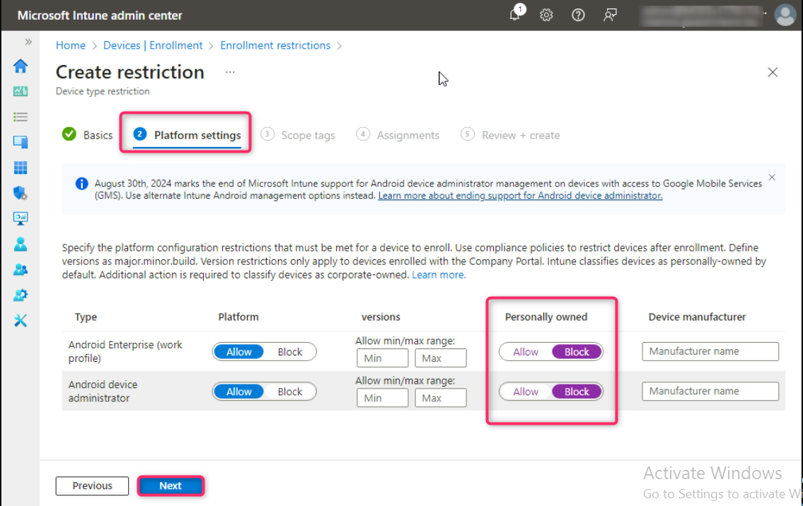
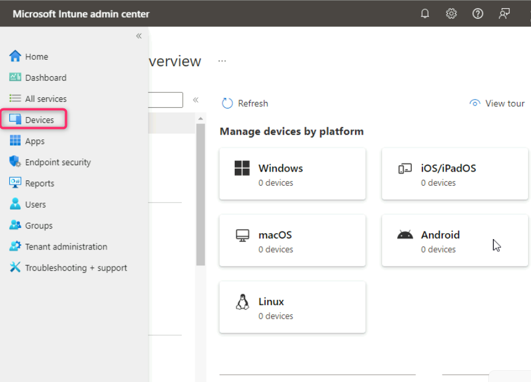

**Atelier 05 : Gérer l'inscription d'un appareil dans Microsoft Intune**

**Résumé**

Dans cet atelier, vous allez préparer la gestion des appareils à l'aide
de Microsoft Intune en examinant et en attribuant des licences, en
configurant l'inscription automatique Windows et en configurant les
restrictions d'inscription.

**Conditions préalables**

Le(s) Ateliers suivant(s) doit(vent) être completé(s) avant cet atelier
:

- Atelier \#1-Gestion des identités dans Microsoft Entra ID

- Atelier \#2 : Synchronisation des identités à l'aide de Microsoft
  Entra Connect

**Remarque** : Vous aurez également besoin d'un téléphone mobile capable
de recevoir des SMS utilisés pour sécuriser l'authentification de
connexion Windows Hello à Entra ID.

**Scénario**

Vous devez préparer la gestion des appareils à l'aide de Microsoft
Intune. Tout d'abord, vous devez vous assurer que les utilisateurs
disposent des licences appropriées pour la gestion des appareils. En
guise de test de vérification, vous attribuerez à Aaron Nicholls les
licences requises. Vous devez également vous assurer que tout appareil
Windows joint ou enregistré auprès de Microsoft Entra ID sera
automatiquement inscrit dans Intune. Vous avez également été invité à
vous assurer que les membres du groupe Ventes ne peuvent pas inscrire
d'appareils Android et iOS personnels dans Intune et que la limite
d'appareils d'inscription est augmentée à 10 appareils. Enfin, vous
devez configurer Allan Deyoung en tant que gestionnaire d'inscription
d'appareils pour lui permettre d'inscrire 1000 appareils.

**Tâche 1 : Examiner et attribuer des licences pour la gestion des
appareils**

1.  Sur
    [*SEA-SVR1*](https://labclient.labondemand.com/Instructions/e7cc4ae1-e3d9-4c55-accc-696f537e1e17?rc=10),
    accédez à la fenêtre de **Microsoft 365 admin center**

2.  Naviguez et sélectionnez **Billing**, puis cliquez sur **Licences**.

3.  Dans la page **Licences**, notez les licences disponibles dans le
    tenant.

4.  Sélectionnez et cliquez sur **Enterprise Mobility + Security E5**.
    Notez tous les utilisateurs auxquels cette licence a été attribuée.
    Vous pouvez attribuer et supprimer des licences à partir de cet
    emplacement.

5.  Sélectionnez un utilisateur pour voir les licences qui lui sont
    attribuées. Prenez connaissance des services inclus dans la licence
    Enterprise Mobility + Security E5. Microsoft Intune est l'un des
    services pris en charge pour cette licence.

6.  Dans le volet de navigation du **Microsoft 365 admin center** ,
    sélectionnez **Active users**.

7.  Recherchez et sélectionnez !!**Cindy White** !!

8.  Sur la page **utilisateur de Cindy White**, cliquez sur **Licenses
    and apps**.

9.  Sous **Settings**, dans le champ **Emplacement d'utilisation**,
    sélectionnez **États-Unis** et cochez la case **Enterprise**
    **Mobility + Security E5 and Office 365 E5 (no teams),** puis
    cliquez sur **Save changes**.

***Remarque** : Avant de pouvoir attribuer une licence à un utilisateur,
celui-ci doit disposer d'un emplacement d'utilisation défini.*

**Tâche 2 : Définition du mot de passe de l'utilisateur à l'aide de
PowerShell**

1.  Dans [***SEA-SVR1***](urn:gd:lg:a:select-vm), cliquez avec le bouton
    droit sur le **bouton Démarrer**, puis sélectionnez **Windows
    PowerShell (Admin).**

2.  Dans la boîte de dialogue **User Account Control** sélectionnez
    **yes**.

3.  Dans la fenêtre **Windows PowerShell**, tapez la commande suivante,
    puis appuyez sur **Enter** :

!!**Connect-MsolService** !!

4.  Dans la boîte de dialogue **Se connecter à votre compte**,
    connectez-vous à l'aide des informations d'identification de Office
    365 tenant à partir de l'onglet Accueil.

**Remarque – Si vous avez été invité à modifier le mot de passe des
informations d'identification de l'administrateur tenant , assurez-vous
de fournir le mot de passe mis à jour.**

5.  Dans la fenêtre **Windows PowerShell**, tapez la commande suivante
    pour réinitialiser les mots de passe de **Cindy White**

!!**Get-MsolUser | Where-Object DisplayName -EQ "Cindy White" |
Set-MsolUserPassword -NewPassword P@55w.rd1234 -ForceChangePassword
$false**!!

**Tâche 3 : Activer l'inscription automatique Windows dans Microsoft
Intune**

1.  Dans **SEA-SVR1**, ouvrez un nouvel onglet dans **Microsoft Edge**,
    puis dans la barre d'adresse de type
    !!**https://Endpoint.microsoft.com** !! puis appuyez sur **Enter**.
    Si vous êtes invité à vous connecter, fournissez les informations
    d'identification de l' **a Office 365 Tenant Admin**.

2.  Dans le centre d'administration Microsoft Intune, sélectionnez
    **Devices**.

3.  Naviguez et cliquez sur **Inscription**. Assurez-vous que l' onglet
    **Windows** est sélectionné, puis accédez à la section **Options
    d'inscription** et cliquez sur **Automatic Enrollment**.

4.  Sur la ligne de **MDM user scope** , sélectionnez la case d'option
    **all**, puis **save**.

5.  Cliquez sur le lien **Devices | Enrollment** comme indiqué dans
    l'image ci-dessous.

**Remarque** : En effectuant cette étape, vous avez activé l'inscription
automatique dans Intune pour tout utilisateur qui effectue une jonction
Azure AD avec un appareil Windows.

**Tâche 4 : Configurer les restrictions d'inscription**

1.  Accédez à la section **Intégration des appareils** et cliquez sur
    **Enrollment**. Ensuite, cliquez sur l'onglet **Android** comme
    indiqué dans l'image ci-dessous.

2.  Faites défiler jusqu'à la section **Enrollment options** et cliquez
    sur **Device platform restriction**.

3.  Sélectionnez l'onglet **Android Restrictions**, puis sélectionnez
    +**Create restriction**.

4.  Sur la page **Create restriction**, dans la zone **Name**, entrez
    !!**Android Personal Device Restriction**!! Sélectionnez **next**.

5.  Sur la page des paramètres de la plate-forme, sous **Propriété
    personnelle**, sélectionnez **Block** pour les types d'appareils
    suivants et cliquez sur le bouton **next** :

    - Android Enterprise (profil professionnel)

    - Administrateur d'appareil Android

6.  Sur la page **Scope tags**, sélectionnez **next**.

7.  Sur la page **Assignments**, sous **Included groups** sélectionnez
    **Add groups**.

8.  Dans la **barre de recherche du** volet **Sélectionner les groupes à
    inclure**, tapez et sélectionnez **sales**, puis cliquez sur le
    bouton **Select.**

9.  Dans l' onglet **Assignments**, cliquez sur le bouton **next**.

10. Sur la page **Review + create**, sélectionnez **Create**.

Notez la restriction d'appareil personnel Android attribuée avec une
priorité de 1.

11. Dans la section **Devices | Enrollment**, dans l' onglet
    **Windows**, accédez à la section **Enrollment options** et cliquez
    sur **Device limit restriction**.

Notez qu'il existe une restriction de limite d'appareil par défaut qui
est attribuée à Tous les utilisateurs. Cette restriction par défaut
définit une limite d'inscription d'appareils à 5 appareils par
utilisateur.

12. Dans **Restrictions de limite d'** **appareil d'inscription**,
    sélectionnez + **Create restriction**.

13. Sur la page Créer une restriction, dans la zone **Name**, entrez
    !!**Sales Device Enrollment Limit**!! Sélectionnez **Next**.

14. Sur la page **Device limit** sélectionnez **10**, puis **Next**.

15. Sur la page **Scope tags**, sélectionnez **Next**.

16. Sur la page **Assignments**, sous **Included groups**, sélectionnez
    **Add groups**

17. Dans la zone de recherche **Select groups to include** dans la page,
    tapez et sélectionnez **Sales**, puis cliquez sur le bouton
    **Select.**

18. Cliquez sur le bouton **Next**.

19. Sur la page **Review + create** sélectionnez **Create**.

20. Rechargez la page. Notez la limite d'inscription de l'appareil
    Sales, configurée avec une limite d'appareil de 10 et attribuée avec
    une priorité de 1.

**Tâche 5 : Configurer un Device enrollment manager**

Dans le **Microsoft Intune admin center** sélectionnez **Devices**.

1.  Accédez à la section **Device onboarding** et cliquez sur
    **Enrollment**, puis sur l' onglet **Device enrolment managers**.

2.  Dans le volet **Enroll devices** , sélectionnez **Device enrollment
    managers**.

Notez que, par défaut, aucun gestionnaire d'inscription d'appareil n'est
configuré.

3.  Dans la page **Enroll devices|Device enrollment managers** ,
    sélectionnez **Add**.

4.  Dans la page **Add user** , sous Nom d'utilisateur, entrez l'adresse
    e-mail de Allan [DeYoung
    !!**AllanD@M365xXXXXXXX.onmicrosoft.com**](mailto:DeYoung !!AllanD@M365xXXXXXXX.onmicrosoft.com) !!
     (remplacez **XXXXXX** par votre nom de locataire), puis
    sélectionnez **Add**.

**Allan est désormais autorisé à inscrire jusqu'à 1000 appareils.**

5.  Dans le Microsoft Intune admin center, dans le volet de navigation,
    sélectionnez **Home**.

6.  Fermez Microsoft Edge.

**Résultats** : Une fois cet exercice terminé, vous aurez examiné et
attribué des licences, configuré l'inscription automatique Windows,
activé et attribué des restrictions d'inscription et configuré un Device
enrollment manager..
