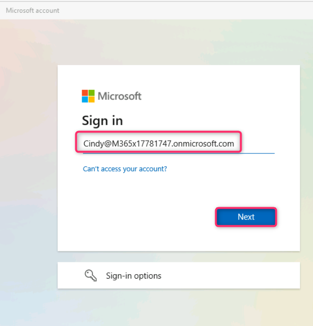
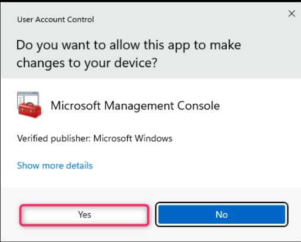
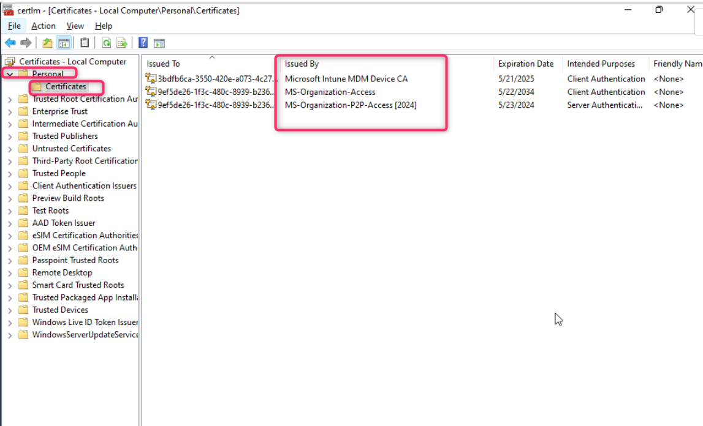

**Atelier 06 - Inscription d'appareils dans Microsoft Intune**

**Résumé**

Dans cet atelier, vous allez joindre un client Windows à Entra ID et
vérifier que l'appareil s'est automatiquement inscrit dans Microsoft
Intune.

**Conditions préalables**

Le(s) Ateliers suivant(s) doit(vent) être completé(s) avant cet atelier
:

- Atelier \#1-Gestion des identités dans Microsoft Entra ID

- Atelier \#2 : Synchronisation des identités à l'aide de Microsoft
  Entra Connect

- Atelier \#5 : Gérer l'inscription d'un appareil dans Microsoft Intune

Remarque : Vous pouvez également avoir besoin d'un téléphone mobile
capable de recevoir des SMS utilisés pour sécuriser l'authentification
de connexion Windows Hello à Entra ID.

**Scénario**

Vous avez attribué à Cindy White les licences appropriées et vous allez
maintenant tester le processus de jonction d'un appareil Windows à Entra
ID et le faire s'inscrire automatiquement dans Microsoft Intune.

**Tâche 1 : Inscrire automatiquement un appareil Windows à Microsoft
Intune**

1.  Passez à
    [*SEA-WS1*](https://labclient.labondemand.com/Instructions/e7cc4ae1-e3d9-4c55-accc-696f537e1e17?rc=10)
    et connectez-vous en tant qu**'administrateur** avec le mot de passe
    de !!**Pa55w.rd** !!

2.  Dans la barre des tâches, sélectionnez **Démarrer**, puis
    **Paramètres.**

3.  Dans la fenêtre **Settings**, sélectionnez **Account**.

4.  Sur la page Comptes, sélectionnez **Access work or school**.

5.  Sur la page **Access work or school** , sélectionnez **connect**.

6.  Dans la fenêtre **Microsoft account**  sélectionnez **Join this
    device to Microsoft Entra ID**.

7.  Sur la page **Sign in** , tapez
    !\ !!
    , puis sélectionnez **Next**.

8.  Sur la page **Entrez le mot de passe**, entrez le mot de passe :
    !\ !! , puis sélectionnez
    **Sign in** .

9.  **Assurez-vous qu'il s'agit de la** boîte de dialogue de votre
    organisation, puis sélectionnez **join**.

10. Sur le site **Vous êtes prêt !** , lisez les informations, puis
    sélectionnez **Done**.

11. Dans la section **Access work or school** , vérifiez que l'option
    **Connected to Contoso's Azure AD s'**affiche.

12. Sélectionnez **Connecté à Azure AD de Contoso**, puis Sélectionnez
    **Info**.

13. Prenez note des informations concernant les zones gérées par
    Contoso, faites défiler l'écran vers le bas, puis sélectionnez
    **Sync**. Cela forcera la synchronisation d'un appareil avec Intune.

14. Fermez la fenêtre **Settings**.

**Tâche 2 : Valider l'inscription de l'appareil dans Microsoft Entra et
Intune**

1.  Dans la barre des tâches **SEA-WS1**, sélectionnez **Start**, tapez
    !!**certlm.msc** !! appuyez sur **Enter**.

2.  Dans la boîte de dialogue Contrôle de compte d'utilisateur,
    sélectionnez le bouton **Yes** .

3.  Dans la console **Certificates**, dans le volet de navigation,
    développez **Personnel** et sélectionnez le nœud **Certificate**.
    Vérifiez que les certificats suivants sont répertoriés dans le volet
    de détails :

- Unité de contrôle des appareils MDM Microsoft Intune

- Accès-organisation-MS

- MS-Organization-P2P-Access \[2024\]

Cela indique que l'appareil est inscrit dans Microsoft Entra et Intune.

4.  Fermez la fenêtre Certificats.

5.  Cliquez avec le bouton droit de la souris sur le bouton **Start**,
    puis sélectionnez **Windows Terminal (Admin)**.

6.  Dans la boîte de dialogue **User Account Control** cliquez sur le
    bouton **Yes**.

7.  Dans la console PowerShell, tapez ce qui suit et appuyez sur
    **Enter** :

!!**dsregcmd /status** !!

8.  Dans la sortie, sous **Device State**,, vérifiez que **AzureAdJoined
    : YES** s'affiche. Cela indique que l'appareil est joint à Azure AD.

9.  Dans la sortie sous **Détails du Tenant**, vérifiez que les trois
    entrées suivantes existent :

- mdmUrl :https :enrollment.manage.microsoft.com/enrollmentserver/discovery.svc

- mdmTouUrl :https :portal.manage.microsoft.com/TermsofUse.aspxmdm

- ComplianceUrl :https :portal.manage.microsoft.com/?portalAction=Compliance

*Remarque : Ces entrées indiquent que l'appareil est inscrit dans
Intune.*

**Tâche 3 : Se connecter en tant qu'utilisateur Microsoft Entra ID**

1.  Déconnectez-vous de **SEA-WS1** car vous êtes connecté avec le
    compte d'administrateur local.

2.  Sur l'écran de connexion, sélectionnez Autre utilisateur et
    connectez-vous en tant que
    !!**Cindy@M365xXXXXXXX.onmicrosoft.com** !!  avec le mot de passe :
    !\ !!

3.  Attendez que le profil soit créé

**Remarque** - Si vous êtes invité à utiliser **Windows Hello**,
terminez le processus de connexion en conséquence et sur la page **Set
up a PIN**, dans les zones **New PIN** et **Confirm PIN**, tapez
!!**102938** !! , puis sélectionnez **OK**.

4.  Se déconnecter de **SEA-WS1**.

**Tâche 4 : Vérification de l'inscription de l'appareil dans la console
Microsoft Intune**

1.  Passez à
    *[SEA-SVR1](https://labclient.labondemand.com/Instructions/e7cc4ae1-e3d9-4c55-accc-696f537e1e17?rc=10)*
    et connectez-vous à l'aide des informations d'identification
    fournies.

2.  Dans le navigateur Microsoft Edge, tapez
    !!**https://intune.microsoft.com** !! dans la barre d'adresse, puis
    appuyez sur **Enter** Connectez-vous à l'aide de votre compte
    d'administrateur de locataire Office 365.

3.  Dans le volet de navigation, sélectionnez **Devices**.

4.  Sur les **appareils | Aperçu**, naviguez et cliquez sur **Windows**.

5.  Naviguez et cliquez sur **Windows devices**. Vérifiez que
    **SEA-WS1** est répertorié.

Notez que pour SEA-WS1, la colonne **Géré par** affiche **Intune** et la
colonne **wnership** affiche **Corporate**.

**Remarque** : Cette vue répertorie les appareils inscrits à Intune.
N'oubliez pas que vous avez configuré l'inscription automatique entre
Microsoft Entra et Microsoft Intune, et que, pour cette raison, tout
appareil joint ou inscrit à Microsoft Entra est automatiquement inscrit
à Microsoft Intune. Tous les appareils joints avant la configuration de
l'inscription sont uniquement joints ou enregistrés auprès d'Entra, mais
ne sont pas inscrits dans Intune.

6.  Ouvrez un nouvel onglet et accédez **Microsoft Entra admin center**
    !!**https://entra.microsoft.com** !!. Cliquez sur **Devices** , puis
    sélectionnez **All devices**

7.  Prenez note de **SEA-WS1**. Notez que la colonne **Join Type**
    affiche Microsoft Entra joint et la colonne **MDM** affiche
    Microsoft Intune.

**Résultats** : Une fois cet exercice terminé, vous aurez joint un
client Windows à Microsoft Entra ID et vérifié que l'appareil s'est
automatiquement inscrit à Microsoft Intune.
